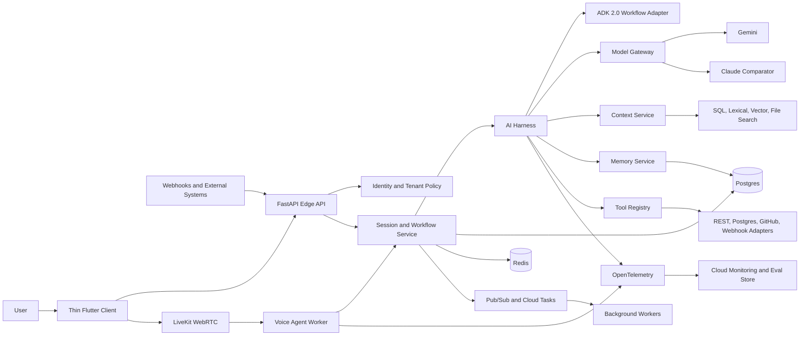
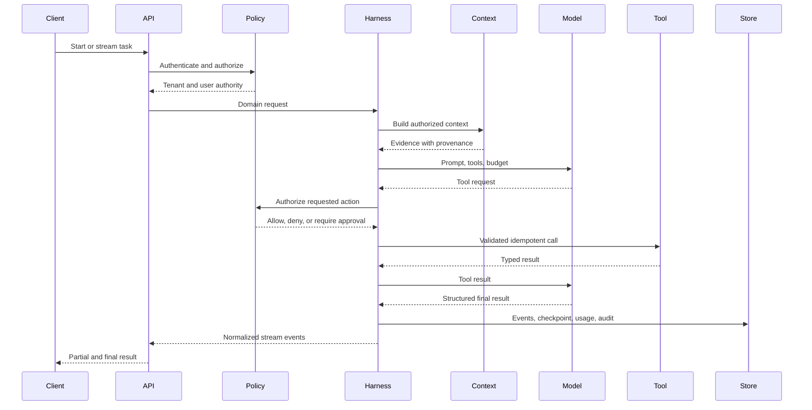
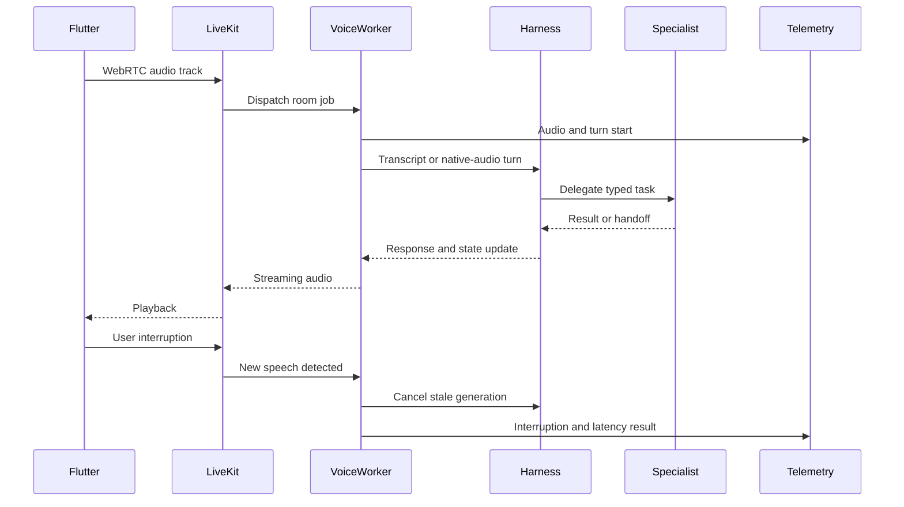
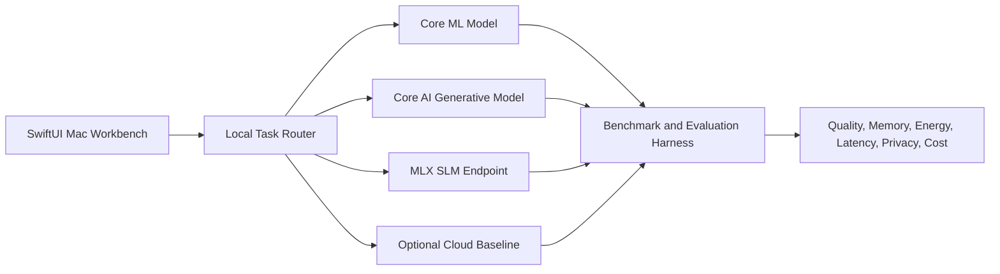

# Portfolio Architecture

The portfolio has three independent deliverables:

1. a reusable production AI Solutions Platform;
2. an Apple AI Lab for Foundation Models and Apple Intelligence APIs; and
3. a Local AI Workbench for Core AI, Core ML, MLX, and small language models.

The separation is intentional. The AI platform proves universal backend and FDE
skills. The Apple projects prove current iOS and on-device AI depth without
making the main platform mobile-specific.

## 1. AI Solutions Platform

### Plain-language description

This is a reusable engine for enterprise AI solutions. It can accept text or
voice, assemble trusted context, remember selected information, call tools,
coordinate agents, measure quality, enforce policy, and run in production.

It is not a “chatbot app.” Small customer-style scenarios configure and prove
the same core capabilities.

### Architectural rule

Begin as a modular monolith. Split a module into a service only when one of
these is measured:

- different scaling or lifecycle needs;
- a security/isolation boundary;
- independent deployment ownership;
- a blocking or long-running workload;
- transport requirements such as real-time media.

Microservices are not a portfolio goal.

### System map



### Core modules

#### `domain`

Provider- and framework-neutral types:

- conversation message;
- multimodal attachment;
- model capability;
- structured response;
- tool request/result;
- workflow event;
- usage and cost;
- error category;
- session/checkpoint;
- memory record;
- evaluation case/result.

No Google, Anthropic, ADK, LiveKit, FastAPI, or database type may cross this
boundary.

#### `model_gateway`

- Gemini implementation through the Google Gen AI SDK.
- One Anthropic implementation as a real comparator/fallback.
- Capability discovery and local rejection of unsupported requests.
- Stable model pinning, preview policy, fallback, retries, timeouts, streaming,
  tool calls, structured output, multimodal input, usage, and cost.
- Routing policy based on eval quality, latency, cost, modality, context size,
  and data policy.

#### `context`

- Task-specific context budget.
- Trusted/untrusted source labels and provenance.
- Exact/SQL search, lexical search, dense search, hybrid fusion, reranking,
  model-native file search, and cached long context behind a strategy contract.
- Source-level authorization and deletion.
- Context assembly, deduplication, ordering, compression, and citations.

The service must be able to answer “no retrieval needed” and “use normal SQL.”

#### `memory`

- Explicit working, episodic, semantic, and procedural records.
- Write policy, retrieval policy, confidence, source, TTL, owner, tenant, and
  deletion.
- Postgres is the durable source of truth.
- Redis is temporary state/cache, not long-term truth.
- Vector lookup is optional and measured.

#### `harness`

- Event-based model/tool/approval/error/cancel/result lifecycle.
- Step, time, token, and cost budgets.
- Typed tools, retries, idempotency, compensation, checkpoint/resume, and
  deterministic termination.
- Bounded parallelism and deterministic aggregation.
- Human approval for high-impact actions.

#### `agent_runtime`

- ADK 2.0 graph adapter.
- Deterministic workflow nodes and model-led agent nodes.
- Collaboration/delegation, state boundaries, artifacts, and trajectory
  evaluation.
- MCP client for tools and A2A endpoint for one independently runnable agent.
- Domain logic remains callable without ADK for unit and contract testing.

#### `realtime`

- Text stream events independent of SSE/WebSocket serialization.
- LiveKit/WebRTC room and worker lifecycle.
- Cascaded ASR → LLM → TTS and native-audio adapters behind one voice-session
  contract.
- VAD, endpointing, interruption, transcript reconciliation, handoff,
  resumption, and graceful drain.
- Stage-level latency and quality metrics.

#### `tools_and_integrations`

Reusable adapters:

- generic REST/OpenAPI;
- Postgres read/write with policy;
- signed incoming and outgoing webhooks;
- small GitHub example;
- small Slack/Teams-style event example.

Every tool declares:

- input/output schema;
- read versus side-effect classification;
- required user/agent permission;
- timeout and retry policy;
- idempotency behavior;
- sensitive fields;
- approval requirement;
- audit event.

#### `evals`

- Versioned cases and datasets.
- Deterministic, model, rubric, pairwise, retrieval, trajectory, memory, safety,
  and voice graders.
- Judge calibration against a human-labeled subset.
- Repeated runs and slice reporting.
- CI regression policy.
- Online outcome and feedback events.
- Quality, latency, safety, and cost in one scorecard.

#### `identity_policy`

- OIDC users and organizations.
- Tenant-scoped data and role checks.
- Agent/service identity and end-user delegation.
- Quotas, rate limits, cost limits, PII handling, retention/deletion, and audit.
- Prompt injection and tool-poisoning controls.

#### `telemetry`

- OpenTelemetry traces, metrics, and logs.
- Current GenAI semantic conventions.
- Correlation across HTTP, queues, retrieval, agents, tools, and voice.
- Sensitive content disabled by default.
- SLIs, SLOs, error budgets, alerts, and runbooks.

### Storage choices

- **Postgres:** users, tenants, sessions, workflow events, checkpoints,
  memories, prompts, source metadata, eval definitions/results, and audit.
- **pgvector:** only semantic retrieval use cases validated by the evaluation
  set.
- **Redis:** ephemeral session state, cache, rate limits, and short locks.
- **Object storage:** uploads, source documents, audio artifacts when consented,
  model/eval exports, and large workflow artifacts.
- **Pub/Sub:** fan-out events and asynchronous workflow progress.
- **Cloud Tasks:** targeted retryable/scheduled invocation.

### API surfaces

- `POST /v1/responses` — non-streaming task.
- `POST /v1/responses:stream` — SSE event stream.
- `POST /v1/sessions` and session read/cancel operations.
- `POST /v1/voice/token` — short-lived LiveKit client authorization.
- `POST /v1/webhooks/{integration}` — signed inbound events.
- `POST /v1/evals/runs` — controlled evaluation run.
- `GET /v1/operations/{id}` — durable long-task state.
- MCP endpoint for approved tool/resource exposure.
- A2A endpoint for one independently deployed specialist.

Exact schemas are authored in the platform repository. HTTP is not allowed to
leak provider-specific response objects.

### Text flow



### Voice flow



### Thin Flutter client

The client is intentionally small:

- login and tenant selection;
- text input and streamed response;
- voice room join/leave, mute, transcript, and connection state;
- visible agent/tool/handoff timeline;
- cancellation and user approval;
- clear error/degraded state.

It does not contain model routing, agent logic, memory policy, eval logic, or an
administration suite.

### GCP deployment

Initial production topology:

- FastAPI edge/platform on Cloud Run.
- Focused event handlers as Cloud Run functions with Eventarc.
- Background task handlers on Cloud Run with Pub/Sub/Cloud Tasks.
- Managed Postgres, Redis, object storage, Secret Manager, Artifact Registry,
  and workload identity.
- Agent Runtime deployment of one ADK workflow for an explicit managed-runtime
  comparison.
- LiveKit Cloud for WebRTC/media and initial voice-worker deployment; evaluate
  self-hosting only if cost, isolation, or lifecycle evidence requires it.
- OpenTelemetry exported to Cloud Monitoring and the selected trace/eval view.

GKE and a large Terraform estate are not required. A small IaC sample and GKE
design comparison provide working literacy.

### Reference scenarios

The core remains reusable; scenarios are proof fixtures:

1. **Knowledge and research:** documents plus citations, long context versus
   retrieval, read-only tools.
2. **Operations triage:** signed webhook, database facts, action proposal,
   human approval, audit, and handoff.
3. **Developer workflow:** small GitHub adapter and asynchronous analysis.

Use synthetic or public data. No Walmart code, identifiers, screenshots,
metrics, architecture, or customer data.

### Extraction rule

Do not create a generic abstraction after seeing it once. Implement the first
scenario cleanly, implement a second, then extract only the repeated stable
contract. This keeps “universal” from becoming speculative framework work.

### Definition of done

- Fresh setup succeeds from the public README.
- Two providers pass the same contract/eval suite.
- Context strategy is selected through measured evidence.
- Workflow resumes without duplicate side effects.
- Text and voice sessions share domain tools, policy, eval, and telemetry.
- Tenant isolation, audit, prompt/tool security, and PII tests pass.
- Staging deploy uses workload identity and no static cloud key.
- SLO, load, fault, latency, and cost reports are reproducible.
- New scenario configuration does not modify core runtime logic.

## 2. Apple AI Lab

### Purpose

A separate SwiftUI workbench demonstrating the current Apple Intelligence
application stack. It is a focused Apple portfolio, not a client for the AI
Solutions Platform.

### Capabilities

- `SystemLanguageModel` availability and explicit fallback states.
- Foundation Models v2 text and image prompts.
- Structured generation and tool use.
- Streaming, prewarming, context limits, and transcript inspection.
- Dynamic Profiles that switch model, instructions, tools, and context policy.
- Evaluations framework with versioned cases and graders.
- Foundation Models Instruments traces and before/after evidence.
- App Intents schemas, entities, confirmation, Core Spotlight search, view
  annotations, and AppIntentsTesting.
- Current SwiftUI, Swift Concurrency, Swift Testing, accessibility, adaptive
  layout, and UIKit interoperability.
- SwiftUI 2027 toolbar, reorderable-container, and Document APIs where the
  chosen lab flow actually needs them.
- Liquid Glass refinements, SF Symbols 8, and Icon Composer 2 used as a final
  accessible design pass rather than the project’s technical claim.

### Suggested module boundaries

```text
AppleAILab/
├── App/
├── Domain/
├── ModelAdapters/
│   ├── SystemModel/
│   ├── PrivateCloudCompute/
│   └── ProviderProtocol/
├── Profiles/
├── Tools/
├── Intents/
├── Search/
├── Evaluations/
├── Features/
└── Tests/
```

### Demonstration flow

Use a small synthetic notes/tasks corpus:

1. inspect model availability;
2. answer or classify locally;
3. change Dynamic Profile for a tool-using task;
4. retrieve private entities through Core Spotlight;
5. require confirmation before an App Intent mutates data;
6. compare two prompt/profile versions in Evaluations;
7. show a fallback when the preferred model is unavailable.

The corpus is a test fixture, not the product concept.

### Device strategy

- Required early work must run on the available Apple Silicon Mac or with a
  provider/fake adapter.
- Device-only paths are guarded by availability checks.
- During Consolidation 3, decide whether a supported physical device and paid
  developer account are available.
- If unavailable, ship Mac/simulator evidence and a precise physical-device
  verification checklist.

### Definition of done

- Dynamic Profile and tool boundaries can be explained and tested.
- The evaluation suite catches a deliberate prompt/profile regression.
- App Intent action requires correct identity/confirmation.
- Spotlight search does not leak excluded entities.
- Instruments identifies and verifies one performance improvement.
- Unavailable model assets produce a useful fallback, not a broken screen.

## 3. Local AI Workbench

### Purpose

A separate Mac-first laboratory for bringing models on-device and deciding
between Core AI, Core ML, MLX, an SLM, and cloud inference.

### Architectural roles

- **Core AI:** package and run a modern generative model on Apple hardware.
- **Core ML:** run a traditional classifier/regressor or Vision/NaturalLanguage
  model that is more deterministic and task-specific.
- **MLX/MLX-LM:** experiment, quantize, fine-tune, serve, and run local
  tool-using SLMs.
- **Metal 4:** understand how quantized tensor and neural-accelerator support
  affects the Core AI path; use profiling evidence rather than custom kernels.
- **Benchmark harness:** make model choice measurable.

### System map



### Required experiments

1. Choose an SLM from current models using license, memory, quality, tool-use,
   and hardware constraints; do not hard-code a May 2026 model choice.
2. Run quantized variants and record size, peak memory, startup, first token,
   tokens/second, and quality.
3. Serve one model through MLX-LM’s local compatible endpoint and call a tool.
4. Convert and run a suitable generative model with Core AI.
5. Add one Core ML model for deterministic classification/routing.
6. Compare at least one task across local paths and a cloud baseline.
7. Record energy/thermal observations and model-availability behavior.

### Suggested module boundaries

```text
LocalAIWorkbench/
├── App/
├── Domain/
├── Routing/
├── CoreAIAdapter/
├── CoreMLAdapter/
├── MLXAdapter/
├── CloudBaseline/
├── Benchmarks/
├── ModelAssets/
└── Tests/
```

Large model files are never committed to Git. Store download metadata, hashes,
license, conversion commands, and reproducibility instructions.

### Definition of done

- A documented model can be downloaded, verified, converted/loaded, and
  benchmarked from a clean Mac.
- Core AI, Core ML, and MLX each have a justified role.
- Quantization comparison includes quality, not only speed and size.
- The router uses measured task/device constraints.
- The report explains when local inference wins on privacy, offline access,
  latency, cost, or control—and when cloud inference still wins.

## 4. Shared portfolio evidence standard

Every repository includes:

- problem and non-goals;
- architecture and data-flow diagrams;
- setup and teardown;
- versioned dependencies and model IDs;
- tests and evaluation instructions;
- security/privacy threat model;
- telemetry, latency, cost, and quality results;
- known limitations and failed experiments;
- operations/runbook where applicable;
- demo script and short recorded walkthrough;
- no Walmart-confidential information.

## 5. Four public case studies

1. **Context systems:** RAG versus long context versus normal search using one
   measured dataset.
2. **Reliable agents:** ADK 2.0 deterministic/model graph, durable state,
   trajectory evals, and failure recovery.
3. **Production voice:** cascaded versus native audio, interruptions, handoffs,
   p95 latency, fallbacks, and two measured fixes.
4. **FDE pilot:** discovery, scope, integration, eval-defined success,
   production rollout, and handoff using the reusable platform.

These are evidence reports, not tutorials that merely restate documentation.

## 6. Portfolio non-goals

- A polished consumer product.
- A large Flutter application.
- Connecting the Apple projects to the backend platform.
- A custom vector database, media server, or agent framework.
- Multiple cloud implementations.
- A private GKE platform.
- A demo that hides failures, costs, or unsupported hardware.
