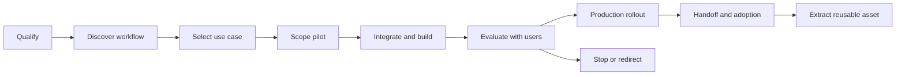

# Forward-Deployed AI Engineering Track

## Role model

For this roadmap, “80/20 FDE” means:

- roughly 80% technical work: discovery with engineers, architecture,
  integration, implementation, evals, security, deployment, and operation;
- roughly 20% customer delivery: scope, workshops, demos, status, adoption,
  training, and handoff.

It does not mean a fixed market-wide job ratio. Different FDE teams vary. The
goal is to prove full ownership from a vague problem to a measurable production
result.

## The FDE lifecycle

Stopping a weak pilot is a successful FDE outcome when the evidence says the
value, data, risk, or adoption does not justify production.

## 1. Qualify the opportunity

Determine:

- Is the problem frequent, costly, slow, risky, or strategically important?
- Does AI handle ambiguity that normal software cannot?
- Is the required data available, lawful, current, and representative?
- Can output quality be measured?
- Is there an owner and a group of real users?
- Can the solution integrate into the current workflow?
- What would make the project unsafe or uneconomic?

### Use-case ranking

Score 1–5 and explain each score:

- user/business value;
- data readiness;
- evaluation clarity;
- integration feasibility;
- adoption/owner strength;
- risk and compliance burden;
- time to first evidence.

The score starts a discussion; it is not a mathematically objective answer.

## 2. Technical discovery

### Workflow questions

- Who performs the task today?
- What event starts it?
- What systems, documents, decisions, and approvals are involved?
- Where does time or quality degrade?
- Which cases are routine and which require judgment?
- What is the current baseline: time, completion, error, cost, or escalation?
- What action occurs after the result?
- What happens when the result is wrong?

### Data questions

- Which systems own the facts?
- Is the data structured, unstructured, multimodal, or live?
- How fresh must it be?
- How are permissions represented?
- Does it contain PII, secrets, regulated content, or customer IP?
- What can leave the customer boundary?
- How are correction, retention, deletion, and audit handled?
- Can representative historical examples become an eval set?

### Integration questions

- REST/OpenAPI, database, webhook, event bus, files, GitHub, Slack/Teams, or a
  proprietary system?
- Read-only or side effects?
- End-user delegated authority or service authority?
- Rate limits, change windows, sandbox, and test environment?
- Required network, identity, and approval boundaries?
- Who owns failures after launch?

### Adoption questions

- Who is the executive sponsor, technical owner, operator, and daily user?
- What existing step must change?
- What trust/explanation is required?
- Which users should pilot first?
- How will feedback be captured?
- Who trains future users and owns the runbook?

### Required artifact

A one-page current-state workflow map containing actors, systems, data,
handoffs, delays, baseline, and failure cost.

## 3. Scope a pilot

A pilot must include:

- one narrow user group;
- one critical workflow;
- current baseline;
- representative evaluation set;
- success metric and minimum threshold;
- guardrails and unacceptable failures;
- integrations and data boundary;
- explicit in/out scope;
- time box;
- kill/redirect criteria;
- production owner if it succeeds.

### Pilot scorecard

Use four dimensions:

1. **Workflow outcome** — time saved, completion, escalation, error, or another
   real outcome.
2. **AI quality/safety** — task success, evidence/citations, tool correctness,
   unsafe action, and important slices.
3. **System performance** — latency, availability, failure recovery, and cost.
4. **Adoption** — use, override, abandonment, and qualitative trust.

Do not claim success from generic “accuracy” or a good demo.

### Kill criteria examples

- a critical slice remains below its safety threshold;
- required data cannot be legally or reliably accessed;
- integration changes exceed the pilot time box;
- latency/cost breaks the workflow economics;
- users do not adopt after workflow and training changes;
- a deterministic product solves the problem more safely.

## 4. Design and integrate

### Architecture responsibilities

- Place the solution inside the customer’s identity, network, data, and
  operational constraints.
- Separate customer-specific adapters/configuration from reusable platform
  modules.
- Decide deterministic versus model-driven steps.
- Decide long context/search/retrieval and agent topology from measured needs.
- Define provider fallback, model migration, and data boundary.
- Design eval, telemetry, audit, and human approval before high-impact tools.
- Define deployment, rollback, support, and ownership.

### Integration contract

For each external system, record:

- owner and environment;
- auth/delegation mechanism;
- schema and version;
- rate/size limits;
- timeout, retry, and idempotency;
- read/write classification;
- PII/secrets;
- approval/audit behavior;
- test/sandbox strategy;
- failure owner.

### Reuse rule

The first customer-specific path may be direct. After a second use case exposes
the same boundary, extract:

- adapter interface;
- configuration schema;
- eval template;
- deployment module;
- threat-model item;
- runbook or discovery playbook.

Do not invent a universal framework from one example.

## 5. Build and evaluate with users

Use short evidence loops:

1. domain expert labels representative examples;
2. engineer runs the baseline;
3. team groups failures by cause;
4. fix the simplest correct layer: code, data, prompt, context, retrieval,
   tool, model, workflow, or user experience;
5. rerun the complete set and important slices;
6. demo inside the actual workflow;
7. record user outcome and disagreement.

Never optimize only the examples shown in the next demo.

### Failure taxonomy

- requirement misunderstanding;
- unavailable/incorrect source data;
- retrieval/context;
- model reasoning;
- tool schema or integration;
- permission/policy;
- stale memory/state;
- latency/reliability;
- UI/workflow;
- user training/adoption;
- economics.

The taxonomy determines the fix. “Use a bigger model” is not a diagnosis.

## 6. Production rollout

Required before broad use:

- production identity and least privilege;
- tenant/user authorization;
- security review and abuse tests;
- representative eval gate;
- SLO, alert, dashboard, and runbook;
- rate/quota/cost controls;
- data retention/deletion and audit;
- canary or limited cohort;
- rollback and degraded mode;
- support owner and escalation;
- user training and feedback path;
- post-launch review date.

### Rollout stages

1. shadow or offline evaluation;
2. internal/domain-expert use;
3. limited pilot cohort;
4. canary production;
5. wider rollout if the scorecard passes;
6. pause/rollback when guardrails fail.

## 7. Handoff and adoption

Deliver:

- architecture and data-flow map;
- integration inventory;
- model/prompt/eval versions;
- operational dashboard and SLO;
- runbook and escalation;
- known limitations and unsafe use;
- cost/budget controls;
- user/admin training;
- change and rollback procedure;
- ownership matrix;
- 30-day follow-up plan.

The customer team must be able to operate the system without the FDE in the
room.

## Communication formats

### Weekly status

- **Outcome:** what changed for the user/business?
- **Evidence:** which metric, eval, trace, or demo proves it?
- **Risk:** what could stop the pilot?
- **Decision needed:** owner and date.
- **Next:** one measurable result for the coming week.

### Two-minute executive demo

1. Current workflow and baseline.
2. One end-to-end user flow.
3. Measured outcome and guardrail.
4. Current risk.
5. Proposed next decision.

### Five-minute technical demo

1. Requirements and boundary.
2. Architecture and critical flow.
3. Live success case.
4. Live or recorded failure/degraded case.
5. Eval, telemetry, security, latency, and cost evidence.
6. Known limits and next experiment.

### Architecture decision

- Context and constraints.
- Considered options.
- Decision.
- Evidence and trade-offs.
- Security/operational consequence.
- Revisit trigger.

## Scheduled practice

FDE practice is embedded in sprint artifacts; it is not extra weekly time.

### Phase 1

- Sprint 1: explain provider-neutral architecture to a non-AI engineer.
- Sprint 2: turn a vague “add AI” request into a task and eval contract.
- Sprint 3: present the RAG/long-context/search decision to a customer.
- Sprint 4: run a failure review without blaming the model.

### Phase 2

- Sprint 5: facilitate a deterministic-versus-agent workflow workshop.
- Sprint 6: defend or remove each multi-agent boundary.
- Sprint 7: define a voice latency budget from the user journey.
- Sprint 8: demo a voice handoff, outage, and degraded mode.

### Phase 3

- Sprint 9: run a security/data-boundary review.
- Sprint 10: present deployment and rollback to a platform team.
- Sprint 11: communicate an incident and SLO breach.
- Sprint 12: run production-beta readiness and make a LoRA adopt/reject
  decision.

### Phase 4

- Sprint 13: two discovery simulations, one pilot proposal, and one no-go.
- Sprint 14: technical and executive demos plus public handoff material.
- Sprint 15: changing scope, skeptical security lead, low adoption, and eval
  regression role-plays.
- Sprint 16: full discovery-to-handoff simulation.

## Capstone simulation

Use a synthetic enterprise operations scenario:

- teams receive incidents through webhooks;
- facts live in documents, a SQL database, and a GitHub-like system;
- an AI system may summarize, research, propose an action, and hand off to a
  specialist;
- write actions require human approval;
- users may interact through text or voice;
- data is multi-tenant and contains synthetic PII;
- a provider outage and latency spike occur during the pilot.

Produce:

1. qualification and discovery notes;
2. current-state workflow;
3. ranked use cases;
4. pilot charter and no-go alternative;
5. architecture and threat model;
6. integration contracts;
7. evaluation set and scorecard;
8. working platform configuration;
9. deployment, SLO, incident response, and cost;
10. executive demo, technical demo, training, and handoff;
11. reusable adapter/playbook extracted from the work.

## FDE rubric

Score 0–3:

1. Discovery depth.
2. Scope and prioritization.
3. Technical architecture/integration.
4. Eval and outcome measurement.
5. Security and production operation.
6. Stakeholder communication.
7. Adoption and handoff.
8. Reusable product thinking.

- **0:** missing or unsafe.
- **1:** completes with heavy prompting.
- **2:** independently strong.
- **3:** anticipates conflict and adapts with evidence.

Final pass: at least 20/24 with no zero in measurement, security/operations, or
handoff.

## Common failure modes

- agreeing to a technology before understanding the workflow;
- building a chatbot when the user needs an integrated action;
- choosing RAG or multiple agents because they are fashionable;
- defining success after the demo;
- using private customer examples as the evaluation set without governance;
- hiding latency, cost, or failure modes;
- treating security and identity as deployment tasks;
- optimizing model quality while users reject the workflow;
- leaving no owner, runbook, rollback, or training;
- generalizing customer-specific code too early.
