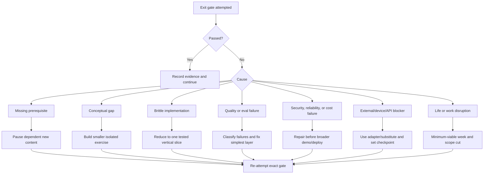

# Assessment and Recovery

The roadmap measures capability, not attendance. A sprint can use all scheduled
hours and still fail its gate. That result is useful if it is recorded honestly
and repaired.

## Valid evidence

Strong evidence:

- passing automated test or eval report;
- reproducible benchmark with inputs and environment;
- trace, metric, load report, or incident drill;
- deployed demo with documented failure behavior;
- architecture defense recording and scored feedback;
- clean setup by another person or a fresh environment;
- public commit, decision record, case study, or demo video.

Weak evidence:

- “read the documentation”;
- number of videos or hours;
- copied tutorial output;
- a happy-path screenshot;
- code that has not been run from a clean environment;
- a model response selected from several unrecorded attempts;
- an unscored self-assessment.

## Sprint assessment

Every sprint gate has four parts.

### 1. Build check

- The required vertical slice works.
- Tests cover happy path, boundary, failure, cancellation, and authorization as
  relevant.
- A fresh setup or CI run is green.

### 2. Concept defense

Without notes, explain:

- the underlying concept;
- why the selected design fits;
- one rejected alternative;
- the main failure and security boundaries;
- what evidence would change the decision.

### 3. Measurement check

Produce the applicable quality, retrieval, trajectory, latency, reliability,
cost, security, or device benchmark. A result without the environment, dataset,
model/version, and timestamp is not reproducible.

### 4. Demo and failure check

Demonstrate:

- one representative success;
- one representative failure or degraded mode;
- how telemetry reveals what happened;
- how an operator or user recovers.

## Sprint scoring

Score 0–3:

1. Conceptual depth.
2. Implementation correctness.
3. Tests and evaluation.
4. Production/security behavior.
5. Communication and evidence.

Definitions:

- **0:** missing, copied, or materially unsafe.
- **1:** works only on the happy path or with substantial prompting.
- **2:** independently correct and reasonably defended.
- **3:** measured, resilient, and adapts to a challenge.

### Status decision

- **Pass:** at least 11/15, every explicit sprint gate satisfied, and no zero.
- **Partial:** at least 8/15 with a precise repair task and no critical safety
  issue.
- **Fail:** below 8/15, an unproven prerequisite, or a critical security/data
  failure.
- **Blocked:** an external dependency prevents an otherwise prepared test; the
  fallback/substitute evidence and unblock checkpoint are recorded.

A “partial” sprint may continue only if its missing item is not a prerequisite
for the next sprint. Otherwise the new material pauses.

## Portfolio performance targets

These are initial engineering targets for controlled portfolio workloads. The
exact workload and environment must be documented. If a target is unrealistic,
change it through an architecture decision backed by user/SLO evidence—not by
quietly deleting it.

### Provider and structured-output contract

- 100% local rejection of known unsupported capability requests.
- At least 99% schema-valid final outputs over the stable contract set after
  bounded repair; report first-attempt validity separately.
- 100% idempotency in side-effect retry tests.
- 100% normalized terminal stream events for success, error, and cancellation.

### Knowledge and context

- Retrieval recall@5 target: at least 0.85 on the curated answerable set.
- Citation/source correctness target: at least 0.95.
- Zero unauthorized/deleted source retrieval in deterministic security tests.
- Report answer task success/faithfulness, latency, and cost by strategy and
  by important slice.
- Long context, exact search, and hybrid retrieval must run on the same core
  questions before selecting a default.

### Agent runtime

- 100% termination within configured step/time/token/cost budgets.
- 100% no-duplicate-side-effect result in checkpoint/retry/fault tests.
- At least 0.90 correct trajectory on the stable critical-path set by Phase 3.
- Zero unauthorized high-impact tool execution.
- Final-answer and trajectory scores are reported separately.

### Text experience

- Default production task p95 time to first text target: 2.0 seconds or lower
  under the documented steady test load.
- Cancellation is visible to the client and releases upstream work.
- Provider outage has a tested fallback or explicit degraded response.

### Voice experience

- Controlled-network p95 time to first audible response target: 1.5 seconds or
  lower.
- p95 stop-playing after valid user barge-in target: 300 milliseconds or lower.
- At least 0.85 task success on the stable voice set.
- Report false interruption, missed interruption, handoff correctness,
  reconnect success, and cost per successful session.
- Zero stale overlapping response after a confirmed interruption in the
  deterministic test set.

### Reliability and scale

- Under the declared steady load, p95 stays inside the feature SLO and
  application-originated 5xx remains below 1%; provider failures are reported
  separately.
- Spike and soak tests report saturation, queue age, and recovery time.
- Fault tests cover provider timeout, database pressure, queue backlog, process
  termination, and duplicate delivery.
- Two measured optimizations must improve the selected bottleneck without
  silently reducing quality.

### Security

- Zero cross-tenant access in automated read/write/retrieval/tool tests.
- Zero committed secrets.
- Zero high-impact action without server-side authorization and required
  approval.
- Sensitive model/tool content absent from default telemetry.
- PII retention/deletion and audit tests pass.

### Apple projects

- Every device/model-dependent path has an availability state and fallback.
- Swift concurrency tests contain no known isolation/data-race warning.
- Evaluations catch one deliberately introduced regression.
- App Intent mutation requires correct parameter resolution and confirmation.
- Instruments or benchmark evidence verifies at least one improvement.
- Core AI/MLX comparisons report model, quantization, hardware, startup, peak
  memory, speed, quality, and energy/thermal observation.

## Architecture defense

At each sprint end, answer five challenge prompts:

1. Why is the model/agent necessary?
2. Which part would you make deterministic?
3. What fails first at 10x scale?
4. How could untrusted input or identity cross a boundary?
5. Which metric or experiment would make you redesign it?

Record the answer or score it live with a peer/AI interviewer. Polished slides
do not compensate for weak answers.

## Monthly portfolio audit

Run during the final Friday or consolidation week:

- Can a fresh environment run the current vertical slice?
- Does the README describe the current architecture?
- Are model IDs, SDK versions, datasets, and benchmark dates pinned?
- Does CI include the relevant eval and security gates?
- Are test fixtures synthetic/public and free of Walmart information?
- Do public claims match actual evidence?
- Is there an unused framework/service to remove?
- Are cloud resources and budgets controlled?
- What failed in production-like testing?
- Is the next milestone smaller and clearer than the current backlog?

## Phase gates

### End Phase 1

Required:

- typed/tested FastAPI foundation;
- two-provider contract and streaming/tool failure behavior;
- measured context-strategy decision;
- explicit state/memory/harness and shared eval foundation;
- Apple model-availability fallback and one evaluation;
- DSA and system-design Phase 1 checks.

### End Phase 2

Required:

- ADK 2.0 graph with deterministic/model boundaries;
- durable single/multi-agent execution;
- MCP tool and small A2A interaction;
- text and voice handoffs, interruptions, latency traces, fallback;
- Apple AI Lab alpha;
- case studies 1 and 2 supported by reproducible evidence.

### End Phase 3

Required:

- tenant/security controls;
- reproducible GCP staging deployment and rollback;
- OpenTelemetry, SLOs, load/fault/cost evidence;
- LoRA adopt/reject experiment;
- production platform beta;
- Core AI/Core ML/MLX local evidence;
- case study 3.

### End Phase 4

Required:

- complete FDE simulation;
- public platform sample and three demos;
- Apple AI Lab and Local AI Workbench evidence;
- four case studies;
- 34 system designs with required mix;
- DSA mocks and final readiness score;
- every resume claim linked to proof.

## Recovery decision tree

## Recovery actions by failure

### Missing prerequisite

- Stop the dependent feature.
- Create one runnable isolated exercise.
- Time-box the repair to one or two blocks.
- Re-attempt the same check.

### Conceptual gap

- Explain it in plain language.
- Draw the flow.
- implement the smallest version without a framework;
- then return to the framework.

### Brittle implementation

- Remove optional layers.
- Keep one vertical slice.
- Add a reproducing test before the fix.
- Re-run fresh setup/CI.

### Evaluation failure

- Group failures by taxonomy and slice.
- Verify labels and judge calibration.
- Fix the simplest layer with causal evidence.
- Run the complete set, not only failed examples.

### Security/reliability failure

- Treat tenant leak, unauthorized action, secret exposure, duplicate side
  effect, or unrecoverable state as critical.
- Freeze related feature/deployment work.
- Add regression test and threat/runbook update.
- Resume only after the exact failure is proven closed.

### External blocker

- Record API/device/region/account requirement and evidence.
- Use a protocol/provider fake or compatible local/cloud implementation.
- Set a dated recheck.
- Do not mark the gated feature complete.

### Life/work disruption

- Use the 9.5-hour minimum-viable week.
- Drop polish and new breadth.
- Keep one core build result plus DSA/design continuity.
- Do not create time debt.

## Consolidation-week order

1. Critical security/data issues.
2. Failed prerequisite gates.
3. Broken fresh setup/CI.
4. Quality/eval regression.
5. Reliability/latency/cost.
6. Missing evidence or communication.
7. Optional polish.

If all gates pass, recovery and portfolio cleanup are legitimate outcomes.

## Drop/defer rules

Drop an item when:

- it does not affect a shipped artifact, assessment, or interview;
- it duplicates another framework or service;
- its prerequisite has not passed;
- it consumes more than two blocks without producing evidence;
- it exists only to make the stack look larger.

Do not drop:

- tests/evals;
- identity and tenant isolation;
- failure recovery;
- telemetry and cost;
- exit-gate evidence.

## Stack-drift control

During each consolidation:

- refresh model and SDK catalogs;
- check stable/preview/deprecation status;
- update provider contract tests;
- review ADK, Agent Runtime, LiveKit, MCP, A2A, OpenTelemetry, Xcode, and Apple
  SDK changes;
- change dependencies only with a migration test and reason.

Never migrate during a final demo week merely because a newer version exists.
