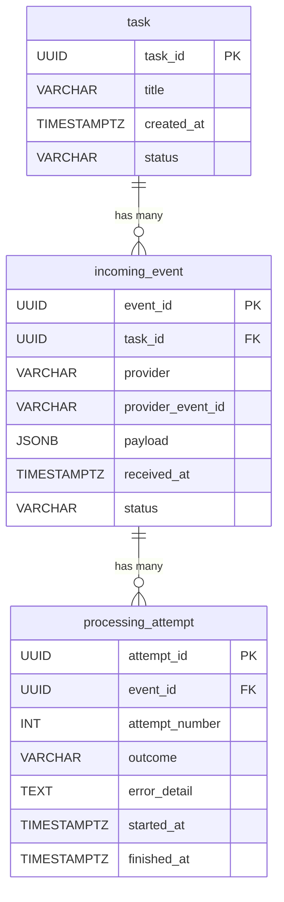

# SQL & PostgreSQL Learning Evidence Package
**Sprint:** Sprint-01-AI-Software-Foundations  
**Block:** SQL/PostgreSQL Practice & Relational Modeling  
**Date:** July 24, 2026  

---

## 1. Schema Rationale & Structural Summary

The relational persistence layer for the AI Solutions Platform consists of three core tables modeling the lifecycle of asynchronous event-driven task execution:

### Table Specifications & Constraints
1. **`task`**:
   - `task_id` (UUID, PK): Application-generated primary key matching domain `TaskRecord.task_id`.
   - `title` (VARCHAR(500), UNIQUE): Database-level enforcement of uniqueness (mirrors `DuplicateTaskTitle` domain exception).
   - `status` (VARCHAR(20), CHECK): Validated against allowed states (`pending`, `active`, `completed`, `failed`, `cancelled`).

2. **`incoming_event`**:
   - `event_id` (UUID, PK): Primary key for event tracking.
   - `task_id` (UUID, FK): Foreign key referencing `task(task_id)` with `ON DELETE CASCADE`.
   - `(provider, provider_event_id)` (UNIQUE): Composite constraint ensuring idempotency and deduplication across webhooks.

3. **`processing_attempt`**:
   - `attempt_id` (UUID, PK): Primary key for attempt attempt audit logs.
   - `event_id` (UUID, FK): Foreign key referencing `incoming_event(event_id)` with `ON DELETE CASCADE`.
   - `(event_id, attempt_number)` (UNIQUE): Prevents duplicate sequence numbers per event.

---

## 2. Index Design & Performance Rationale

Total indexes across 3 tables: **8 indexes** (5 implicit/automatic from constraints, 3 explicit/manual).

| Table | Index Name | Type / Columns | Access Pattern Target |
|---|---|---|---|
| `task` | `task_pkey` | Auto (PK on `task_id`) | Direct key-value lookup by ID |
| `task` | `uq_task_title` | Auto (UNIQUE on `title`) | Deduplication check on title insert |
| `task` | `idx_task_status_recent` | Manual (`status, created_at DESC`) | Dashboard query: recent tasks filtered by status |
| `incoming_event` | `incoming_event_pkey` | Auto (PK on `event_id`) | Direct key-value lookup by event ID |
| `incoming_event` | `uq_incoming_event_provider_dedup` | Auto (UNIQUE on `provider, provider_event_id`) | Ingest deduplication lookup |
| `incoming_event` | `idx_incoming_event_task` | Manual (`task_id`) | FK join lookup: find all events for task |
| `processing_attempt` | `processing_attempt_pkey` | Auto (PK on `attempt_id`) | Direct key-value lookup by attempt ID |
| `processing_attempt` | `uq_attempt_per_event` | Auto (UNIQUE on `event_id, attempt_number`) | Attempt history ordering & constraint check |

---

## 3. Evidence Files Created

1. **Schema Definition File**: [sql_schema.sql](file:///Users/swapnildhiman/Desktop/AI/iOSToAIJourney/AI%20Solutions%20Platform/diagnostics/Sprint-01-AI-Software-Foundations/sql_schema.sql)
2. **Transaction Rollback Proof**: [rollback_proof.sql](file:///Users/swapnildhiman/Desktop/AI/iOSToAIJourney/AI%20Solutions%20Platform/diagnostics/Sprint-01-AI-Software-Foundations/rollback_proof.sql)
3. **Parameterized Query Proof Script**: [parameterized_query_proof.py](file:///Users/swapnildhiman/Desktop/AI/iOSToAIJourney/AI%20Solutions%20Platform/diagnostics/Sprint-01-AI-Software-Foundations/parameterized_query_proof.py)
4. **Query Plan Observation Script**: [query_plan_observation.sql](file:///Users/swapnildhiman/Desktop/AI/iOSToAIJourney/AI%20Solutions%20Platform/diagnostics/Sprint-01-AI-Software-Foundations/query_plan_observation.sql)

---

## 4. Fixture Hygiene Confirmation

All test data, sample scripts, and documentation fixtures use synthetic, non-sensitive placeholders:
- Email domain: `@example.invalid`
- Database user: `postgres` / `learner@example.invalid`
- Database name: `learner_exercise`
- No production credentials, real personal names, or external system secrets are contained in any file.
