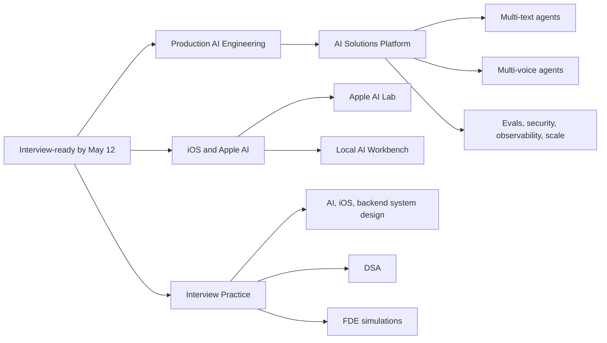

# AI FDE + iOS AI Journey — Master Index

> Active window: July 16, 2026–May 12, 2027  
> Schedule revised August 26, 2026: +6 weeks after a four-week pause. Scope unchanged.  
> Primary outcome: production AI Engineer and Forward-Deployed AI Engineer  
> Secondary differentiator: modern iOS + Apple on-device AI

This is a competency-gated program, not a list of technologies to finish.
Progress occurs only when a working artifact, measured result, or defended
system design proves the skill.

## The destination

By May 12, 2027, the portfolio must show that you can:

1. Build provider-neutral AI systems in Python and FastAPI.
2. Engineer context, memory, retrieval, evals, safety, latency, and cost rather
   than merely call a model API.
3. Build reliable single-agent, multi-agent, multi-text, and multi-voice
   systems with ADK 2.0 and LiveKit/WebRTC.
4. Deploy and operate those systems on GCP using Cloud Run, Cloud Run
   functions, event-driven services, and Agent Runtime.
5. Design AI, iOS, and selected backend systems at interview depth.
6. Run the complete AI-FDE motion: discovery, pilot, integration, measurement,
   rollout, and handoff.
7. Use WWDC26 Apple technologies in two independent Apple portfolio projects.

## Workstreams

The Apple projects are deliberately separate from the AI Solutions Platform.
They strengthen the candidate narrative without turning the backend platform
into an iOS-specific product.

## Program constraints

- Required roadmap work: 20–25 hours per week.
- IIT KGP ML program: Wednesday and Thursday, 6:00–8:00 PM, outside this
  roadmap budget.
- DSA: four hours per week.
- System design: one two-hour case each week from the beginning.
- Cadence: two-week sprints, followed by an exit gate.
- Recovery: one consolidation week after every four sprints.
- Publishing: four substantial engineering case studies, not weekly content.
- Applications: networking begins in December; selective applications begin
  in January.

## Active roadmap

1. [Competency map](./01-Competency-Map.md) — what must be deep, what only
   needs working literacy, and what is intentionally deferred.
2. [Master roadmap](./02-Master-Roadmap-Jul2026-Mar2027.md) — all dated sprints,
   consolidation weeks, outcomes, and exit gates.
3. [Portfolio architecture](./03-Portfolio-Architecture.md) — the AI platform,
   Flutter demonstration client, Apple AI Lab, and Local AI Workbench.
4. [Weekly operating system](./04-Weekly-Operating-System.md) — the sustainable
   use of the fixed office timetable.
5. [System-design track](./05-System-Design-Track.md) — 18 AI, 10 iOS, and
   6 backend cases.
6. [DSA track](./06-DSA-Track.md) — pattern revision, spaced repetition, timed
   problems, and mocks.
7. [FDE track](./07-FDE-Track.md) — discovery through production handoff.
8. [Assessment and recovery](./08-Assessment-and-Recovery.md) — objective gates,
   minimum-viable weeks, and recovery rules.
9. [Current stack snapshot](./09-Current-Stack-Snapshot.md) — dated models,
   frameworks, protocols, and preview risks.
10. [Progress ledger](./PROGRESS.md) — the only source of truth for status and
    evidence.
11. [Validation report](./VALIDATION.md) — calendar, count, coverage,
    currentness, and consistency checks.

## Detailed material

Only the immediate horizon is detailed. This prevents fast-moving model,
framework, and cloud instructions from becoming stale.

- [Sprint 00 — Orientation and diagnostics](./sprints/Sprint-00-Orientation.md)
- [Restart gate — August 26–30, 2026](./sprints/Restart-Gate-2026-08-26.md)
- [Sprint 01 — AI software and backend foundations](./sprints/Sprint-01-AI-Software-Foundations.md)
- [Sprint 02 — Model API and context engineering](./sprints/Sprint-02-Model-API-and-Context.md)

Later sprint guides are authored during the preceding consolidation checkpoint.

## Portfolio deliverables

### AI Solutions Platform

A reusable production platform containing model adapters, prompt and context
management, retrieval, memory, an ADK 2.0 runtime, MCP/A2A interoperability,
text and voice sessions, evals, observability, enterprise controls, and GCP
deployment. A thin Flutter client exists only to demonstrate text and voice.

### Apple AI Lab

A separate SwiftUI project for Foundation Models v2, multimodal prompts,
Dynamic Profiles, Evaluations, App Intents, Core Spotlight, current Swift
Concurrency, and device-availability fallbacks.

### Local AI Workbench

A separate Mac-first project for Core AI generative-model deployment, a
traditional Core ML model, MLX/SLM experiments, quantization, profiling, and
local-versus-cloud benchmarks.

## Non-negotiable learning rules

1. Learn the concept before the framework abstraction.
2. Use official documentation as the primary source.
3. Every model or provider claim must be measured on this workload.
4. RAG is a context strategy, not the default answer to every knowledge problem.
5. Deterministic code owns predictable work; models own ambiguous reasoning.
6. A multi-agent design must justify why one agent plus tools is insufficient.
7. Security, evals, telemetry, latency, and cost begin before deployment.
8. Optional blocks replace missed required work; they never inflate the
   baseline.
9. A failed exit gate pauses new content until the gap is repaired.
10. Model IDs and preview APIs are refreshed at every phase boundary.

## Current status

The active block is the **restart gate, August 26–30, 2026** — see
[`sprints/Restart-Gate-2026-08-26.md`](./sprints/Restart-Gate-2026-08-26.md).
Orientation passed July 20. Sprint 1 was attempted July 20–August 2, never
closed, and resumes as a repair sprint on August 31.

Historically, start with [Sprint 00](./sprints/Sprint-00-Orientation.md), then record every
diagnostic result and evidence link in [PROGRESS.md](./PROGRESS.md). Do not use
the legacy May schedule; it is retained only in
[the pre-WWDC26 archive](./archive/pre-WWDC26/README.md).

