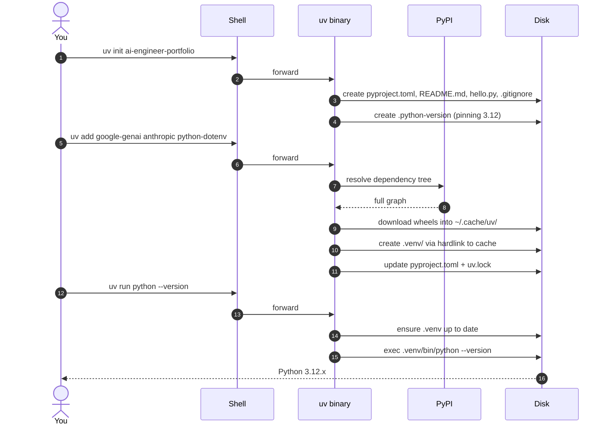
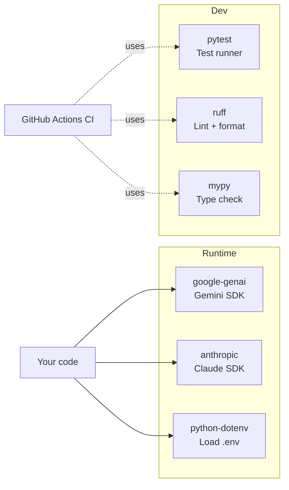

# 02 — Project Skeleton

## 🧒 Layman explanation

A "project skeleton" is the boring scaffolding that **every** Python project starts with. Once you have it, you can focus on real work for the next 8 months without re-deciding folder structure.

Today's skeleton is small. You'll add to it weekly — by Week 10 it'll have FastAPI, a Dockerfile, tests, GitHub Actions, and more. The point of today is just: **create the project**, **add the two SDKs**, and **be ready to write code**.

---

## 🔧 Technical deep-dive — `pyproject.toml`

`pyproject.toml` is the **single config file** that replaces all of:

- `setup.py`
- `setup.cfg`
- `requirements.txt`
- `requirements-dev.txt`
- `.flake8`
- `pytest.ini`
- `mypy.ini`

Modern Python projects keep everything here. PEP 621 standardized it; PEP 735 added dependency groups. `uv` reads/writes it natively.

A minimal `pyproject.toml` looks like:

```toml
[project]
name = "ai-engineer-portfolio"
version = "0.0.1"
description = "Career switch portfolio: Doc-Talk, OSS-Docs RAG, Researcher Agent"
requires-python = ">=3.12"
dependencies = [
    "google-genai>=0.8.0",      # Gemini SDK (NOT "google-generativeai" — that's the old one)
    "anthropic>=0.40.0",        # Claude SDK
    "python-dotenv>=1.0.0",     # .env loader
]

[dependency-groups]
dev = [
    "pytest>=8.0",
    "ruff>=0.6",
    "mypy>=1.10",
]

[tool.ruff]
line-length = 100
target-version = "py312"

[tool.ruff.lint]
select = ["E", "F", "I", "B", "UP"]   # errors, pyflakes, isort, bugbear, pyupgrade

[tool.mypy]
python_version = "3.12"
strict = true
```

> ⚠️ **Package name gotcha:** `google-genai` is the **new unified Gemini SDK** that supports BOTH Google AI Studio and Vertex AI from one client. The older `google-generativeai` is being deprecated. Use `google-genai`.

---

## 💻 Hands-on — create the project

Open a terminal in your code workspace folder (you can use `~/Desktop/AI/code/` or wherever you want — I'll assume `~/Desktop/AI/code/` since that's near your study notes):

```bash
# 1. Pick a parent folder
mkdir -p ~/Desktop/AI/code
cd ~/Desktop/AI/code

# 2. Initialize the project (uv creates pyproject.toml + .venv on-demand)
uv init ai-engineer-portfolio
cd ai-engineer-portfolio

# 3. Pin Python version
uv python pin 3.12

# 4. Add runtime dependencies
uv add google-genai anthropic python-dotenv

# 5. Add dev dependencies (in the dev group)
uv add --dev pytest ruff mypy

# 6. Verify environment is healthy
uv run python --version       # Expected: Python 3.12.x
uv run python -c "import google.genai; print(google.genai.__version__)"
uv run python -c "import anthropic; print(anthropic.__version__)"
```

### What just happened



The `.venv/` folder lives inside your project. Every `uv run …` ensures the venv is in sync with `pyproject.toml` before running.

---

## 📂 Folder structure after this lesson

```
~/Desktop/AI/code/ai-engineer-portfolio/
├── .gitignore           ← uv generated; includes .venv/
├── .python-version      ← pins 3.12
├── .venv/               ← actual venv (don't commit)
├── README.md
├── hello.py             ← placeholder uv created — feel free to delete
├── pyproject.toml       ← your project config
└── uv.lock              ← deterministic lockfile (commit this!)
```

### Initialize git now

```bash
git init -b main
git add .
git commit -m "chore: scaffold ai-engineer-portfolio with uv"
```

You'll push this to GitHub on Thursday (Day 3).

---

## 📊 Where does each dependency go in the stack?



---

## 📚 References

- **PEP 621** (project metadata in `pyproject.toml`) — https://peps.python.org/pep-0621/
- **`uv` `pyproject.toml` guide** — https://docs.astral.sh/uv/concepts/projects/
- **Ruff config reference** — https://docs.astral.sh/ruff/configuration/
- **Mypy config reference** — https://mypy.readthedocs.io/en/stable/config_file.html

---

## ✅ Exit criteria

- [ ] I have `~/Desktop/AI/code/ai-engineer-portfolio/` with a `pyproject.toml`
- [ ] `uv run python --version` prints 3.12.x
- [ ] `uv run python -c "import google.genai"` works without error
- [ ] `uv run python -c "import anthropic"` works without error
- [ ] `uv.lock` exists in the project folder
- [ ] `git status` shows the project is committed

**Next:** [`03-env-file-and-secrets.md`](03-env-file-and-secrets.md) — set up `.env` for API keys.

---

