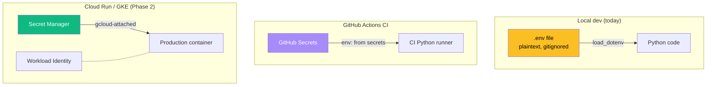

# 03 — `.env` File and Secrets

## 🧒 Layman explanation

API keys are **passwords for machines**. Anyone who has your `GOOGLE_API_KEY` can spend money on your account, just like anyone with your credit card can buy things. There are 3 sins you must never commit:

1. **Don't hard-code keys in `.py` files** — they end up in git history, screenshots, Stack Overflow questions
2. **Don't email keys to yourself** — your email provider's logs leak someday
3. **Don't paste keys into ChatGPT** ← yes, people do this. The model might mention it later in a different chat.

The standard pattern is a **`.env` file**: a tiny file at the project root listing your keys as `KEY=value`. The file is **never committed to git** (it's in `.gitignore`). At program startup, you load it with `python-dotenv` so `os.environ["GOOGLE_API_KEY"]` works.

In production (Cloud Run, GKE), keys come from **Secret Manager**, not `.env`. Same code; different source. You'll do that in Phase 2.

---

## 🔧 Technical deep-dive — the secrets lifecycle



The pattern: **same code reads from `os.environ`. The *source* of the value changes per environment.** This is the 12-factor app principle in practice.

### Why `python-dotenv` and not `os.getenv` only?

`python-dotenv` reads a file and *injects* its contents into `os.environ` early in your process. After that, `os.environ.get("GOOGLE_API_KEY")` returns the right value. In production (Cloud Run), you skip `python-dotenv` entirely because the platform already injects env vars — your code remains the same.

```python
import os
from dotenv import load_dotenv

# In dev: load from .env (no-op in prod where env vars are already set)
load_dotenv()

api_key = os.environ["GOOGLE_API_KEY"]      # fails loudly if missing
```

> 💡 Use `os.environ["KEY"]` (bracket notation) for **required** keys — it raises a clear KeyError if missing.
> Use `os.environ.get("KEY", default)` only for **optional** keys.

---

## 💻 Hands-on — create the `.env` flow

In your project root (`ai-engineer-portfolio/`):

### 1. Create a `.env.example` (committed, no secrets)

```bash
cd ~/Desktop/AI/code/ai-engineer-portfolio

cat > .env.example <<'EOF'
# Copy this to .env and fill in real values.
# .env is gitignored — never commit real keys.

# ---- Gemini via Google AI Studio (dev) ----
# Get at: https://aistudio.google.com/apikey
GOOGLE_API_KEY=

# ---- Gemini via Vertex AI (prod) ----
# Filled on Day 4 (Friday). Leave blank for now.
GOOGLE_CLOUD_PROJECT=
GOOGLE_CLOUD_LOCATION=us-central1
GOOGLE_GENAI_USE_VERTEXAI=false

# ---- Anthropic ----
# Get at: https://console.anthropic.com/settings/keys
ANTHROPIC_API_KEY=
EOF
```

### 2. Create your real `.env` by copying

```bash
cp .env.example .env
# Now edit .env in VS Code and paste your real keys when you get them
```

### 3. Confirm `.gitignore` excludes `.env`

`uv init` already created a sensible `.gitignore`. Check:

```bash
grep -E "^\.env$" .gitignore || echo ".env" >> .gitignore
grep -E "^\.env$" .gitignore     # should print: .env
```

### 4. Test that loading works (without keys yet — that's fine)

Create `code/check_env.py`:

```python
"""Sanity check that python-dotenv loads .env correctly."""
import os
from dotenv import load_dotenv

load_dotenv()

keys = ["GOOGLE_API_KEY", "ANTHROPIC_API_KEY", "GOOGLE_CLOUD_PROJECT"]
for k in keys:
    val = os.environ.get(k)
    status = "✅ set" if val else "⚠️  empty (fill in Day 1 lesson 4–6)"
    masked = (val[:6] + "…" + val[-4:]) if val and len(val) > 12 else val
    print(f"{k:30s} {status:30s} {masked or ''}")
```

Run it:

```bash
uv run python code/check_env.py
```

You'll see all three as "empty" right now — you fill them in lessons 4 and 6.

### 5. Commit the example

```bash
git add .env.example .gitignore code/check_env.py
git commit -m "chore: add .env.example and env loader sanity check"
```

> ⚠️ **CRITICAL:** Never `git add .env`. Run `git status` and confirm `.env` is **not** in the staged list before any commit. If you ever accidentally commit a key:
> 1. **Rotate the key immediately** (revoke + create new in the provider's console)
> 2. Then clean git history (BFG repo-cleaner)
> 3. Force-push (and tell anyone who pulled to re-clone)

---

## 📂 What your folder looks like now

```
ai-engineer-portfolio/
├── .env                 ← real keys (gitignored ✋ never commit)
├── .env.example         ← committed, placeholder for keys
├── .gitignore           ← contains .env + .venv + __pycache__
├── .python-version
├── README.md
├── code/
│   └── check_env.py     ← new today
├── pyproject.toml
└── uv.lock
```

---

## 🔐 The 5 rules for handling keys (frame and put on your wall)

1. **Never** commit `.env` files
2. **Always** rotate any key that touched a screenshot, chat, or email
3. **Prefer ADC over API keys** in Google services (Day 4 lesson)
4. **Set spend limits** on every provider (Anthropic, OpenAI, Cohere all let you cap monthly spend)
5. **Use a different key per app/environment** — so one leak doesn't compromise everything

---

## 📚 References

- **`python-dotenv` docs** — https://github.com/theskumar/python-dotenv
- **The Twelve-Factor App: Config** — https://12factor.net/config
- **Anthropic key management** — https://docs.anthropic.com/en/api/api-keys
- **Google AI Studio key management** — https://aistudio.google.com/apikey
- **GitGuardian's "secrets sprawl" report** — annual; sobering read on leaked keys in public repos

---

## ✅ Exit criteria

- [ ] `.env` exists with placeholders for `GOOGLE_API_KEY` and `ANTHROPIC_API_KEY`
- [ ] `.env.example` exists and is committed
- [ ] `.gitignore` contains `.env`
- [ ] `uv run python code/check_env.py` prints all three keys as "empty" (we fill them next)
- [ ] I understand why ADC is preferred over API keys for Google in production

**Next:** [`04-gemini-api-key-and-sdk.md`](04-gemini-api-key-and-sdk.md) — get your Gemini key and make your first call.

---

🌀 *Magic applied with Wibey VS Code Extension 🪄*
