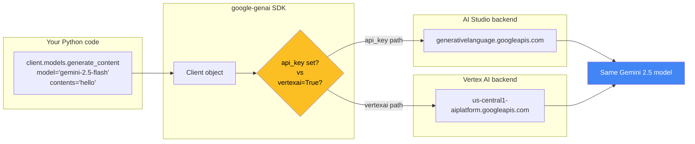

# 04 — Gemini API Key + `google-genai` SDK

## 🧒 Layman explanation

Gemini is Google's family of LLMs. There are **two ways** to call them:

| Access path        | Best for              | Auth                   | Free tier?           |
|--------------------|-----------------------|------------------------|----------------------|
| **Google AI Studio** | Dev / prototyping     | API key in `.env`      | Yes, generous        |
| **Vertex AI**        | Production            | ADC / Workload Identity| No, but cheap        |

**Today** you'll set up the **AI Studio path** — free, fast, perfect for hello-world. **On Friday (Day 4)** you'll add the **Vertex path** — same code, just a different client init.

The brilliant part: the `google-genai` SDK exposes **one client class** that talks to both. You flip a flag and your code routes through Vertex instead of AI Studio. Same `client.models.generate_content(...)`. No code rewrite.

---

## 🔧 Technical deep-dive — `google-genai` SDK architecture



The same model lives behind both backends. AI Studio's pricing has a free tier; Vertex doesn't but adds: VPC-SC, regional residency, IAM controls, audit logs.

### Initializing the client (two styles)

```python
from google import genai

# Style A — AI Studio (dev). Uses GOOGLE_API_KEY from env.
client = genai.Client(api_key=os.environ["GOOGLE_API_KEY"])

# Style B — Vertex AI (prod). Uses Application Default Credentials (ADC).
client = genai.Client(
    vertexai=True,
    project=os.environ["GOOGLE_CLOUD_PROJECT"],
    location=os.environ.get("GOOGLE_CLOUD_LOCATION", "us-central1"),
)
```

### Auto-routing pattern (the FDE move)

```python
USE_VERTEX = os.environ.get("GOOGLE_GENAI_USE_VERTEXAI", "false").lower() == "true"

client = (
    genai.Client(
        vertexai=True,
        project=os.environ["GOOGLE_CLOUD_PROJECT"],
        location=os.environ.get("GOOGLE_CLOUD_LOCATION", "us-central1"),
    )
    if USE_VERTEX
    else genai.Client(api_key=os.environ["GOOGLE_API_KEY"])
)
```

One env var flips dev ↔ prod. **This is the kind of code that gets you hired**: it shows you understand both auth paths and you've made them symmetric.

---

## 💻 Hands-on — get your AI Studio API key

### Step 1 — Open AI Studio and create a key

1. Open https://aistudio.google.com/apikey in a browser
2. Sign in with your personal Google account (NOT your @walmart account — corporate accounts can't manage personal keys)
3. Click **Create API key**
4. Either pick "Create API key in new project" (recommended for clean separation) **or** pick an existing project
5. Copy the key — it starts with `AIza…` and is ~40 characters

### Step 2 — Paste into `.env`

Open `~/Desktop/AI/code/ai-engineer-portfolio/.env`:

```bash
GOOGLE_API_KEY=AIzaSyA_your_real_key_here...
```

### Step 3 — Verify it loads

```bash
cd ~/Desktop/AI/code/ai-engineer-portfolio
uv run python code/check_env.py
```

You should now see:

```
GOOGLE_API_KEY                 ✅ set                          AIzaSy…wxyz
ANTHROPIC_API_KEY              ⚠️  empty                       
GOOGLE_CLOUD_PROJECT           ⚠️  empty                       
```

### Step 4 — Confirm the SDK can authenticate

```bash
uv run python -c "
from google import genai
import os
from dotenv import load_dotenv
load_dotenv()
client = genai.Client(api_key=os.environ['GOOGLE_API_KEY'])
models = list(client.models.list())
print(f'Auth works ✅ — {len(models)} models reachable')
print(f'First 3:', [m.name for m in models[:3]])
"
```

Expected output:

```
Auth works ✅ — XX models reachable
First 3: ['models/gemini-2.5-flash', 'models/gemini-2.5-pro', ...]
```

If you see `403 Forbidden` or `API_KEY_INVALID`, the key didn't paste cleanly — try again.

---

## 🎯 Setting a free-tier quota cap (do this now)

AI Studio's free tier is generous but you want a safety net. Open https://aistudio.google.com/apikey, click your key, and confirm "Restrict to specific APIs" if available. For deeper limits, link the key to a GCP project and set Cloud Quotas there (you'll do that Friday Day 4).

---

## 📊 What your project looks like now

```
ai-engineer-portfolio/
├── .env                    ← now has GOOGLE_API_KEY filled
├── .env.example
├── code/
│   └── check_env.py
├── pyproject.toml          ← has google-genai dependency
└── uv.lock
```

---

## 🚨 The four Gemini model names you must remember

| Model name                | Best for                                     | Context window | Cost rank |
|---------------------------|----------------------------------------------|----------------|-----------|
| `gemini-2.5-pro`          | Reasoning, complex chains, code              | 1M             | $$$       |
| `gemini-2.5-flash`        | **Default workhorse** — your daily driver    | 1M             | $$        |
| `gemini-2.5-flash-lite`   | High-volume batch, simple extraction         | 1M             | $         |
| `gemini-embedding-001`    | Embeddings (not for text generation)         | 8K input       | $         |

**Rule of thumb:** Start with `gemini-2.5-flash`. Only escalate to `pro` when Flash visibly fails. Only drop to `flash-lite` when you've done 1000s of calls and need cost relief.

---

## 📚 References

- **`google-genai` SDK reference** — https://googleapis.github.io/python-genai/
- **Gemini API quickstart** — https://ai.google.dev/gemini-api/docs/quickstart
- **Model list + pricing** — https://ai.google.dev/gemini-api/docs/models
- **AI Studio key management** — https://aistudio.google.com/apikey

---

## ✅ Exit criteria

- [ ] I have an active Gemini API key
- [ ] It's pasted into `.env` as `GOOGLE_API_KEY=AIza…`
- [ ] `uv run python code/check_env.py` shows `GOOGLE_API_KEY ✅ set`
- [ ] `client.models.list()` returned a non-empty list of models
- [ ] I can name the 3 generation models + 1 embedding model

**Next:** [`05-first-gemini-call.md`](05-first-gemini-call.md) — your first real LLM call.

---

