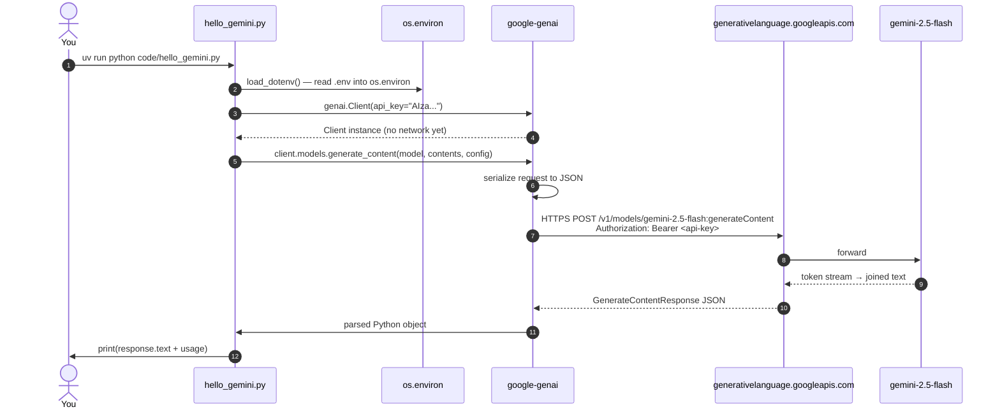

# 05 — Your First Gemini Call

## 🧒 Layman explanation

You're going to write 15 lines of Python that send "hello" to Gemini 2.5 Flash and print the response. Tiny. But this is the moment your machine talks to a frontier LLM for the first time on your own infrastructure. From here, everything else in the next 8 months is **just adding to this skeleton**.

Three things you'll learn from this one script:

1. **What a `Client` is** and how it holds your auth
2. **What `generate_content` returns** (a structured object, not just a string)
3. **What `usage_metadata` looks like** — the field every cost dashboard reads

---

## 🔧 Technical deep-dive

### The `GenerateContentResponse` object

When you call `client.models.generate_content(...)`, what you get back is **not** a string. It's a rich object:

```python
GenerateContentResponse(
    candidates=[
        Candidate(
            content=Content(
                parts=[Part(text="Hello! I'm Gemini...")],
                role="model",
            ),
            finish_reason=FinishReason.STOP,
            safety_ratings=[...],
        ),
    ],
    usage_metadata=UsageMetadata(
        prompt_token_count=8,
        candidates_token_count=24,
        total_token_count=32,
    ),
    model_version="gemini-2.5-flash",
)
```

- `.text` is a **shortcut** that pulls `candidates[0].content.parts[0].text`. Use it when you have exactly one candidate.
- `.usage_metadata` is the **billing footprint** — read this and log it for every call.
- `.candidates[0].finish_reason` tells you *why* generation stopped — `STOP` (natural), `MAX_TOKENS` (you cut it off), `SAFETY` (a filter fired).

### The `config=` parameter — your tuning surface

Every behavior knob lives in a `GenerateContentConfig`:

```python
from google.genai import types

response = client.models.generate_content(
    model="gemini-2.5-flash",
    contents="What is 2 + 2?",
    config=types.GenerateContentConfig(
        system_instruction="You are a math tutor for 5-year-olds.",
        temperature=0.2,
        max_output_tokens=200,
        thinking_config=types.ThinkingConfig(thinking_budget=0),  # disable thinking for speed
    ),
)
```

The full list of knobs: `system_instruction`, `temperature`, `top_p`, `top_k`, `max_output_tokens`, `stop_sequences`, `response_mime_type`, `response_schema`, `tools`, `tool_config`, `safety_settings`, `thinking_config`.

You'll meet each of these over the next 9 weeks.

---

## 💻 Hands-on — write `hello_gemini.py`

In your project's `code/` folder, create `hello_gemini.py`:

```python
"""First Gemini call. Day 1 of the AI Engineer roadmap."""
import os

from dotenv import load_dotenv
from google import genai
from google.genai import types

load_dotenv()

# 1. Initialize a client (AI Studio path — uses GOOGLE_API_KEY env var)
client = genai.Client(api_key=os.environ["GOOGLE_API_KEY"])

# 2. Make the call
response = client.models.generate_content(
    model="gemini-2.5-flash",
    contents="Introduce yourself in one sentence.",
    config=types.GenerateContentConfig(
        temperature=0.7,
        max_output_tokens=100,
    ),
)

# 3. Print the human-readable answer
print("=== Response ===")
print(response.text)

# 4. Print the cost footprint (you'll do this for every call from now on)
print("\n=== Usage ===")
print(f"Prompt tokens:    {response.usage_metadata.prompt_token_count}")
print(f"Output tokens:    {response.usage_metadata.candidates_token_count}")
print(f"Total tokens:     {response.usage_metadata.total_token_count}")

# 5. Bonus — finish_reason tells you why generation stopped
print(f"\nFinish reason:    {response.candidates[0].finish_reason}")
```

Run it:

```bash
cd ~/Desktop/AI/code/ai-engineer-portfolio
uv run python code/hello_gemini.py
```

Expected output:

```
=== Response ===
Hello! I'm Gemini, a large language model developed by Google AI.

=== Usage ===
Prompt tokens:    7
Output tokens:    15
Total tokens:     22

Finish reason:    FinishReason.STOP
```

🎉 **You just made your first LLM call.** Save this output as a screenshot — it's the beginning.

---

## 📊 What just happened over the wire



This whole loop typically takes **400–900ms** for a short prompt to `gemini-2.5-flash`. The model latency is in the 200–400ms range; the rest is network + JSON serde.

---

## 🧪 Experiment — vary the temperature

Edit the temperature to 0.0 and run twice. The output should be **identical** (or nearly so). Now set it to 1.5 and run twice — the outputs diverge. This is your felt experience of what temperature does.

```python
# Run the script with these three values and observe:
config = types.GenerateContentConfig(temperature=0.0, max_output_tokens=100)   # deterministic
config = types.GenerateContentConfig(temperature=0.7, max_output_tokens=100)   # balanced
config = types.GenerateContentConfig(temperature=1.5, max_output_tokens=100)   # chaotic
```

---

## 🧪 Bonus — try streaming

Add a second script `code/hello_gemini_streaming.py`:

```python
"""Streaming version — feels 5× faster even though it isn't."""
import os
from dotenv import load_dotenv
from google import genai

load_dotenv()
client = genai.Client(api_key=os.environ["GOOGLE_API_KEY"])

for chunk in client.models.generate_content_stream(
    model="gemini-2.5-flash",
    contents="Write a haiku about Mumbai monsoon rain.",
):
    print(chunk.text, end="", flush=True)

print()  # final newline
```

Run it — you'll see the haiku appear word-by-word. **This UX is non-negotiable** in any chat product; you now have a working pattern for it.

---

## 🐛 If things break

| Symptom                                | Likely cause                                                            |
|----------------------------------------|--------------------------------------------------------------------------|
| `KeyError: 'GOOGLE_API_KEY'`           | `.env` not loaded — make sure `load_dotenv()` runs before reading env    |
| `403 Forbidden — API_KEY_INVALID`      | Wrong key or pasted whitespace; regenerate in AI Studio                  |
| `404 NOT_FOUND — model gemini-...`     | Model name typo; try `gemini-2.5-flash` exactly                          |
| `429 Too Many Requests`                | Hit free-tier quota; wait a minute and try again                         |
| Hangs forever                          | Walmart corporate proxy — set `HTTPS_PROXY` env or use personal hotspot |
| `safety_ratings` blocks the response   | Try a less provocative prompt                                             |

---

## 📚 References

- **`client.models.generate_content` reference** — https://googleapis.github.io/python-genai/genai.html#genai.models.Models.generate_content
- **Generation config schema** — https://ai.google.dev/api/generate-content
- **Gemini cookbook (official samples)** — https://github.com/google-gemini/cookbook
- **Eugene Yan: "On using LLMs"** — https://eugeneyan.com/writing/llms/

---

## ✅ Exit criteria

- [x] `code/hello_gemini.py` exists and is committed
- [x] Running it prints a Gemini response + usage metadata
- [x] I tried temperature 0.0 vs 1.5 and observed the difference
- [x] I tried the streaming variant
- [x] I understand `response.text` vs `response.candidates[0].content.parts[0].text`

**Next:** [`06-anthropic-sdk-and-key.md`](06-anthropic-sdk-and-key.md) — do the equivalent with Claude.

---

🌀 *Magic applied with Wibey VS Code Extension 🪄*
