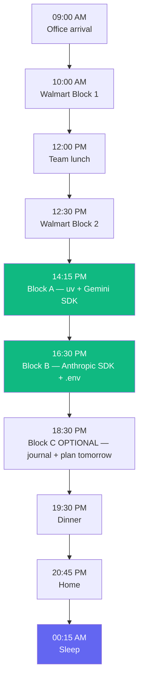

# 07 — End-of-Day Checklist

> 18:30, lights low, dinner break. Run this checklist before closing the laptop.

---

## ✅ Verification — does everything still work?

Run these one by one. **All four must pass** before you call Day 1 done.

```bash
cd ~/Desktop/AI/code/ai-engineer-portfolio

# 1. Python is 3.12
uv run python --version
# Expected: Python 3.12.x

# 2. Both SDKs importable
uv run python -c "from google import genai; import anthropic; print('SDKs OK')"
# Expected: SDKs OK

# 3. Gemini hello-world
uv run python code/hello_gemini.py
# Expected: a response + usage metadata

# 4. Anthropic hello-world
uv run python code/hello_anthropic.py
# Expected: a response + usage
```

If any step fails, refer back to the lesson for that step before moving on.

---

## 🔐 Security check — is your `.env` safe?

```bash
# .env MUST NOT appear in tracked files
git status --short | grep -E "^\?\?.*\.env$" && echo "OK — .env is untracked" || echo "DANGER — investigate"

# .env MUST be in .gitignore
grep -E "^\.env$" .gitignore && echo "OK — .env gitignored" || echo "DANGER — add .env to .gitignore"
```

Both checks must print **OK**.

---

## 💾 Commit your work

```bash
git add -A
git status
# Review what you're about to commit — confirm .env is NOT in the list

git commit -m "feat: Day 1 — uv project + Gemini + Anthropic hello-world

- Initialize uv project with Python 3.12
- Add google-genai, anthropic, python-dotenv
- Add .env.example with placeholders
- Add hello_gemini.py and hello_anthropic.py
- Add check_env.py sanity script"
```

(You'll push to GitHub on Thursday Day 3 once the portfolio repo is created.)

---

## 📓 Journal entry (3 minutes)

Open a notes app (Apple Notes / Notion / Obsidian) and write **one paragraph** answering:

1. What surprised me today?
2. What was harder than expected?
3. What's the one thing I want to remember tomorrow?

This is your **learning log**. By Week 35 you'll have ~245 entries and they'll become source material for your blog posts + interview stories.

---

## 🌙 Set up for tomorrow (Wed May 20)

Tomorrow is **Hashnode + kickoff post draft**. Prep work — 5 min only:

- [ ] Sketch on paper (or in Notes): "Why am I doing this 8-month plan? Who is my future self?"
- [ ] Note down 3 candidate post titles
- [ ] Pick a personal email to use for the Hashnode account

---

## 📊 Day 1 retrospective — diagram



---

## ✅ Final Day 1 exit criteria (the whole day)

- [ ] `uv` installed, Python 3.12 managed by uv
- [ ] Project `ai-engineer-portfolio` initialized with `pyproject.toml`
- [ ] `google-genai`, `anthropic`, `python-dotenv` installed
- [ ] `.env` with `GOOGLE_API_KEY` and `ANTHROPIC_API_KEY` filled
- [ ] `.env.example` committed, `.env` gitignored
- [ ] `hello_gemini.py` runs and prints a response
- [ ] `hello_anthropic.py` runs and prints a response
- [ ] All work committed locally with a clean message
- [ ] Journal entry written

✅ Tomorrow: [`../Day-02-Wed-May-20/README.md`](../Day-02-Wed-May-20/README.md)

---

🌀 *Magic applied with Wibey VS Code Extension 🪄*
