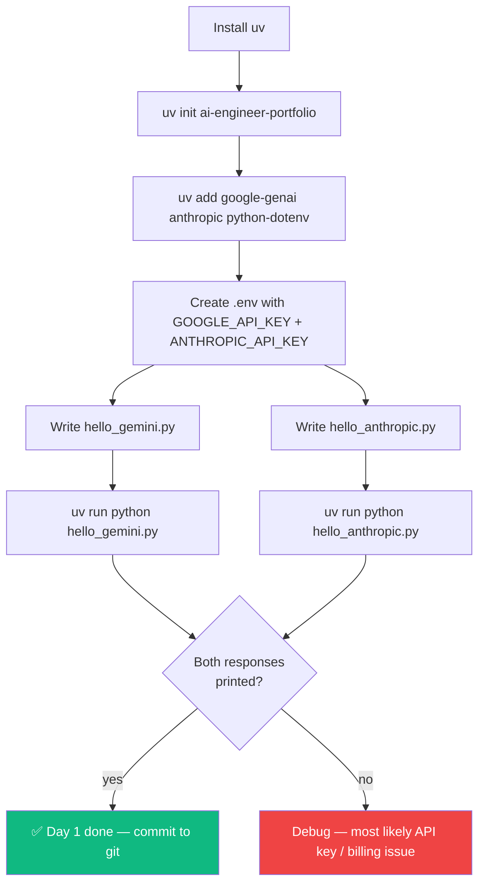

# Day 1 — Tuesday, May 19, 2026

> **Goal:** End the day with a working Python environment that can call **both Gemini and Claude** and print back a response — using API keys loaded from a `.env` file.

**Time budget:** ~4 hours (Office Block A 14:15–16:15 + Block B 16:30–18:30)

---

## Lessons (read in order)

| #  | File                                          | What you'll learn                                  | Est. time |
|----|-----------------------------------------------|----------------------------------------------------|-----------|
| 1  | [`01-install-uv-and-python.md`](01-install-uv-and-python.md) | Install `uv`, create project, install Python 3.12 | 30 min    |
| 2  | [`02-project-skeleton.md`](02-project-skeleton.md) | `pyproject.toml`, virtual env, ruff + mypy        | 30 min    |
| 3  | [`03-env-file-and-secrets.md`](03-env-file-and-secrets.md) | `.env` flow, `python-dotenv`, `.gitignore`        | 20 min    |
| 4  | [`04-gemini-api-key-and-sdk.md`](04-gemini-api-key-and-sdk.md) | Get AI Studio key + `google-genai` install        | 45 min    |
| 5  | [`05-first-gemini-call.md`](05-first-gemini-call.md) | Your first `client.models.generate_content` call  | 45 min    |
| 6  | [`06-anthropic-sdk-and-key.md`](06-anthropic-sdk-and-key.md) | Anthropic key + `anthropic` SDK install + call    | 30 min    |
| 7  | [`07-end-of-day-checklist.md`](07-end-of-day-checklist.md) | Verify everything works, commit, sleep            | 10 min    |

---

## Big picture for today



---

## What success looks like at 18:30

Your terminal should produce both of these:

```bash
$ uv run python hello_gemini.py
Hello! I'm Gemini 2.5 Flash. I can help with writing, analysis, coding, and more.

$ uv run python hello_anthropic.py
Hi! I'm Claude, made by Anthropic. How can I help you today?

$ git status
On branch main
nothing to commit, working tree clean
```

If you see this, **you are done for Day 1**. Close laptop, take a walk, eat dinner.

---

