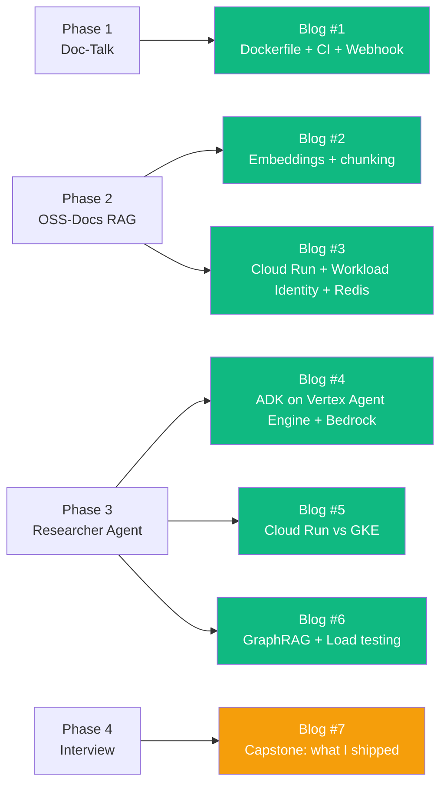

# 01 — Why the Blog Matters (it's a hiring tool)

## 🧒 Layman explanation

A blog post in 2026 is the **single highest-leverage thing a self-taught engineer can produce**. Here's why:

- A LinkedIn post is read once and forgotten
- A GitHub repo is judged on whether it compiles
- A blog post is read **before** the recruiter messages you. It's how they decide whether to bother messaging

Recruiters and hiring managers Google your name. The top 2–3 results are your **personal brand**. By the time you have 5 substantive blog posts, those results are *yours*, not random LinkedIn auto-posts.

A senior engineer who blogs 1× per month for 6 months has built a *moat*. That's what you're building.

---

## 🔧 The economics

| Action                 | Time invested | Lifetime impact                                      |
|------------------------|---------------|------------------------------------------------------|
| 1 blog post (2K words) | 5–8 hours     | Read 100–500 times, cited in interviews 5+ times     |
| 1 LinkedIn post        | 30 min        | Skimmed 1× over 48 hrs                                |
| 1 GitHub commit        | 5 min         | Looked at if someone reads your repo (~10/yr)         |
| 1 conference talk      | 40 hours      | 100–500 viewers + recording on YouTube                |
| 1 PR to OSS project    | 2–10 hours    | 10s of devs see your name in changelog                |

A blog post returns **~50× the per-hour ROI** vs LinkedIn over 6 months. The compounding part is that future posts can link to past posts, so your "moat" deepens.

---

## What FDE hiring managers screen for in a blog

Reading 5 candidate blogs in a row, I'd be looking for:

1. **You ship things.** Posts about a thing you built, not just opinions
2. **You measure things.** Numbers in the post (latency, $/req, accuracy %)
3. **You can teach.** Diagrams, structure, a reader actually walks away knowing something
4. **You're honest about tradeoffs.** "I tried X, it failed for reason Y, so I switched to Z"
5. **You write in your own voice.** Not LLM-slop — markedly human

Your kickoff post (Wed/Sat) should hit at least 3 of these. By post #3 you should hit all 5.

---

## Why Hashnode vs Medium vs personal site

| Platform     | Pros                                          | Cons                                          | Verdict for you   |
|--------------|-----------------------------------------------|------------------------------------------------|-------------------|
| **Hashnode** | Free custom domain, dev-focused readers, fast | Smaller "discovery" than Medium               | **Pick this**     |
| Medium       | Bigger audience                              | Paywalls; bad for code blocks; not dev-native | No                |
| Dev.to       | Free, dev community                          | UI dated; less ownership of domain            | OK alternative    |
| Personal site| Total control                                | You build the site = no posts get written     | Only for later    |
| Substack     | Email-list strong                            | Optimized for newsletters not engineering posts | No              |

The roadmap picked Hashnode in v2's "Confirmed Decisions" — stick with that.

---

## The blog's role in the 8-month plan

The kickoff post you write this week is the **scene-setter** — call it Post #0. It's not in the count above because it's not technical; it's the manifesto.

---

## 📚 References

- **Julia Evans's blog** (the gold standard for engineering writing) — https://jvns.ca
- **Hamel Husain on "Why blog?"** — https://hamel.dev
- **Eugene Yan on blog mechanics** — https://eugeneyan.com/writing/

---

## ✅ Exit criteria

- [x] I believe the blog is a hiring tool, not vanity
- [x] I understand why Hashnode over Medium
- [x] I can name the 5 things FDE managers screen for in a blog

**Next:** [`02-hashnode-setup.md`](02-hashnode-setup.md)

---

