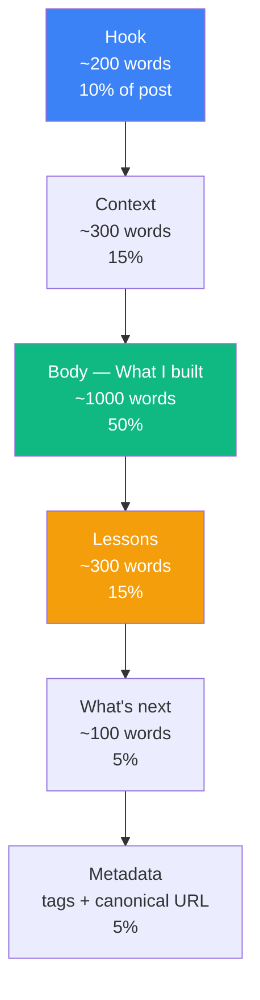

# 03 — The 5-Section Structure That Works for Engineering Posts

## 🧒 Layman explanation

Engineering blog posts that get read all follow the same skeleton. **Memorize this skeleton and you'll never stare at a blank page again.**

1. **Hook (200 words)** — a story or a number that makes the reader want to keep going
2. **Context (300 words)** — who you are, what you were trying to do, why it matters
3. **What I built / What happened (800–1200 words)** — the meat, with code + diagrams
4. **What I learned (300 words)** — opinions, tradeoffs, things that surprised you
5. **What's next (100 words)** — points the reader to your next post + your GitHub

Total: ~2,000 words. Reading time: ~8 minutes. This length wins on dev-twitter.

---

## 🔧 Technical deep-dive — section by section

### 1. The Hook — first 200 words

The hook decides if the post gets read. Three styles that work:

**Style A — The number.** *"In 7 months I plan to switch from iOS engineering at Walmart to a Forward-Deployed AI Engineer role. I'll spend 32 hours per week studying, ship 3 production projects, and write 7 blog posts. Here's the plan."*

**Style B — The story.** *"At 11:47 PM last Tuesday, my Walmart manager pinged me about a production bug. While I waited for the build, I opened Anthropic's careers page. By midnight I'd decided to spend the next 8 months becoming an AI Engineer."*

**Style C — The contrarian.** *"Every 'become an AI Engineer in 2026' guide tells you to learn LangChain. I'm not going to. Here's what I'm doing instead."*

Pick whichever feels true. **Don't fake it.** Readers smell fake hooks.

### 2. The Context — next 300 words

Tell the reader:

- Who you are professionally
- What problem you're solving for **yourself**
- Why this is interesting to **them**

For your kickoff post: "I'm an iOS engineer at Walmart with 4 years of UIKit. I want to be an AI Engineer. Here's the path I designed — share it if you find it useful, copy it if it helps."

### 3. What I built / What I'm doing — 800–1200 words

This is where 60% of the post lives. Use:

- **Subheadings** — every 200 words. Readers scan.
- **Code blocks** — with language tags (` ```python ` not ` ``` `)
- **Diagrams** — Mermaid renders natively on Hashnode. Use them.
- **Tables** — comparison tables are powerful. Don't write paragraphs that should be tables.
- **Numbered lists** for sequences, bullets for parallel items

For your kickoff post: spell out the **Phase 0–4 map**, the **stack decisions** (Gemini + ADK + Vertex), and the **weekly hour breakdown**.

### 4. What I learned — 300 words

Even on Day 1 you've learned things. List 3–5 surprises or convictions:

- "Modern Python with `uv` actually is 50× faster than I remembered"
- "I was going to learn AWS — I switched to GCP because Gemini lives there"
- "Blog posts are the highest-leverage thing a career switcher can produce — so post #1 is right now"

### 5. What's next — 100 words

End with a hook for the next post:

> *"Next post: shipping my first LLM app to a Slack webhook end-to-end (Phase 1 capstone, expected July 2026). Subscribe for updates. Repo: github.com/yourname/ai-engineer-portfolio"*

---

## 📊 The shape of a great engineering post



---

## ⚠️ Anti-patterns to avoid

| Anti-pattern                                | Why it kills the post                                   |
|---------------------------------------------|---------------------------------------------------------|
| Starting with "In this post, I'll discuss…" | Lazy. The hook is supposed to be a hook.                 |
| LLM-written prose                           | Readers can tell. Voice = trust.                         |
| No code at all                              | "Engineering" without code is just opinion.              |
| Code without context                        | Show *why* this code, not just what it is.              |
| 300-word post                               | Too thin to share or link to.                            |
| 6,000-word post                             | Nobody reads it. Split it.                              |
| No diagrams                                 | Modern readers expect visual chunks every 600 words.    |
| Misuse of "AI"                              | Don't say "AI did X" when you mean "GPT-4 / Gemini X did". Be precise. |

---

## 🛠️ Tools you'll use to write

| Tool                  | What for                                                      |
|-----------------------|---------------------------------------------------------------|
| **VS Code**           | Writing markdown                                              |
| **Markdown preview** | (Cmd+Shift+V in VS Code)                                      |
| **Mermaid Preview ext** | Render diagrams live                                       |
| **Hemingway editor**  | https://hemingwayapp.com — readability score (aim for grade ≤ 9) |
| **Grammarly browser ext** | Catch typos and passive voice — but ignore its "style" suggestions |
| **CleanShot X / macOS shortcuts** | Screenshots of terminal + Hashnode dashboard       |

---

## 📚 References

- **Julia Evans's writing style** — every post follows this skeleton — https://jvns.ca
- **"How to write a blog post that doesn't suck"** — Jeff Goins
- **"The pyramid principle"** by Barbara Minto (book) — the canonical structure for technical writing
- **Hemingway editor** — https://hemingwayapp.com

---

## ✅ Exit criteria

- [ ] I have the 5-section template memorized
- [ ] I can name 3 hook styles
- [ ] I know which Mermaid + table + code-block patterns to use
- [ ] I know what NOT to do (anti-patterns list)

**Next:** [`04-kickoff-post-draft.md`](04-kickoff-post-draft.md) — actually write the post.

---

🌀 *Magic applied with Wibey VS Code Extension 🪄*
