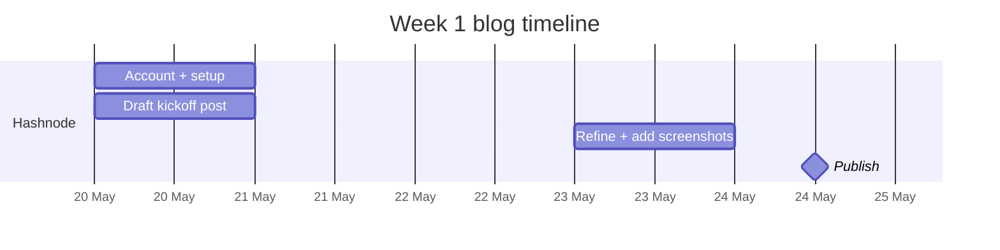

# Day 2 — Wednesday, May 20, 2026

> **Goal:** End the day with a **Hashnode blog account live**, a **kickoff post drafted**, and a **plan to publish on Saturday**.

**Time budget:** ~4 hours (Office Block A + B). This is a writing day, not a coding day — your brain switches gears.

---

## Lessons

| #  | File                                          | What you'll learn                                                  | Time   |
|----|-----------------------------------------------|---------------------------------------------------------------------|--------|
| 1  | [`01-why-blog-matters.md`](01-why-blog-matters.md) | The blog is a hiring tool, not a hobby — how FDEs use it           | 20 min |
| 2  | [`02-hashnode-setup.md`](02-hashnode-setup.md)     | Create Hashnode + custom subdomain + connect GitHub                | 30 min |
| 3  | [`03-blog-structure-for-engineers.md`](03-blog-structure-for-engineers.md) | The 5-section post template every engineer uses    | 30 min |
| 4  | [`04-kickoff-post-draft.md`](04-kickoff-post-draft.md) | Outline + write your kickoff post (2,000-word target)           | 2 hrs  |
| 5  | [`05-end-of-day-checklist.md`](05-end-of-day-checklist.md) | Save draft, schedule publish for Saturday                      | 10 min |

---

## Why Wednesday is a writing day

The roadmap plans **7 substantial blog posts over 8 months**. That's roughly one every 4–5 weeks. The first one ("Going from iOS to AI Engineer in 7 months") is the **accountability device** — it commits you publicly. If you don't ship the post by Saturday, your week is at risk.

---

## What "drafted" means today

You don't need a polished post tonight. You need:

- [ ] Hashnode account active
- [ ] Subdomain claimed (e.g., `<yourname>.hashnode.dev`)
- [ ] A `**` draft saved with all 5 sections written (skeleton OK if some bullets are placeholder)
- [ ] Title chosen
- [ ] At least one good "hook" sentence

Saturday morning you'll polish + add screenshots + hit publish.

---

🌀 *Magic applied with Wibey VS Code Extension 🪄*
