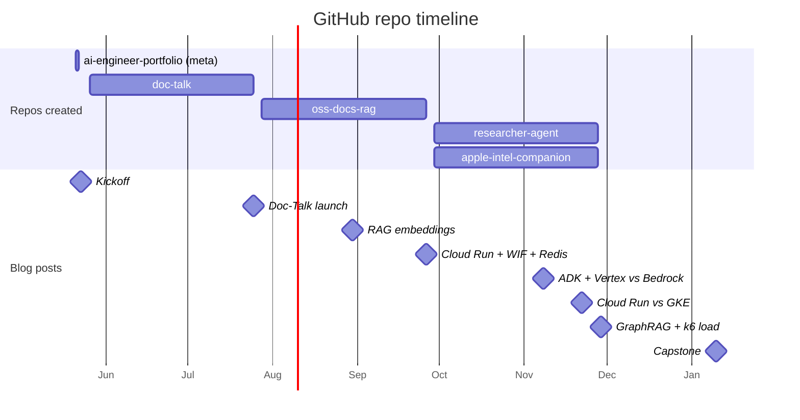

# 01 — GitHub Portfolio Strategy (FDE-style)

## 🧒 Layman explanation

A GitHub portfolio for an AI Engineer is not a junk drawer of toy projects. It's a **highlight reel of 3–5 things you actually shipped**.

The convention for top hires:

1. **One pinned README profile** that frames who you are
2. **3–5 pinned production-quality repos** — each shows a different competency
3. **No noisy contribution graph** with weekly "test" repos
4. **Working CI badges** in every repo's README
5. **Live deployed URLs** in the repos that have a UI

For your 8-month plan, the portfolio will end up with:

- `doc-talk` — Phase 1 capstone
- `oss-docs-rag` — Phase 2 capstone
- `researcher-agent` — Phase 3 capstone
- `apple-intel-companion` — Phase 3 iOS side-quest
- `ai-engineer-portfolio` — meta repo / personal landing page (the one you're creating today)

Today you set up the **portfolio meta repo + placeholder folders** for the 3 flagship projects.

---

## 🔧 Technical deep-dive — anatomy of a great AI Engineer repo

Each flagship repo (by Phase 3) should have:

```
flagship-repo/
├── README.md                ← The most important file. ~500 words.
│                             Has CI badges, live URL, screenshots, architecture diagram.
├── ARCHITECTURE.md          ← Detailed system design + tradeoffs.
├── pyproject.toml
├── uv.lock
├── .github/
│   └── workflows/
│       └── ci.yml           ← lint + test + build + deploy
├── .dockerignore
├── Dockerfile               ← multi-stage, slim, non-root
├── docker-compose.yml       ← local dev parity
├── app/
│   ├── __init__.py
│   ├── main.py              ← FastAPI app
│   ├── llm.py               ← provider-agnostic LLM wrapper
│   ├── prompts/             ← versioned prompt templates
│   └── schemas.py           ← Pydantic models
├── tests/
│   └── test_main.py
├── evals/                   ← golden Q&A + ragas / LLM-as-judge harness
├── infra/                   ← Terraform from Phase 3
│   └── main.tf
└── posts/                   ← markdown drafts linked to from Hashnode
    └── how-i-built-this.md
```

This shape signals "shipped this for real" without needing to dig into the code.

### The README is the most-read file

99% of recruiters won't click past the README. Your README must answer in the first 30 seconds:

1. **What does this do?** (one sentence)
2. **What's the architecture?** (one Mermaid diagram)
3. **How do I run it?** (3 shell commands)
4. **What's the live demo URL?** (link)
5. **What did I learn building this?** (link to blog post)

Steal the README template from popular AI engineering repos: LlamaIndex, Langfuse, Phoenix.

---

## The pinned profile README

GitHub lets you have a special repo named `<your-username>/<your-username>` whose README appears at the top of your profile. This is your billboard.

Example structure:

```markdown
### Hi, I'm Swapnil 👋

I'm an iOS engineer at Walmart Global Tech transitioning to AI Engineering.
Currently shipping production LLM apps as I work toward Forward-Deployed AI Engineer roles.

**Currently:**
- 🤖 Building [Doc-Talk](link), an LLM-powered PDF Q&A service deployed to Cloud Run
- 🧠 Studying RAG, agents, and on-device LLMs (Gemma 3 via MLX)
- ✍️  Writing about it at [your-blog.hashnode.dev](link)

**Stack I'm betting on:** Gemini + ADK + Vertex AI + FastAPI + Docker + Terraform

**Find me at:** [Blog](link) · [LinkedIn](link) · [Email](mailto:...)
```

You'll write this Sunday after the meta-repo exists.

---

## 📊 Portfolio evolution over 8 months



---

## 📚 References

- **"Make a Great GitHub Profile"** — official GitHub docs
- **Phoenix observability** — https://github.com/Arize-ai/phoenix — copy this README's structure
- **LlamaIndex** — https://github.com/run-llama/llama_index — another great template

---

## ✅ Exit criteria

- [ ] I understand the difference between a "junk drawer" portfolio and an FDE-style portfolio
- [ ] I know what each flagship repo will look like (folder structure)
- [ ] I know what the profile-README pattern is

**Next:** [`02-create-portfolio-repo.md`](02-create-portfolio-repo.md)

---

🌀 *Magic applied with Wibey VS Code Extension 🪄*
