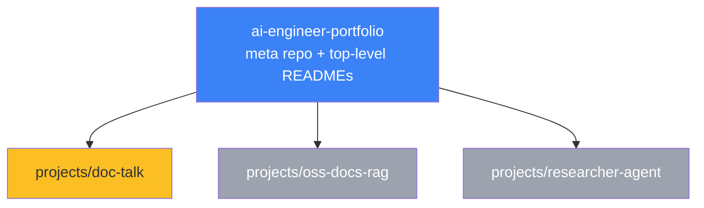

# 02 — Create the Portfolio Repo

## 💻 Hands-on — create the GitHub repo

### Step 1 — Create the empty repo on GitHub

1. Go to https://github.com/new
2. **Owner:** your personal account
3. **Repository name:** `ai-engineer-portfolio`
4. **Description:** *"Career switch portfolio: Doc-Talk (Phase 1), OSS-Docs RAG (Phase 2), Researcher Agent (Phase 3) — built May 2026 → Jan 2027."*
5. **Public** ✅ (this is the whole point — visibility)
6. **Do NOT** check "Add a README" / "Add .gitignore" / "Choose a license" — your local copy already has these
7. Click **Create repository**

### Step 2 — Push your local Day 1+2 work

```bash
cd ~/Desktop/AI/code/ai-engineer-portfolio

# If you haven't set git identity yet
git config user.name "Your Name"
git config user.email "your-personal-email@example.com"

# Add the remote (replace <your-handle>)
git remote add origin https://github.com/<your-handle>/ai-engineer-portfolio.git

# Push
git branch -M main
git push -u origin main
```

If push fails with auth error: GitHub uses **Personal Access Tokens** instead of passwords. Generate one at https://github.com/settings/tokens (classic; scope: `repo`), then paste it when prompted. Or use `gh auth login` if you have the GitHub CLI installed.

### Step 3 — Open the repo in browser, verify

You should see:
- `pyproject.toml`
- `code/hello_gemini.py`, `hello_anthropic.py`, `check_env.py`
- `posts/00-kickoff.md`
- `.env.example`
- `.gitignore`
- `uv.lock`

**You should NOT see `.env`**. If you do — danger! Rotate keys immediately and clean git history.

---

## 📁 Step 4 — Add flagship placeholder folders

Create three flagship folders, each with a README placeholder explaining what it'll become.

```bash
cd ~/Desktop/AI/code/ai-engineer-portfolio
mkdir -p projects/doc-talk projects/oss-docs-rag projects/researcher-agent
```

### `projects/doc-talk/README.md`

```markdown
# Doc-Talk

> **Status:** Coming Phase 1 (May 26 – Jul 27, 2026)

A FastAPI service that ingests PDFs and answers structured questions using
Gemini 2.5 Flash, returning Pydantic-validated JSON (`answer`, `citations`,
`confidence`).

## Planned stack
- FastAPI + Pydantic + Instructor
- `google-genai` SDK (Gemini 2.5 Flash + Pro)
- Pgvector on Neon (dev)
- Docker multi-stage build
- GitHub Actions CI (lint + test + build + push)
- Slack `/docTalk` webhook integration
- Deployed to Render

## What I'll learn
- Production FastAPI patterns (async, dep injection, streaming)
- Structured generation with Gemini schema
- Cross-provider parity (Gemini + Anthropic)
- Dockerfile best practices
- GitHub Actions CI/CD
- Webhooks (Slack-style)

## Companion blog post
*(Coming Jul 27, 2026)* — "Shipping my first LLM app: Dockerfile, CI, and a Slack webhook"
```

### `projects/oss-docs-rag/README.md`

```markdown
# OSS-Docs RAG

> **Status:** Coming Phase 2 (Jul 28 – Sep 28, 2026)

A production-grade RAG system over FastAPI + Swift + Kubernetes documentation.
Hybrid retrieval (BM25 + dense), Cohere reranker, Gemini context caching +
Redis semantic cache, deployed to Cloud Run via Workload Identity Federation.

## Planned stack
- Embeddings: `gemini-embedding-001`
- Vector DB: pgvector → Memorystore in prod
- Retrieval: BM25 + dense + Cohere rerank
- Caching: Gemini context cache + Redis semantic cache
- Evals: Ragas + LLM-as-judge (Gemini 2.5 Pro as judge)
- Observability: Langfuse
- Deploy: Cloud Run + Workload Identity for Vertex
- Monitoring: Cloud Monitoring + SLOs

## Companion blog posts
*(Coming Aug + Sep 2026)*
1. "Embeddings + Matryoshka truncation: when 768 dims beats 3072"
2. "From localhost to Cloud Run: Workload Identity + context cache + Redis"
```

### `projects/researcher-agent/README.md`

```markdown
# Researcher Agent

> **Status:** Coming Phase 3 (Sep 29 – Nov 30, 2026)

A multi-agent research assistant built on Google ADK with MCP tool
integration, GraphRAG over Neo4j, grounding-with-Google-Search,
deployed to GKE behind a private VPC, infrastructure as Terraform.

## Planned stack
- Framework: Google ADK
- Models: Gemini 2.5 Pro (supervisor) + Flash (workers)
- Tools: MCP toolset, Google Search grounding, Code execution
- Memory: Vertex AI Memory Bank
- Graph layer: Neo4j + entity extraction via Gemini
- Async: Pub/Sub for long-running tools
- Deploy: GKE + Vertex Agent Engine
- Infra: 100% Terraform
- Cross-cloud: AWS Bedrock literacy (Claude-via-Bedrock comparison)
- Load test: k6 (steady, spike, soak)
- Networking: Private Service Connect to Memorystore

## Companion blog posts
*(Coming Oct + Nov 2026)*
1. "Vertex Agent Engine vs Bedrock Agents for an ADK-style agent"
2. "Cloud Run vs GKE for AI agents — when each wins"
3. "GraphRAG vs hybrid RAG on a real corpus"
4. "Load-testing an LLM agent: what k6 told me about my p95"
```

### Top-level repo README

Replace the existing `README.md`:

```markdown
# AI Engineer Portfolio

> Career switch from iOS (Walmart Global Tech) → Forward-Deployed AI Engineer.
> May 19, 2026 → Jan 17, 2027.

## Flagships

| Project | Phase | Stack | Status |
|---|---|---|---|
| [Doc-Talk](projects/doc-talk/) | 1 | FastAPI + Gemini + Docker + Slack | 🟡 In progress (May 26) |
| [OSS-Docs RAG](projects/oss-docs-rag/) | 2 | Cloud Run + Vertex + Redis + Workload Identity | ⚪ Coming Jul |
| [Researcher Agent](projects/researcher-agent/) | 3 | ADK + GKE + Terraform + Bedrock | ⚪ Coming Sep |

## Why this exists
8-month plan to switch careers in public. Each project ships with a Dockerfile,
CI, deployed URL, eval harness, and a companion blog post.

## Blog
[your-blog.hashnode.dev](https://<your-handle>.hashnode.dev)

## Status legend
🟢 Shipped · 🟡 In progress · ⚪ Planned
```

### Commit + push

```bash
git add projects/ README.md
git commit -m "feat(portfolio): add 3 flagship placeholder folders + top-level README"
git push
```

Open your repo on GitHub.com and confirm it looks clean.

---

## 📊 Repo dependency map



Eventually you may split each flagship into its own dedicated repo (cleaner pinning on profile). For now, monorepo is fine — easier to grep across.

---

## 📚 References

- **GitHub: setting up a personal repo** — https://docs.github.com/en/get-started/quickstart/create-a-repo
- **GitHub CLI (`gh`)** — https://cli.github.com — optional but speeds up flow

---

## ✅ Exit criteria

- [ ] `https://github.com/<your-handle>/ai-engineer-portfolio` exists and is public
- [ ] Code from Days 1+2 is pushed
- [ ] `.env` is NOT in the repo (verify in browser!)
- [ ] Three `projects/*/README.md` placeholders exist
- [ ] Top-level `README.md` lists the three flagships in a table

**Next:** [`03-docker-fundamentals.md`](03-docker-fundamentals.md)

---

