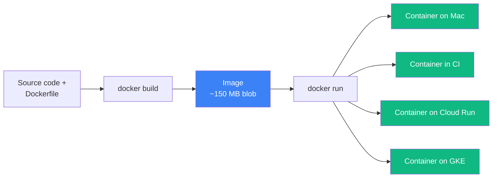
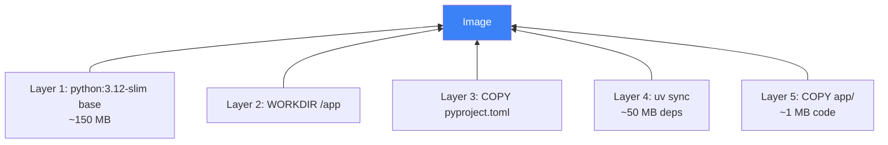
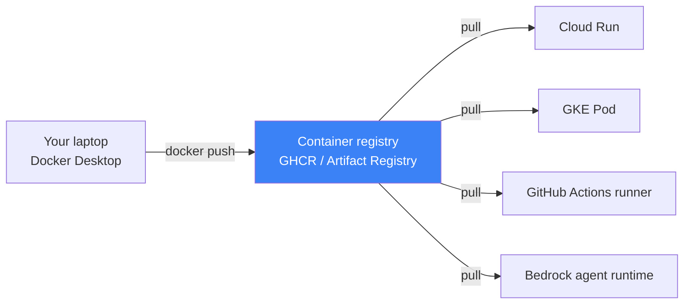

# 03 — Docker Fundamentals

## 🧒 Layman explanation

Docker is the **"shipping container" of software**. Picture this:

Before shipping containers (the metal kind, 1950s), every shipment was a bespoke nightmare. Was your cargo barrels of oil? Crates of bananas? Each had to be loaded differently, stacked differently, and unloaded differently at every port.

Then came the **standardized shipping container**: 20-foot box, same on every ship, every crane, every truck. Suddenly you didn't have to know what was inside — the box was the contract. Global trade exploded.

Docker does this for software:

- Your app + its OS dependencies + its Python version + its libraries → one **image** (a recipe)
- Run the image → you get a **container** (a live instance)
- Same image runs identically on your Mac, your CI server, AWS, GCP, your colleague's Linux laptop
- "Works on my machine" disappears because **the machine is in the box**



Every deploy target you'll touch (Cloud Run, GKE, Bedrock agents) **consumes the same artifact: a container image**. So learning Docker once unlocks all four clouds.

---

## 🔧 Technical deep-dive

### Image vs Container — the two key nouns

| Term         | Mental model           | Analogy             | Lifetime              |
|--------------|------------------------|---------------------|-----------------------|
| **Image**    | A read-only template   | A class             | Permanent (until deleted) |
| **Container**| A running instance     | An object           | Temporary (start/stop) |
| **Layer**    | A diff inside an image | A git commit        | Immutable             |
| **Volume**   | Persistent disk        | A USB stick         | Outlives container    |
| **Network**  | Virtual LAN            | Wi-Fi router        | Persists per setup    |

Concretely:
- You **build** an image once (`docker build`).
- You **run** containers from it many times (`docker run`).
- Containers are **disposable** — when one crashes, you start another. Same image.

### The Dockerfile — your recipe

A Dockerfile is a small text file with sequential instructions. Each instruction creates a **layer** that's cached separately. Example:

```dockerfile
# 1. Start from an existing image as base
FROM python:3.12-slim

# 2. Create a working directory inside the image
WORKDIR /app

# 3. Copy dependency files first (caching trick — see below)
COPY pyproject.toml uv.lock ./

# 4. Install dependencies (cached if pyproject.toml didn't change)
RUN pip install --no-cache-dir uv && \
    uv sync --frozen --no-dev

# 5. Copy actual application code
COPY app/ ./app/

# 6. Tell Docker which port the container listens on
EXPOSE 8000

# 7. The command that runs when a container starts
CMD ["uv", "run", "uvicorn", "app.main:app", "--host", "0.0.0.0", "--port", "8000"]
```

**The caching trick (steps 3–5):** Docker hashes each layer. If `pyproject.toml` didn't change, step 4 is reused from cache — even though step 5 (your app code) is rebuilt. This is why your first build takes 60s but subsequent builds take 5s.

### The image-layer model — visualized



Each layer is content-addressed (SHA256 hashed) and deduplicated across images. If two of your images both use `python:3.12-slim`, that 150 MB is downloaded once globally.

### Multi-stage builds — the production pattern

Real production Dockerfiles use **multi-stage builds** to keep the final image small:

```dockerfile
# Stage 1 — Builder (has compilers, big)
FROM python:3.12 AS builder
WORKDIR /app
COPY pyproject.toml uv.lock ./
RUN pip install uv && uv sync --frozen --no-dev

# Stage 2 — Runtime (slim, no compilers)
FROM python:3.12-slim
WORKDIR /app
COPY --from=builder /app/.venv /app/.venv
COPY app/ ./app/
ENV PATH="/app/.venv/bin:$PATH"
EXPOSE 8000
CMD ["uvicorn", "app.main:app", "--host", "0.0.0.0", "--port", "8000"]
```

The final image only contains the runtime (~80 MB), not the build toolchain (~800 MB). You'll write a Dockerfile exactly like this in Phase 1 Week 9 for Doc-Talk.

### Three commands you'll run constantly

```bash
# Build an image from current directory
docker build -t doc-talk:latest .

# Run a container (interactive)
docker run --rm -p 8000:8000 --env-file .env doc-talk:latest

# List running containers
docker ps

# Stop a container
docker stop <container-id>

# See what images you have
docker images

# Remove an image (free disk)
docker rmi <image-id>
```

### Where containers run — the deploy layer



Containers + registries = the deploy abstraction. Every modern AI infra speaks this language.

---

## 🛠️ The 5 Docker concepts you must know cold for interviews

1. **Image vs container** — class vs object
2. **Layer caching** — copy dependencies before code
3. **Multi-stage builds** — keep runtime image lean
4. **Volumes** — persistent data outlives containers
5. **`docker-compose`** — orchestrate multi-container apps locally (Week 9 of Phase 1)

If you can riff on these five for 60s each, you have interview-acceptable Docker literacy.

---

## 📚 References

- **Docker official "Get Started" guide** — https://docs.docker.com/get-started/
- **"Docker for Python apps" (RealPython)** — https://realpython.com/tutorials/docker/
- **Bret Fisher's free Docker Mastery lectures** — https://www.bretfisher.com/devops-podcast-show/
- **"Best practices for writing Dockerfiles"** — https://docs.docker.com/build/building/best-practices/
- **The 12-factor app** — https://12factor.net (Docker is how you achieve 12-factor)

---

## ✅ Exit criteria

- [ ] I can explain "image vs container" in one sentence each
- [ ] I understand why we copy `pyproject.toml` before code (layer caching)
- [ ] I know what a multi-stage build is and why we use it
- [ ] I can list 3 places a container can run after `docker push`
- [ ] I'm ready to install Docker Desktop

**Next:** [`04-install-docker-desktop.md`](04-install-docker-desktop.md)

---

