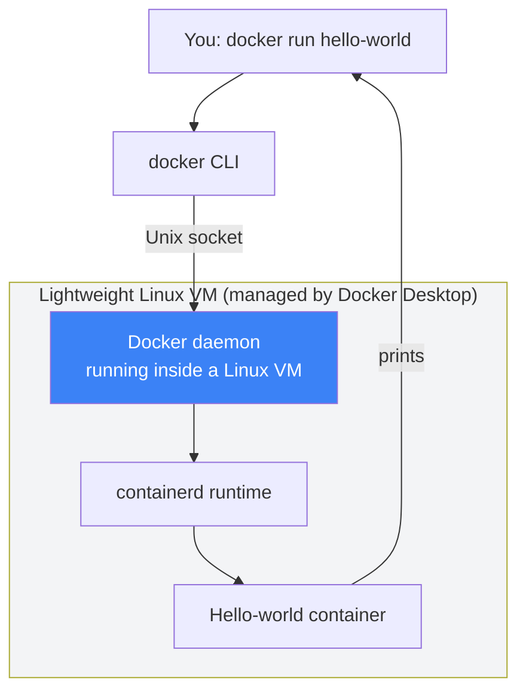

# 04 — Install Docker Desktop

## 🧒 Layman explanation

Docker Desktop is the **GUI + daemon** that runs containers on your Mac. It includes:
- The Docker engine (the daemon that actually runs containers)
- The `docker` CLI
- A Mac UI for managing images / containers / volumes
- A small Linux VM under the hood (macOS isn't Linux; containers need a Linux kernel)

You'll install it once and then mostly forget about it — except to launch it when you boot your Mac.

> ⚠️ **License note:** Docker Desktop is **free for individuals** and **small companies (<250 employees AND <$10M annual revenue)**. Walmart is neither — so **don't use Docker Desktop on a Walmart-managed laptop**. For your personal Mac (which is where your portfolio work lives), it's free. If you ever need a Walmart-friendly alternative on a corporate laptop, use **Rancher Desktop** or **Colima** — both free, both speak the same `docker` CLI.

---

## 💻 Hands-on — install Docker Desktop on personal Mac

### Step 1 — Check chip type

```bash
uname -m
# arm64 → Apple Silicon (M1/M2/M3/M4)
# x86_64 → Intel Mac
```

This matters because you'll download a different installer.

### Step 2 — Download

1. Open https://www.docker.com/products/docker-desktop/
2. Click **Download for Mac — Apple Silicon** (or Intel, depending on Step 1)
3. The download is ~600 MB

### Step 3 — Install

1. Open the `.dmg`
2. Drag Docker.app to Applications
3. Launch Docker from Applications
4. Accept the license terms (read the individual-use clause)
5. Skip the optional sign-in (you can sign up later for Hub features)
6. Wait for the green status indicator in the menu bar

### Step 4 — Verify

```bash
docker --version
# Expected: Docker version 27.x.x, build ...

docker info
# Expected: lots of output, no error lines

docker run hello-world
# Expected: ASCII art saying "Hello from Docker!"
```

If `docker run hello-world` succeeds, you have a working Docker install. 🎉

### Step 5 — Configure resources (optional but recommended)

Open Docker Desktop → **Settings → Resources** and set:

| Setting    | Recommended for AI dev          |
|------------|---------------------------------|
| CPUs       | 4 (or half your cores)          |
| Memory     | 8 GB                            |
| Swap       | 1 GB                            |
| Disk size  | 64 GB (image cache grows fast)  |

These can be tuned later. Defaults are fine for Week 1 hello-worlds.

---

## 📊 What Docker Desktop is doing under the hood (Mac)



On Linux there is no VM — Docker runs natively. On Mac, the VM is hidden by Docker Desktop. You don't manage it; it just exists.

---

## 🐛 Common install issues

| Symptom                                                | Fix                                                            |
|--------------------------------------------------------|----------------------------------------------------------------|
| Docker Desktop won't start                             | macOS Security & Privacy → allow + restart                     |
| "Docker Desktop requires a newer version of macOS"     | Update macOS via System Settings                               |
| `docker: command not found`                            | Open new terminal tab (PATH wasn't refreshed)                  |
| `Cannot connect to the Docker daemon`                  | Docker Desktop isn't running — launch the app                  |
| Mac fan goes wild                                      | Settings → Resources → cap CPUs at half your cores              |
| Disk fills up                                          | `docker system prune -a` (warning: deletes all unused images)  |

---

## 🧹 Hygiene — keep your image library lean

After a few weeks of work you'll have dozens of half-finished images. Clean up periodically:

```bash
# Remove stopped containers
docker container prune

# Remove unused images
docker image prune

# Remove EVERYTHING unused (use carefully)
docker system prune -a
```

---

## 📚 References

- **Docker Desktop on Mac** — https://docs.docker.com/desktop/install/mac-install/
- **Docker license FAQ** — https://www.docker.com/pricing/
- **Rancher Desktop (free alternative)** — https://rancherdesktop.io
- **Colima (lightweight CLI-only alt)** — https://github.com/abiosoft/colima

---

## ✅ Exit criteria

- [ ] `docker --version` works
- [ ] `docker info` runs without error
- [ ] `docker run hello-world` prints the ASCII greeting
- [ ] I understand the personal-use license (free for me on personal Mac)
- [ ] I've configured CPUs/Memory in Settings

**Next:** [`05-first-dockerfile.md`](05-first-dockerfile.md)

---

