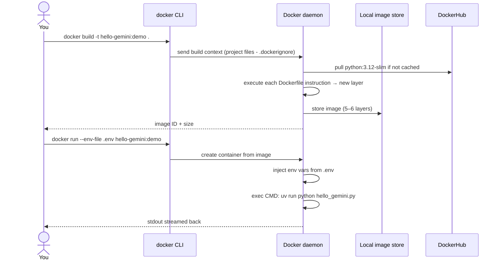

# 05 — Your First Dockerfile (Preview)

> This is a *preview* — the real Doc-Talk Dockerfile lands in Phase 1 Week 9. Today you'll just get a feel by containerizing `hello_gemini.py`.

## 🧒 Layman explanation

Take the same `hello_gemini.py` from Day 1, but instead of running it on your Mac, you'll bake it into a **container image** and run it as a container. The script will still print "Hello!" from Gemini — but now it's running inside the same kind of container that Cloud Run would run.

You'll do this in ~30 minutes. It's the smallest possible "containerize a Python app" exercise.

---

## 💻 Hands-on

### Step 1 — Create a `Dockerfile` in your project root

```bash
cd ~/Desktop/AI/code/ai-engineer-portfolio
touch Dockerfile
```

Edit `Dockerfile` to contain:

```dockerfile
# Tiny demo Dockerfile — we'll write a real production one in Phase 1 Week 9.

# 1. Base image: slim Python 3.12.
FROM python:3.12-slim

# 2. Install uv (fast).
RUN pip install --no-cache-dir uv

# 3. Set workdir.
WORKDIR /app

# 4. Copy dependency manifest first (for layer caching).
COPY pyproject.toml uv.lock ./

# 5. Install only the runtime deps (no dev tools in container).
RUN uv sync --frozen --no-dev

# 6. Copy the actual script.
COPY code/hello_gemini.py ./

# 7. Default command — runs hello_gemini.py.
CMD ["uv", "run", "python", "hello_gemini.py"]
```

### Step 2 — Create a `.dockerignore`

This tells Docker to **not copy these files** into the image (they'd bloat it):

```bash
cat > .dockerignore <<'EOF'
.venv
.env
.git
.gitignore
__pycache__
*.pyc
.pytest_cache
.mypy_cache
.ruff_cache
posts/
projects/
.DS_Store
EOF
```

Without `.dockerignore`, your `.venv` would be copied into the image — adding 500 MB for nothing.

### Step 3 — Build the image

```bash
docker build -t hello-gemini:demo .
```

You'll see Docker execute each instruction. First build: ~60 seconds.

```
[+] Building 58.4s (10/10) FINISHED
 => => naming to docker.io/library/hello-gemini:demo
```

### Step 4 — Run the container

The script needs your `GOOGLE_API_KEY` to authenticate. Pass it from your local `.env`:

```bash
docker run --rm --env-file .env hello-gemini:demo
```

You should see the same output as `uv run python code/hello_gemini.py` on Day 1:

```
=== Response ===
Hello! I'm Gemini, a large language model developed by Google AI.

=== Usage ===
Prompt tokens:    7
Output tokens:    15
...
```

🎉 **You just ran an AI workload inside a container** — the same primitive Cloud Run and GKE use.

### Step 5 — Inspect what you built

```bash
# Size of the image
docker images hello-gemini

# What's inside (poke around)
docker run --rm -it --entrypoint /bin/bash hello-gemini:demo
# Inside the container:
ls /app
# Should show: hello_gemini.py, pyproject.toml, uv.lock, .venv/
exit
```

---

## 📊 The build flow



---

## 🛠️ Try the caching effect

```bash
# Build once
time docker build -t hello-gemini:demo .
# ~58s

# Touch a comment in pyproject.toml (force a change)
echo "# tiny edit" >> pyproject.toml

# Build again
time docker build -t hello-gemini:demo .
# ~12s — dependencies cached, only later layers rebuilt

# Touch only the script
echo "# tiny edit" >> code/hello_gemini.py

# Build again
time docker build -t hello-gemini:demo .
# ~3s — only the COPY step + CMD rebuilt
```

This is why **layer order matters** in Dockerfiles. Put rarely-changing things (deps) before frequently-changing things (your code).

---

## 🧹 Cleanup

```bash
# Image takes ~250 MB on disk
docker images hello-gemini

# Remove it when you're done with the demo
docker rmi hello-gemini:demo

# Or do a full cleanup
docker system prune -a   # ⚠ removes ALL unused images
```

---

## 📚 References

- **Dockerfile reference** — https://docs.docker.com/reference/dockerfile/
- **`.dockerignore` best practices** — https://docs.docker.com/build/building/context/#dockerignore-files
- **uv in Docker** — https://docs.astral.sh/uv/guides/integration/docker/
- **Slim Python images** — Itamar Turner-Trauring's blog: https://pythonspeed.com

---

## ✅ Exit criteria

- [x] `Dockerfile` exists in repo root
- [x] `.dockerignore` exists
- [x] `docker build -t hello-gemini:demo .` completes
- [x] `docker run --rm --env-file .env hello-gemini:demo` prints a Gemini response
- [x] I observed the caching effect on rebuild

**Next:** [`06-end-of-day-checklist.md`](06-end-of-day-checklist.md)

---

