# Day 3 — Thursday, May 21, 2026

> **Goal:** End the day with a **public GitHub portfolio repo** containing skeleton folders for the three flagship projects, and a **working Docker Desktop install** that can run `docker run hello-world`.

**Time budget:** ~4 hours

---

## Lessons

| #  | File                                          | Topic                                                  | Time   |
|----|-----------------------------------------------|---------------------------------------------------------|--------|
| 1  | [`01-github-portfolio-strategy.md`](01-github-portfolio-strategy.md) | How an FDE-flavor portfolio repo is structured | 30 min |
| 2  | [`02-create-portfolio-repo.md`](02-create-portfolio-repo.md) | Create repo + add 3 flagship folders + push      | 45 min |
| 3  | [`03-docker-fundamentals.md`](03-docker-fundamentals.md) | What Docker is, images vs containers, the model    | 1 hr   |
| 4  | [`04-install-docker-desktop.md`](04-install-docker-desktop.md) | Install Docker Desktop + run hello-world          | 30 min |
| 5  | [`05-first-dockerfile.md`](05-first-dockerfile.md) | Write a 10-line Dockerfile for hello_gemini.py (preview) | 45 min |
| 6  | [`06-end-of-day-checklist.md`](06-end-of-day-checklist.md) | Wrap up                                              | 10 min |

---

## Big picture

```mermaid
flowchart LR
    A[Local repo from Day 1+2] --> B[Create GitHub repo]
    B --> C[Push existing work]
    C --> D[Add 3 flagship folders<br/>README placeholders]
    D --> E[Install Docker Desktop]
    E --> F[docker run hello-world]
    F --> G[Write tiny Dockerfile<br/>for hello_gemini.py]
    G --> H[docker build + run]
    H --> I[✅ Day 3 done]

    style F fill:#10b981,color:#fff
    style I fill:#10b981,color:#fff
```

---

