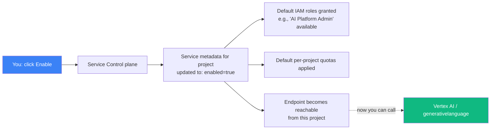

# 02 — Enable Vertex AI + Generative Language APIs

## 🧒 Layman explanation

GCP has ~200 APIs (Compute Engine, Cloud Run, Vertex AI, BigQuery, etc.). By default **all of them are disabled** in a new project. You enable just the ones you'll use.

Today: enable two.

1. **Vertex AI API** (`aiplatform.googleapis.com`) — the full Vertex AI surface (Gemini via Vertex, Agent Engine, Model Garden, etc.)
2. **Generative Language API** (`generativelanguage.googleapis.com`) — the AI Studio path (you already use this via your `GOOGLE_API_KEY`, but the API needs to be enabled in your project for some upstream features)

Enabling an API doesn't cost anything by itself. You only pay when you make calls.

---

## 💻 Two ways to enable APIs

### Option A — Web Console (easier for first time)

1. Open https://console.cloud.google.com/apis/library
2. Confirm correct project in the top bar
3. Search for **"Vertex AI API"** → click the result → **Enable**
4. Wait ~30 seconds
5. Search for **"Generative Language API"** → click → **Enable**

### Option B — `gcloud` CLI (faster, scriptable)

You'll install `gcloud` in the next lesson. After that, the same enable is:

```bash
gcloud services enable \
    aiplatform.googleapis.com \
    generativelanguage.googleapis.com \
    --project="$GCP_PROJECT_ID"
```

For today, use Option A.

---

## 📊 What enabling an API does behind the scenes



---

## 🔍 Verify the APIs are enabled

In the console: https://console.cloud.google.com/apis/dashboard

You should see at least these two with green "Enabled" markers:
- Vertex AI API
- Generative Language API

You may also see auto-enabled prerequisites (Cloud Resource Manager, Service Usage, etc.). That's normal.

---

## 🧱 What APIs you'll enable later (preview — don't do today)

| API                                  | When                               | Used for                                    |
|--------------------------------------|------------------------------------|----------------------------------------------|
| Cloud Run API                        | Phase 2 Week 18                    | Deploy OSS-Docs RAG                          |
| Secret Manager API                   | Phase 2 Week 18                    | Store Anthropic + Cohere keys                |
| Memorystore for Redis API            | Phase 2 Week 19                    | Semantic cache                                |
| Cloud Monitoring API                 | Phase 2 Week 19                    | SLOs                                          |
| Kubernetes Engine API                | Phase 3 Week 27                    | GKE for Researcher Agent                     |
| Pub/Sub API                          | Phase 3 Week 22                    | Long-running tool dispatch                   |
| Compute Engine API                   | (auto)                             | Implied by GKE                                |
| IAM Service Account Credentials API  | Phase 2 Week 18                    | Workload Identity Federation                  |

Don't enable any of these today. **Only what you need, when you need it.**

---

## 🐛 Common issues

| Symptom                                           | Fix                                                         |
|---------------------------------------------------|--------------------------------------------------------------|
| "This API requires billing"                       | Confirm billing account is linked (Console → Billing)        |
| "You don't have permission to enable APIs"        | You're in the wrong project — switch in top bar              |
| API enabled but later 403 on call                 | Wait 1–2 minutes; provisioning is eventually consistent       |

---

## 📚 References

- **API Library** — https://console.cloud.google.com/apis/library
- **Vertex AI API docs** — https://cloud.google.com/vertex-ai/docs
- **`gcloud services enable` docs** — https://cloud.google.com/sdk/gcloud/reference/services/enable

---

## ✅ Exit criteria

- [ ] Vertex AI API enabled in my project
- [ ] Generative Language API enabled in my project
- [ ] Both show "Enabled" in API Dashboard

**Next:** [`03-billing-alert.md`](03-billing-alert.md)

---

