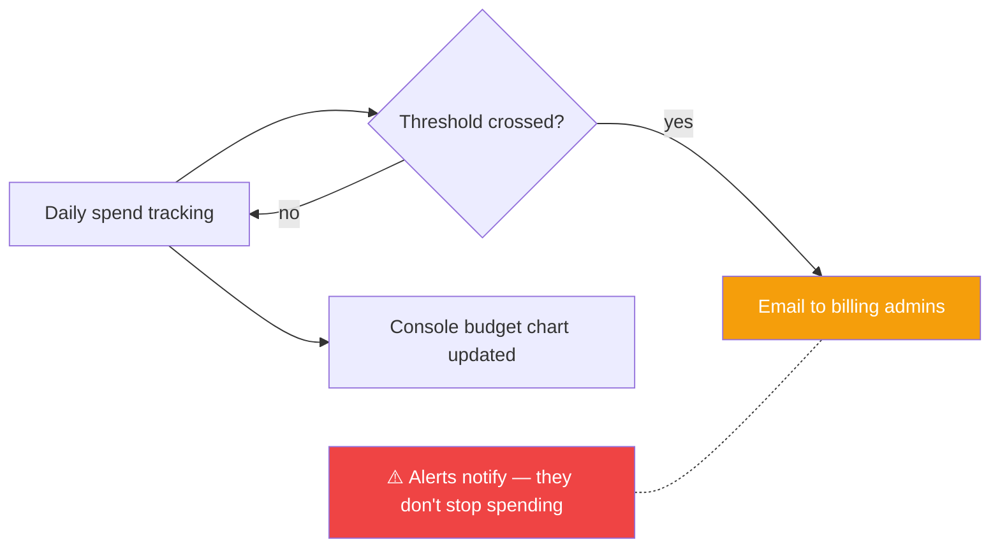

# 03 — Set the $50/month Billing Alert

## 🧒 Layman explanation

Cloud bills surprise people. A misconfigured BigQuery query, a forgotten Cloud SQL instance, an agent that loops uncontrollably — each has cost real engineers thousands of dollars in a single weekend.

The fix: a **billing budget with an email alert**. When your spend crosses 50%, 90%, and 100% of $50, you get an email. You stop the leak before it floods.

This is a **5-minute task that prevents a 4-figure mistake**. Do it now.

---

## 💻 Hands-on

### Step 1 — Open Billing

1. Console → top-left hamburger → **Billing**
2. Click **Budgets & alerts**
3. Click **Create budget**

### Step 2 — Configure the budget

| Field                | Value                                          |
|----------------------|------------------------------------------------|
| Name                 | `Personal AI Engineer Portfolio`               |
| Time range           | Monthly                                        |
| Projects             | Select `ai-engineer-portfolio`                 |
| Services             | All services                                   |
| Budget type          | Specified amount                               |
| Target amount        | **$50.00 USD**                                  |
| Credit applies       | Include all credits                            |

Click **Next**.

### Step 3 — Set the alert thresholds

| % of budget | Trigger on    | Action     |
|-------------|---------------|------------|
| 50%         | Actual spend  | Email me   |
| 90%         | Actual spend  | Email me   |
| 100%        | Actual spend  | Email me   |
| 120%        | Forecasted    | Email me   |

Check **"Email alerts to billing admins and users"**.

Click **Finish**.

---

## 📊 What the budget actually does (and doesn't)



> ⚠️ Important: **GCP budgets ALERT you. They do not HARD-STOP spending.** If you want a hard cap, you need a **Pub/Sub-triggered Cloud Function** that disables billing on the project when the budget hits 100%. That's overkill for personal hello-world; the email alerts are enough.
> 
> The pattern for hard-cap (you might use this in Phase 3 if you do heavy load testing): https://cloud.google.com/billing/docs/how-to/disable-billing-with-notifications

### Hard-cap recipe (preview, do NOT set up today)

```
Pub/Sub topic ← Budget alert publishes here
    ↓
Cloud Function ← Triggered by Pub/Sub
    ↓
projects.updateBillingInfo({billingAccountName: ""}) ← Detach billing = stop charges
```

You'll come back to this in Phase 3 Week 28 (load testing week) when an accidental k6 run could hammer your bill.

---

## 💡 What "$50/month" buys you on GCP for Phase 1+2

A rough mental model so you sleep at night:

| Activity                                   | Approx cost                                       |
|--------------------------------------------|----------------------------------------------------|
| 1000 Gemini 2.5 Flash calls (small)        | $0.30                                             |
| 100K embedding calls                       | $1.50                                             |
| Cloud Run service running 8 hrs/day (1 CPU, 512 MB) | ~$2                                       |
| Memorystore Redis 1 GB tier                | ~$30/month                                         |
| Cloud SQL Postgres db-f1-micro             | ~$8/month                                          |
| GKE Autopilot cluster (idle)               | ~$70/month — **avoid until Phase 3**              |
| BigQuery storage 100 GB                    | ~$2/month                                          |

For Week 1 (today + tomorrow + Sun), you'll spend **under $1**. The $50 limit is your safety net.

---

## 📚 References

- **Create budgets and budget alerts** — https://cloud.google.com/billing/docs/how-to/budgets
- **Automate cost control** (hard-cap recipe) — https://cloud.google.com/billing/docs/how-to/notify
- **GCP pricing calculator** — https://cloud.google.com/products/calculator

---

## ✅ Exit criteria

- [ ] Budget `Personal AI Engineer Portfolio` exists
- [ ] Target: $50/month
- [ ] Alerts: 50%, 90%, 100% (actual) + 120% (forecast)
- [ ] Confirmation email arrived in inbox
- [ ] I understand alerts notify but don't auto-stop

**Next:** [`04-install-gcloud-cli.md`](04-install-gcloud-cli.md)

---

