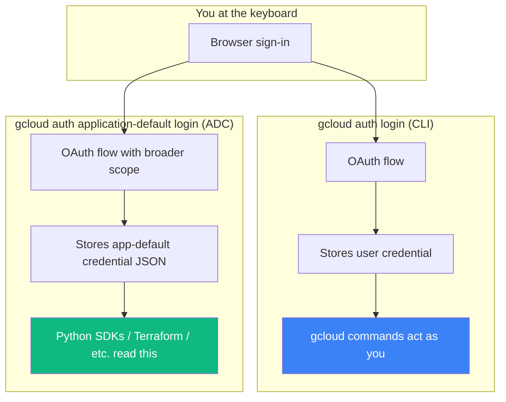

# 04 — Install `gcloud` CLI

## 🧒 Layman explanation

`gcloud` is to GCP what `git` is to GitHub — the command-line tool that lets your code (and you) talk to the cloud. Every senior cloud-using engineer lives in `gcloud`.

You'll install it once. From then on:

- `gcloud auth login` → sign you in
- `gcloud config set project ai-engineer-portfolio-123456` → pin which project commands target
- `gcloud services enable aiplatform.googleapis.com` → enable an API
- `gcloud run deploy doc-talk --source .` → ship a service

The CLI bundles several tools: `gcloud` itself, `gsutil` (Cloud Storage), `bq` (BigQuery), `kubectl` (Kubernetes — for GKE in Phase 3).

---

## 💻 Hands-on — install on macOS

### Best path: Homebrew

```bash
brew install --cask google-cloud-sdk
```

Brew handles updates, PATH setup, and shell completion.

### Alternative: the official installer

```bash
curl https://sdk.cloud.google.com | bash
exec -l $SHELL
```

Follow prompts; pick install location (default OK).

### Verify

```bash
gcloud --version
# Expected: Google Cloud SDK 4xx.x.x ...

which gcloud
# Expected: /opt/homebrew/bin/gcloud (brew on Apple Silicon)
#       or /usr/local/bin/gcloud (Intel Mac)
#       or ~/google-cloud-sdk/bin/gcloud (installer)
```

### Add components (extras)

By default the install gives you `gcloud` + `gsutil` + `bq`. Add a few more for what's coming:

```bash
gcloud components install kubectl beta alpha
```

`kubectl` is needed for GKE in Phase 3. `beta` and `alpha` unlock newer Vertex commands.

---

## 🔐 Step 2 — Authenticate (TWO different logins!)

This is the part that confuses everyone the first time. There are **two distinct auth flows**:

### Flow A — `gcloud auth login`  (interactive, for CLI commands)

This logs **you** in so `gcloud` CLI commands can act on your behalf.

```bash
gcloud auth login
```

A browser opens. Sign in with your **personal Google account** (the same one you used to create the GCP project). Grant the requested scopes.

After this, commands like `gcloud projects list`, `gcloud services enable` work as "you".

### Flow B — `gcloud auth application-default login`  (for SDKs and libraries)

This sets up **Application Default Credentials (ADC)** — used by Python SDKs (like `google-genai` in Vertex mode), Terraform, Pulumi, and anything that wants credentials *programmatically* without a key file.

```bash
gcloud auth application-default login
```

A browser opens. Sign in (same account). It writes a credential file to `~/.config/gcloud/application_default_credentials.json`.

After this, ANY Python script calling `genai.Client(vertexai=True, ...)` will pick up your identity automatically. **No API key, no JSON key on disk in your code, no environment variable.**

You'll learn ADC in depth in the next lesson — for now just run both commands.

### Set your default project

```bash
gcloud config set project "$GCP_PROJECT_ID"
```

(Recall: `GCP_PROJECT_ID` is set in your `~/.zshrc` from yesterday's lesson 01.)

### Verify

```bash
# Who am I?
gcloud auth list

# What's my default project?
gcloud config get-value project

# Can I list APIs?
gcloud services list --enabled --project="$GCP_PROJECT_ID" --limit=5
```

You should see `aiplatform.googleapis.com` in the list.

---

## 📊 The two auth flows visualized



**Both** flows are needed. They store credentials in different places and serve different consumers.

---

## 🐛 Common issues

| Symptom                                              | Fix                                                              |
|------------------------------------------------------|-------------------------------------------------------------------|
| `gcloud: command not found` after install            | New terminal tab or `exec -l $SHELL`                              |
| Wrong account active                                 | `gcloud auth login` again; or `gcloud config set account ...`     |
| `Permission denied (403)` on enable                  | Switch project: `gcloud config set project PROJECT_ID`             |
| Brew won't install (corp-managed Mac)                | Use official installer or download the tarball                     |
| ADC seems to use wrong account                       | Re-run `gcloud auth application-default login`                    |

---

## 🧰 Bonus — handy gcloud aliases

Add to `~/.zshrc`:

```bash
alias gcp='gcloud'
alias gcl='gcloud config list'
alias gca='gcloud auth list'
alias gcp-proj='gcloud config set project'
alias gcp-region='gcloud config set compute/region us-central1'
```

---

## 📚 References

- **gcloud install** — https://cloud.google.com/sdk/docs/install
- **gcloud cheatsheet** — https://cloud.google.com/sdk/docs/cheatsheet
- **ADC explanation** (deep dive next) — https://cloud.google.com/docs/authentication/application-default-credentials

---

## ✅ Exit criteria

- [ ] `gcloud --version` works
- [ ] `gcloud auth list` shows my personal email as ACTIVE
- [ ] `gcloud auth application-default login` ran successfully
- [ ] `gcloud config get-value project` returns my project ID
- [ ] `gcloud services list --enabled` shows Vertex AI + Generative Language

**Next:** [`05-adc-explained.md`](05-adc-explained.md)

---

🌀 *Magic applied with Wibey VS Code Extension 🪄*
