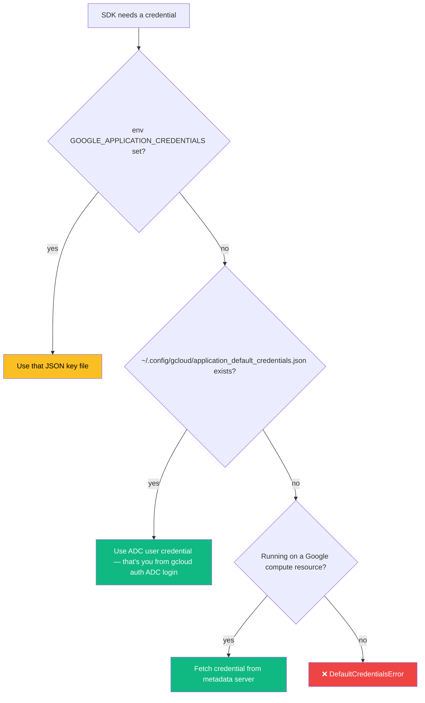

# 05 — Application Default Credentials (ADC) — the security story

> This is the single most important concept on Day 4. Read it carefully. ADC is the answer to almost every "how do you handle keys?" question in an FDE interview.

---

## 🧒 Layman explanation

Imagine you have a fancy office building (your code) and a vault (Vertex AI). You want your code to access the vault.

**Wrong way:** Print a key, glue it to your laptop, copy it to every server. Anyone who steals a server has the key. If the key leaks, you're cooked.

**Right way:** Don't print keys. Instead, **the building automatically knows who's standing inside it**. A guard checks the badge of whoever is asking. The badge is short-lived and tied to identity, not a piece of paper.

**Application Default Credentials (ADC)** is GCP's "the building knows who you are" system. Your code doesn't carry a key. It says "hey GCP, I'm running. What identity should I use?" and GCP picks the right one based on **where the code is running**.

| Where code runs                        | What ADC returns                                                 |
|----------------------------------------|------------------------------------------------------------------|
| Your laptop (after `gcloud auth ADC login`) | Your user identity                                          |
| Cloud Run                              | The service account attached to the Cloud Run service             |
| GKE pod                                | The pod's Workload Identity (a service account)                  |
| GitHub Actions (with WIF set up)       | Federated identity exchanged from GitHub OIDC token              |
| Compute Engine VM                      | The VM's attached service account                                |

**Same Python code. Different credential automatically. No `.env` change between dev and prod.**

This is the cleanest security model in cloud computing. **Memorize the table above.**

---

## 🔧 Technical deep-dive — how ADC resolves credentials

When you call `genai.Client(vertexai=True, project=...)`, the underlying library does this lookup chain:



This precedence is fixed and documented. **The right setup is: leave `GOOGLE_APPLICATION_CREDENTIALS` unset, run `gcloud auth application-default login` on your laptop, and let cloud runtimes attach their own service account.**

---

## 🔐 The 3 production identity patterns

When you ship to GCP in Phase 2+, ADC becomes powered by one of three mechanisms. **All three appear in interviews.**

### Pattern 1 — Attached Service Account (Cloud Run, GKE, Compute Engine)

```
[Cloud Run service]
     │
     │ has attached service account: doc-talk-runner@PROJECT.iam.gserviceaccount.com
     ↓
[Vertex AI Gemini API]
```

When the container starts, the metadata server (a magic URL at `http://metadata.google.internal/...`) hands the code a fresh token tied to that service account. The token rotates every ~hour. **No key file anywhere.**

### Pattern 2 — Workload Identity Federation (GKE pods, AWS workloads, GitHub Actions)

```
[GitHub Actions runner]
     │
     │ presents GitHub OIDC token →
     ↓
[Workload Identity Pool]
     │ exchanges for →
     ↓
[Short-lived GCP token]
     │
     ↓
[Vertex AI Gemini API]
```

This is **the answer to "how do you deploy from GitHub Actions without storing GCP keys in GitHub Secrets?"** You set up WIF once. After that GitHub Actions can authenticate to GCP by virtue of *being GitHub Actions on a specific repo* — no shared secret.

You'll do this in Phase 2 Week 18 when CI deploys OSS-Docs RAG to Cloud Run.

### Pattern 3 — User Credentials (you, on your laptop)

```
[Your Python script on laptop]
     │
     │ reads ~/.config/gcloud/application_default_credentials.json (you, after gcloud ADC login)
     ↓
[Vertex AI Gemini API]
```

This is what you set up today. The credentials are tied to your user account and expire after ~16 hours. Re-run `gcloud auth application-default login` if it expires.

---

## ⚠️ The anti-pattern: service-account JSON keys

A long time ago, the standard pattern was:

```
1. Create a service account
2. Generate a JSON key file
3. Download it
4. Commit it accidentally (or paste into Slack)
5. Discover billed $50,000 of crypto mining
6. Cry
```

**Do not generate service-account JSON keys** unless you can't avoid them. ADC + WIF cover ~99% of cases. The exception: legacy CI systems that don't speak OIDC.

If you ever see a Python repo with a `service-account-key.json` referenced, that's an anti-pattern in 2026. ADC is the answer.

---

## 🔍 Verify your ADC setup

```bash
# 1. Show what ADC will resolve to
gcloud auth application-default print-access-token | head -c 40
# Expected: a JWT-looking string starting with ya29.

# 2. Show the credential file
cat ~/.config/gcloud/application_default_credentials.json | jq 'keys'
# Expected: ["client_id", "client_secret", "refresh_token", "type"]
# (Refresh token, not a key — that's the point.)

# 3. From Python — what credential is the SDK using?
uv run python -c "
import google.auth
creds, project = google.auth.default()
print('Project:', project)
print('Credential class:', type(creds).__name__)
"
# Expected: Project: ai-engineer-portfolio-...
#           Credential class: Credentials (or UserCredentials)
```

If all three pass, ADC is wired correctly. You're ready for the Vertex hello-world.

---

## 📚 References

- **ADC official docs** — https://cloud.google.com/docs/authentication/application-default-credentials
- **Authentication strategies decision tree** — https://cloud.google.com/docs/authentication
- **Workload Identity Federation** — https://cloud.google.com/iam/docs/workload-identity-federation
- **Anthropic blog "Securing AI Workloads"** (Pattern 2 explanation) — when published, link here

---

## ✅ Exit criteria

- [ ] I can explain ADC to a 5-year-old (the "building knows you" metaphor)
- [ ] I can explain the 3 production patterns (attached SA, WIF, user credentials)
- [ ] I know why service-account JSON keys are an anti-pattern
- [ ] `gcloud auth application-default print-access-token` returns a token
- [ ] The Python `google.auth.default()` test returned the right project

**Next:** [`06-vertex-gemini-hello-world.md`](06-vertex-gemini-hello-world.md)

---

