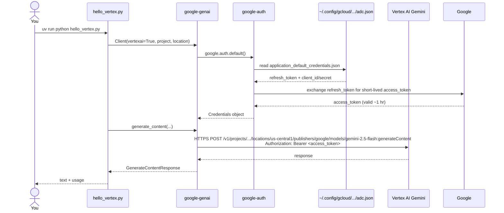

# 06 — First Gemini Call via Vertex AI (no API key)

## 🧒 Layman explanation

On Day 1 you called Gemini through **Google AI Studio** using an API key. Today you'll call the **same model** through **Vertex AI** using **Application Default Credentials** (no key file).

This is the "you can now ship to production" moment. Real production code looks exactly like what you'll write today.

The magic line is **one config change** in your `genai.Client(...)`:

```python
# Day 1 — AI Studio (dev)
client = genai.Client(api_key=os.environ["GOOGLE_API_KEY"])

# Day 4 — Vertex AI (prod-shape)
client = genai.Client(
    vertexai=True,
    project=os.environ["GOOGLE_CLOUD_PROJECT"],
    location=os.environ["GOOGLE_CLOUD_LOCATION"],
)
```

That's it. Same `client.models.generate_content(...)`. Same `response.text`. Just routed through a different backend.

---

## 💻 Hands-on

### Step 1 — Update your `.env`

```bash
cd ~/Desktop/AI/code/ai-engineer-portfolio
```

Open `.env` and fill in the Vertex section:

```bash
# ---- Gemini via Vertex AI (prod) ----
GOOGLE_CLOUD_PROJECT=ai-engineer-portfolio-123456   # ← your real project ID
GOOGLE_CLOUD_LOCATION=us-central1
GOOGLE_GENAI_USE_VERTEXAI=false   # leave as false; we'll flip per-script
```

> 💡 We're keeping `GOOGLE_GENAI_USE_VERTEXAI=false` as the default so existing `hello_gemini.py` (AI Studio mode) still works. The new `hello_vertex.py` will use the Vertex path explicitly.

### Step 2 — Write `code/hello_vertex.py`

```python
"""First Gemini call via Vertex AI (ADC auth, no API key).

Run with:
    uv run python hello_vertex.py
"""
import os

from dotenv import load_dotenv
from google import genai
from google.genai import types

load_dotenv()

# 1. Initialize client for VERTEX AI backend.
#    No api_key. Auth happens via Application Default Credentials.
client = genai.Client(
    vertexai=True,
    project=os.environ["GOOGLE_CLOUD_PROJECT"],
    location=os.environ.get("GOOGLE_CLOUD_LOCATION", "us-central1"),
)

# 2. Same call as AI Studio path — note the same method/args.
response = client.models.generate_content(
    model="gemini-2.5-flash",
    contents="Introduce yourself and mention you're being called via Vertex AI.",
    config=types.GenerateContentConfig(
        temperature=0.7,
        max_output_tokens=120,
    ),
)

# 3. Same response shape.
print("=== Response (via Vertex AI) ===")
print(response.text)

print("\n=== Usage ===")
print(f"Prompt tokens:    {response.usage_metadata.prompt_token_count}")
print(f"Output tokens:    {response.usage_metadata.candidates_token_count}")
print(f"Total tokens:     {response.usage_metadata.total_token_count}")
```

### Step 3 — Run it

```bash
uv run python code/hello_vertex.py
```

Expected:

```
=== Response (via Vertex AI) ===
Hello! I'm Gemini, a large language model from Google, running via Vertex AI.

=== Usage ===
Prompt tokens:    12
Output tokens:    21
Total tokens:     33
```

🎉 **You just called Gemini in production-shape**: container-ready, key-less, IAM-controlled.

### Step 4 — Cost check

This call cost about **$0.0001**. Confirm:
- Console → Billing → Reports → Filter by service "Vertex AI"
- Or wait ~24 hours for the billing report to update

You're not going to spend anything meaningful this week.

---

## 📊 What auth looked like under the hood



**Note:** there's no API key anywhere in this flow. The refresh token in your ADC file is exchanged for short-lived access tokens automatically. **If your laptop is stolen** you can revoke the refresh token from Console → Security; **no key file lives in your code or repo**.

---

## 🔧 Bonus — provider-agnostic wrapper preview

In Phase 2 you'll write something like this:

```python
"""Tiny provider-agnostic wrapper. You'll harden this in Phase 2."""
import os
from dotenv import load_dotenv

load_dotenv()

def get_gemini_client():
    from google import genai
    if os.environ.get("GOOGLE_GENAI_USE_VERTEXAI", "false").lower() == "true":
        return genai.Client(
            vertexai=True,
            project=os.environ["GOOGLE_CLOUD_PROJECT"],
            location=os.environ.get("GOOGLE_CLOUD_LOCATION", "us-central1"),
        )
    return genai.Client(api_key=os.environ["GOOGLE_API_KEY"])

client = get_gemini_client()
# rest of your code unchanged
```

**Flip one env var → switch between AI Studio and Vertex.** This is the kind of code that shows up in interviews.

---

## 🐛 Common Vertex issues

| Symptom                                          | Likely cause                                                  | Fix                                                  |
|--------------------------------------------------|---------------------------------------------------------------|-------------------------------------------------------|
| `DefaultCredentialsError`                        | ADC not set up                                                 | `gcloud auth application-default login` again         |
| `PermissionDenied: Vertex AI API has not been used` | API not enabled in this project                              | Lesson 02 — enable the API                            |
| `Quota exceeded: 0 requests per minute`           | Project just created; quota provisioning                      | Wait 5 minutes and retry                              |
| `404 Model not found gemini-2.5-flash`            | Wrong location (model not available in that region)            | Use `us-central1`                                     |
| `403 The user does not have permission to access project` | ADC user differs from project owner                  | `gcloud auth login` and `gcloud auth application-default login` with the correct account |

---

## 📚 References

- **`google-genai` Vertex client init** — https://googleapis.github.io/python-genai/genai.html#genai.client.Client
- **Vertex AI Gemini quickstart** — https://cloud.google.com/vertex-ai/generative-ai/docs/start/quickstarts/quickstart
- **Gemini on Vertex pricing** — https://cloud.google.com/vertex-ai/generative-ai/pricing
- **Locations where Gemini is available** — https://cloud.google.com/vertex-ai/generative-ai/docs/learn/locations

---

## ✅ Exit criteria

- [ ] `code/hello_vertex.py` exists and runs
- [ ] Output contains a real Gemini response
- [ ] No API key was used in the script
- [ ] I understand the difference between Day 1's AI Studio path and today's Vertex path
- [ ] I can name the two `genai.Client(...)` styles

**Next:** [`07-end-of-day-checklist.md`](07-end-of-day-checklist.md)

---

