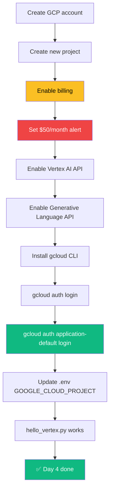

# Day 4 — Friday, May 22, 2026

> **Goal:** End the day with a **personal GCP project** that has **Vertex AI + Generative Language APIs enabled**, **`gcloud` CLI installed and authenticated**, and a **Gemini call working via Vertex AI using Application Default Credentials (no API key)**.

**Time budget:** ~4 hours. This is the deepest installation day of the week.

---

## Lessons

| #  | File                                          | Topic                                                    | Time   |
|----|-----------------------------------------------|----------------------------------------------------------|--------|
| 1  | [`01-gcp-account-and-project.md`](01-gcp-account-and-project.md) | Create personal GCP account + first project + billing | 45 min |
| 2  | [`02-enable-apis.md`](02-enable-apis.md)       | Enable Vertex AI + Generative Language APIs              | 20 min |
| 3  | [`03-billing-alert.md`](03-billing-alert.md)   | Set the $50/month budget alert                           | 15 min |
| 4  | [`04-install-gcloud-cli.md`](04-install-gcloud-cli.md) | Install + authenticate gcloud CLI                      | 30 min |
| 5  | [`05-adc-explained.md`](05-adc-explained.md)   | Application Default Credentials — what they are + why    | 30 min |
| 6  | [`06-vertex-gemini-hello-world.md`](06-vertex-gemini-hello-world.md) | First Gemini call via Vertex (no API key!)         | 45 min |
| 7  | [`07-end-of-day-checklist.md`](07-end-of-day-checklist.md) | Wrap up + journal                                       | 10 min |

---

## Big picture for today

The two yellow/red boxes (billing + budget alert) are **non-negotiable** — never skip them.

---

## The key insight for today

**Vertex AI is the same Gemini model, but with enterprise plumbing.**

Up to today you've been talking to Gemini through Google AI Studio (`api_key=...`). Today you set up the path that production code uses: **Vertex AI via Application Default Credentials**.

The brilliant part: **the same Python code works on both**. Flip one config flag and you switch from AI Studio (dev) → Vertex (prod). No code rewrite.

---

🌀 *Magic applied with Wibey VS Code Extension 🪄*
