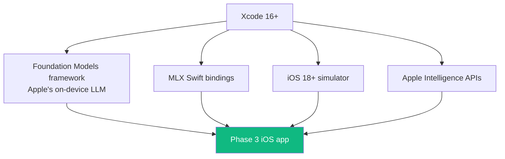

# 01 — Xcode 16+ and iOS 18+ Simulator

## 🧒 Layman explanation

You're a Walmart iOS engineer — Xcode is already on your work laptop. But for the **personal-portfolio iOS app** in Phase 3 (Apple Intelligence Companion), you want Xcode + iOS simulator set up on your **personal Mac** too, where MLX and the AI portfolio live.

Two key reasons:

1. **Foundation Models** (Apple's on-device LLM framework) requires Xcode 16+ and iOS/macOS 18+
2. **MLX** has Xcode bindings via Swift Package Manager — your iOS app can call MLX directly

If you already have Xcode 16+ on this Mac, skim and tick — you're done with this lesson in 5 minutes.

---

## 💻 Hands-on

### Step 1 — Install Xcode (skip if already done)

Mac App Store → search "Xcode" → install. Size: ~12 GB. Time: 30+ min depending on bandwidth.

> 💡 The roadmap suggests starting the download Friday night so it's ready Saturday morning.

### Step 2 — Confirm version + accept license

```bash
xcodebuild -version
# Expected: Xcode 16.x or higher

# If first time after install:
sudo xcodebuild -license accept
```

### Step 3 — Install command-line tools

```bash
xcode-select --install
# Pops a GUI installer; click "Install"

# Verify
xcrun --version
xcrun --find swift
```

### Step 4 — Download iOS 18+ simulator runtime

1. Open Xcode
2. Settings (⌘,) → **Platforms**
3. Click `+` → pick **iOS 18.x** (or latest 18.x available)
4. Download (~5 GB)

### Step 5 — Quick sanity test

```bash
# List available simulators
xcrun simctl list devices available

# Boot iPhone 16 Pro
xcrun simctl boot "iPhone 16 Pro"
open -a Simulator
# Wait ~30s for the simulator to fully boot
```

You should see a virtual iPhone 16 Pro on your screen.

---

## 📊 Why Xcode matters for the AI plan



You won't write iOS code until Phase 1 Week 2 (SwiftUI ramp-up). Today is just *install*.

---

## 📚 References

- **Xcode download** — https://apps.apple.com/us/app/xcode/id497799835
- **Foundation Models docs** — https://developer.apple.com/documentation/foundationmodels
- **iOS Simulator usage** — https://developer.apple.com/documentation/xcode/running-your-app-in-simulator-or-on-a-device

---

## ✅ Exit criteria

- [ ] `xcodebuild -version` shows 16.x or higher
- [ ] `xcrun --version` works
- [ ] iOS 18+ simulator runtime installed
- [ ] Simulator boots an iPhone 16 Pro

**Next:** [`02-mlx-fundamentals.md`](02-mlx-fundamentals.md)

---

