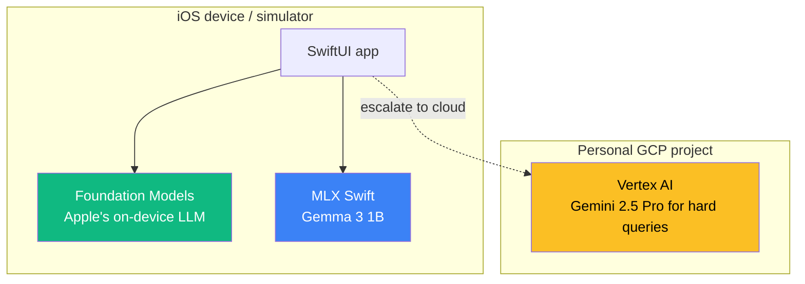

# 02 — MLX Fundamentals (Apple's ML Framework)

## 🧒 Layman explanation

**MLX** is Apple's open-source machine-learning framework. It's PyTorch-like, but built specifically for **Apple Silicon** (M1/M2/M3/M4 chips). The big trick: MLX uses **unified memory** — your CPU and GPU share the same RAM, so models load and run faster on Macs than on equivalent PCs.

Why this matters for you:

1. **Run LLMs locally on your laptop** — Gemma 3, Llama, Mistral, Phi can all run on an M-series Mac in MLX
2. **Phase 3 iOS app uses MLX** — your Apple Intelligence Companion app will load Gemma 3 (1B) into the iOS simulator via MLX
3. **No cloud cost** — once a model is downloaded, inference is free and offline
4. **Privacy** — sensitive prompts never leave the device. This is the FDE selling point for enterprise customers.

Today: install MLX, download Gemma 3 (1B), and ask it a question — all running locally on your Mac.

---

## 🔧 Technical deep-dive

### MLX vs PyTorch vs CoreML — when to use which

| Framework  | Built for           | Strengths                                                      | Weaknesses                  |
|------------|---------------------|----------------------------------------------------------------|------------------------------|
| **MLX**    | Apple Silicon       | Unified memory, simple API, fast inference, NumPy-like         | Apple-only                   |
| PyTorch    | Cross-platform GPU  | Most models, biggest ecosystem                                  | Heavier; CUDA-first           |
| CoreML     | Apple production    | Tightly integrated with iOS/macOS, hardware-accelerated         | Trickier custom-model deploy  |
| Foundation Models | Apple AI       | Apple's own LLM exposed via simple Swift API                    | iOS/macOS 18+ only            |

The roadmap uses MLX for **development + local inference** of open models (Gemma 3), and Foundation Models for the **iOS app integration** (Apple's native LLM).

### Unified memory — why it matters

On a typical PC with an NVIDIA GPU:
1. Model weights are in system RAM
2. Copy to GPU VRAM (slow, capped at ~24 GB on consumer cards)
3. Inference happens on GPU
4. Copy results back to CPU

On Apple Silicon:
1. Model weights are in **shared RAM** (up to 128 GB on M3 Ultra)
2. No copy. GPU and CPU access the same bytes.
3. Inference happens — both CPU/GPU can do parts
4. No copy back.

A 7B-parameter quantized model that requires ~5 GB:
- PC: slow load, must fit in VRAM
- Mac M3 with 24 GB RAM: loads instantly, runs alongside browser + IDE

This is why MLX is a real thing.

### What MLX gives you (the API)

```python
# Looks like NumPy — but operations run on GPU automatically
import mlx.core as mx

a = mx.array([1.0, 2.0, 3.0])
b = mx.array([4.0, 5.0, 6.0])
c = a + b           # MLX computes this on GPU; result still in unified memory
print(c)            # array([5, 7, 9])

# MLX-LM is the LLM-specific layer
from mlx_lm import load, generate
model, tokenizer = load("mlx-community/gemma-3-1b-it-4bit")
response = generate(model, tokenizer, prompt="Hello!", max_tokens=50)
```

The `mlx-community` HF org hosts **quantized MLX-ready models** for everything popular. You download the model files once (~600 MB for Gemma 3 1B at 4-bit) and they live in `~/.cache/huggingface/`.

---

## 📊 What runs where in the Phase 3 iOS app (preview)



The Phase 3 app demonstrates the **on-device-first, cloud-when-needed** pattern that every modern Apple AI app uses.

---

## 📚 References

- **MLX repo** — https://github.com/ml-explore/mlx
- **mlx-examples (today's playground)** — https://github.com/ml-explore/mlx-examples
- **MLX-LM (LLM helper layer)** — https://github.com/ml-explore/mlx-lm
- **Awni Hannun's MLX talk** (Apple's MLX lead) — search YouTube
- **`mlx-community` on Hugging Face** — https://huggingface.co/mlx-community

---

## ✅ Exit criteria

- [ ] I understand MLX is Apple-Silicon-native and PyTorch-like
- [ ] I can explain "unified memory" and why it matters
- [ ] I know the difference between MLX, CoreML, and Foundation Models
- [ ] I'm ready to clone mlx-examples and download Gemma 3

**Next:** [`03-clone-mlx-examples.md`](03-clone-mlx-examples.md)

---

