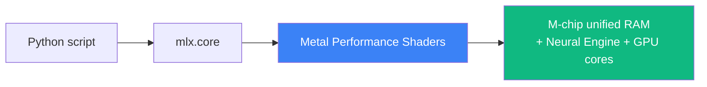

# 03 — Clone `mlx-examples` and Smoke Test

## 💻 Hands-on

### Step 1 — Pick a parent folder for ML tools

Outside your portfolio repo (to keep portfolio clean):

```bash
mkdir -p ~/Desktop/AI/ml-tools
cd ~/Desktop/AI/ml-tools
```

### Step 2 — Clone the examples repo

```bash
git clone https://github.com/ml-explore/mlx-examples.git
cd mlx-examples
ls
```

You'll see folders for `llms/`, `mistral/`, `whisper/`, `lora/`, `stable_diffusion/`, etc. Each is a runnable example.

### Step 3 — Install MLX-LM in a clean venv

Use `uv` for MLX too (not `pip`):

```bash
cd ~/Desktop/AI/ml-tools
uv venv mlx-env
source mlx-env/bin/activate

uv pip install mlx mlx-lm
```

Verify:

```bash
python -c "import mlx.core as mx; print('MLX device:', mx.default_device())"
# Expected: MLX device: Device(gpu, 0)
```

`gpu, 0` means MLX is using the M-chip's GPU (Metal). 🎉

### Step 4 — Quick smoke test (NumPy-style)

```bash
python <<'EOF'
import mlx.core as mx

a = mx.random.uniform(shape=[3, 3])
b = mx.random.uniform(shape=[3, 3])
c = a @ b  # matrix multiply on GPU
print("Random 3×3 matmul result:\n", c)
print("MLX is alive ✅")
EOF
```

If you see a 3x3 matrix of floats, MLX is operational.

---

## 📊 What's actually happening



When you write `a @ b`, MLX compiles a Metal kernel that runs the matmul on your GPU. The result lives in unified memory and is immediately readable from Python without a copy. This is the "Apple Silicon magic" people refer to.

---

## ✅ Exit criteria

- [ ] `mlx-examples` repo cloned to `~/Desktop/AI/ml-tools/mlx-examples`
- [ ] `mlx-env` venv created and activated
- [ ] `mlx` and `mlx-lm` installed
- [ ] `mx.default_device()` returns `Device(gpu, 0)`
- [ ] Random matmul smoke test passes

**Next:** [`04-run-gemma-3-locally.md`](04-run-gemma-3-locally.md)

---

🌀 *Magic applied with Wibey VS Code Extension 🪄*
