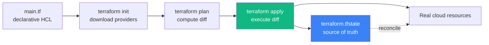

# 05 — Terraform Fundamentals (Infrastructure as Code)

## 🧒 Layman explanation

**Terraform** is "your cloud infrastructure, expressed as code". Instead of clicking 47 buttons in the GCP console to create a Cloud Run service + a Memorystore Redis + a Postgres + IAM bindings, you write:

```hcl
resource "google_cloud_run_v2_service" "doc_talk" {
  name     = "doc-talk"
  location = "us-central1"
  template {
    containers {
      image = "ghcr.io/yourname/doc-talk:latest"
    }
  }
}
```

…and then `terraform apply` makes it real. Run the same file on another account → identical infrastructure. Tear it down → `terraform destroy` cleans up everything.

**This is the difference between "I clicked some buttons once" and "I deploy reproducible cloud infra".** Every FDE interview cares about the second.

The roadmap puts you on Terraform in **Phase 3 Week 26** as a refactor — converting Phase 2's clicked-together Cloud Run setup into 100% Terraform. Today is just **install + verify**.

---

## 🔧 Technical deep-dive — IaC concepts

### Declarative vs imperative

- **Imperative (Bash, gcloud CLI):** "Run these commands in order to get a Cloud Run service."
  ```bash
  gcloud run deploy doc-talk --image gcr.io/...
  ```
  If something exists already, command may fail or no-op. State lives in your head.

- **Declarative (Terraform):** "I want the state of the world to look like this."
  Terraform compares desired-state (your `.tf` files) to actual-state (the cloud), and applies the **diff**. Run it twice → no extra work the second time.

### The Terraform workflow — three commands

```
terraform init    → Download provider plugins (Google, AWS, etc.)
terraform plan    → Show me what would change. No mutations.
terraform apply   → Make it happen. Updates terraform.tfstate.
terraform destroy → Tear everything down.
```

### State file — the source of truth

Terraform keeps a `terraform.tfstate` file that maps "the resource I declared" → "the real cloud resource". This file is **critical** — losing it means Terraform can't track resources anymore.

In production: store state in a **remote backend** (GCS bucket, S3 bucket) with locking. In Phase 3 you'll set this up.

### Providers — the cloud adapters

Terraform itself doesn't know about GCP / AWS / Azure. It speaks to them via **providers** — plugins downloaded by `terraform init`. The major ones:

- `hashicorp/google` — GCP
- `hashicorp/aws` — AWS
- `hashicorp/kubernetes` — k8s
- `integrations/github` — GitHub repos, secrets, etc.

You can mix providers in one config — that's how a single Terraform apply can create a GKE cluster + an AWS S3 bucket + a GitHub repo settings update.

---

## 📊 The Terraform mental model



### A complete tiny example (for intuition only)

```hcl
# providers
terraform {
  required_providers {
    google = { source = "hashicorp/google", version = "~> 5.0" }
  }
}

provider "google" {
  project = "ai-engineer-portfolio-123456"
  region  = "us-central1"
}

# a bucket
resource "google_storage_bucket" "demo" {
  name     = "ai-portfolio-demo-bucket-12345"
  location = "US"
}

# output the URL
output "bucket_url" {
  value = google_storage_bucket.demo.url
}
```

`terraform init && terraform apply` → bucket exists. `terraform destroy` → bucket gone. That's all.

---

## ⚙️ Why Terraform vs `gcloud` scripts

| Aspect                                       | Bash + `gcloud` script              | Terraform                                  |
|----------------------------------------------|--------------------------------------|--------------------------------------------|
| Idempotent (safe to re-run)                  | You must code it                     | Built-in                                   |
| Tracks what exists                           | You must keep notes                  | State file does this                       |
| Detects drift (someone clicked in console)   | No                                   | Yes (`terraform plan` shows mismatch)      |
| Cross-cloud (GCP + AWS)                      | Multiple scripts                     | One config                                 |
| Code review                                  | Hard                                 | `terraform plan` output is reviewable      |
| Rollback                                     | Manual                               | Re-apply previous git commit               |
| Industry adoption                            | Smaller projects                     | **Standard** for any team > 1 engineer     |

> 💡 You'll still use `gcloud` for **one-off exploration**. Terraform is for **anything that's repeated, shared, or auditable**.

---

## 📚 References

- **Terraform docs** — https://developer.hashicorp.com/terraform/docs
- **Google provider for Terraform** — https://registry.terraform.io/providers/hashicorp/google/latest/docs
- **Terraform learning path (free)** — https://developer.hashicorp.com/terraform/tutorials
- **"Terraform Up & Running"** (book, Yevgeniy Brikman) — the canonical book if you go deep

---

## ✅ Exit criteria

- [ ] I can explain "declarative vs imperative" infra
- [ ] I know what `init` / `plan` / `apply` / `destroy` do
- [ ] I understand why `terraform.tfstate` matters
- [ ] I can name 3 reasons Terraform beats a Bash script

**Next:** [`06-install-terraform-cli.md`](06-install-terraform-cli.md)

---

