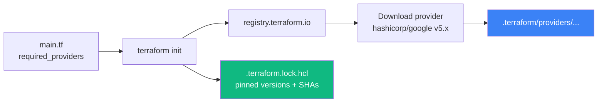

# 06 — Install the Terraform CLI

## 🧒 Layman explanation

The Terraform binary is a single Go executable. Once installed, you can run `terraform` from any directory. On macOS, the cleanest install is via **Homebrew** with HashiCorp's official tap.

This lesson is short. The next 8 months of your roadmap assume a working `terraform` on PATH — let's get it right now.

---

## 💻 Hands-on

### Step 1 — Add the HashiCorp tap and install

```bash
brew tap hashicorp/tap
brew install hashicorp/tap/terraform
```

> 💡 If you already had a non-tap Terraform: `brew uninstall terraform` first, then re-install from the tap. The tap version receives faster updates and is the HashiCorp-blessed channel.

### Step 2 — Verify

```bash
terraform version
# Expected: Terraform v1.9.x or newer
# on darwin_arm64

terraform -help | head -20
# Should list usage including: init, plan, apply, destroy, fmt, validate, ...
```

### Step 3 — Enable shell autocomplete (optional, recommended)

```bash
terraform -install-autocomplete
# Adds completion to ~/.zshrc or ~/.bashrc
# Restart your shell, then:
#   terraform a<TAB>  → expands to apply
```

### Step 4 — Smoke test (no cloud calls — just init)

Create a throwaway folder so you don't pollute the portfolio repo:

```bash
mkdir -p ~/Desktop/AI/ml-tools/terraform-smoke
cd ~/Desktop/AI/ml-tools/terraform-smoke
```

Drop a minimal `main.tf` (provider only, no resources — won't actually contact GCP):

```hcl
terraform {
  required_providers {
    google = {
      source  = "hashicorp/google"
      version = "~> 5.0"
    }
  }
}

provider "google" {
  project = "placeholder-project"
  region  = "us-central1"
}
```

Then:

```bash
terraform init
# Initializing the backend...
# Initializing provider plugins...
# - Finding hashicorp/google versions matching "~> 5.0"...
# - Installing hashicorp/google v5.x.x...
# Terraform has been successfully initialized!
```

You should see a new `.terraform/` directory (provider plugin cached) and a `.terraform.lock.hcl` file (provider version lock). **You did not create any cloud resources** — `init` only downloads providers.

### Step 5 — Try `plan` against the empty config

```bash
terraform plan
# No changes. Your infrastructure matches the configuration.
```

Because there are no `resource` blocks yet, the plan is empty. This proves the CLI + the Google provider are wired up correctly.

### Step 6 — Add formatter and validator to muscle memory

```bash
terraform fmt        # auto-formats .tf files (use it like gofmt)
terraform validate   # syntactic + provider-schema validation
```

You'll run these on every change in Phase 3.

---

## 📊 What `terraform init` actually does



The lock file commits to git (in Phase 3) so every teammate gets identical provider versions.

---

## 🗑️ Cleanup

```bash
cd ~/Desktop/AI/ml-tools
rm -rf terraform-smoke
```

The smoke folder served its purpose. Phase 3 will introduce the real Terraform layout under your portfolio repo.

---

## 📚 References

- **HashiCorp tap install guide** — https://developer.hashicorp.com/terraform/install
- **Provider versioning constraints** — https://developer.hashicorp.com/terraform/language/expressions/version-constraints
- **`terraform init` reference** — https://developer.hashicorp.com/terraform/cli/commands/init

---

## ✅ Exit criteria

- [ ] `terraform version` returns 1.9+ on darwin_arm64
- [ ] Smoke `terraform init` succeeded with the `hashicorp/google` provider
- [ ] `terraform plan` ran cleanly (no changes for an empty config)
- [ ] Autocomplete installed (optional)

**Next:** [`07-publish-kickoff-blog.md`](07-publish-kickoff-blog.md)

---

🌀 *Magic applied with Wibey VS Code Extension 🪄*
