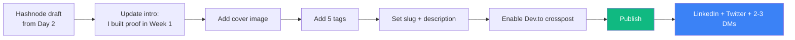

# 07 — Polish & Publish the Kickoff Blog Post

## 🧒 Layman explanation

On **Day 2** you drafted a kickoff blog post titled *"I'm a Walmart iOS engineer learning to become a Forward-Deployed AI Engineer — here's the 8-month plan"*. It's been sitting in Hashnode's draft state for ~4 days.

Today you publish it.

**Why now and not on Day 2?** Because by today you've actually *done* something concrete — installed Python + uv + Docker + gcloud + Xcode + MLX + Terraform, hit Gemini from both AI Studio and Vertex, and run Gemma 3 locally. You can rewrite the intro from "I'm going to" to "I've already started" — which is dramatically more credible.

This is a **public commitment**. Once it's live, you can't quietly back out of the 8-month plan.

---

## 💻 Hands-on

### Step 1 — Open your Hashnode draft

1. Go to https://hashnode.com/draft
2. Open the kickoff draft from Day 2

### Step 2 — Rewrite the opening paragraph

Replace the original "I'm going to do this" with a "Look what I already built in Week 1" hook. Suggested template:

```markdown
**5 days ago I was a Walmart iOS engineer who'd never typed `gcloud` once.**
Today, my MacBook holds:

- A working Python 3.12 environment scripted by `uv` that can ping Gemini 2.5 Flash and Claude Sonnet 4
- A personal GCP project with a $50 billing alert, Vertex AI enabled, and a hello-world that calls Gemini through ADC
- Gemma 3 (1B) running locally on Apple Silicon via MLX, producing tokens with no internet
- Docker Desktop, the Terraform CLI, and Xcode 16 / iOS 18 all green

And I'm 1 of 35 weeks in. Here's the 8-month plan to become a Forward-Deployed
AI Engineer at one of {Anthropic, OpenAI, Google DeepMind, Vertex AI}.
```

### Step 3 — Refresh the rest of the post

Use the body skeleton you drafted on Day 2, but for each phase, add one concrete sentence about what you proved in Week 1 that gives you confidence in that phase.

Section checklist:

- [ ] **Who I am** — Walmart iOS engineer, X years experience, learning publicly
- [ ] **Why I'm switching** — FDE role, why now, what excites me about post-AGI economy
- [ ] **The 8-month plan** — Phase 0 → Phase 7 with a one-line theme each
- [ ] **What I built in Week 1** — bullet list (the proof from Step 2)
- [ ] **What I'll ship per phase** — Doc-Talk, OSS-Docs RAG, Researcher Agent (with rough timelines)
- [ ] **Where to follow** — Hashnode RSS, GitHub portfolio link, "DM me if you're hiring FDEs"
- [ ] **Disclaimer** — Personal opinions only; not affiliated with my employer

### Step 4 — Add a cover image (one-time setup)

Use a simple gradient or a screenshot of your terminal showing `mx.default_device()` returning `Device(gpu, 0)`. Hashnode → cover image → upload.

> 💡 If you don't have a cover image ready, skip — Hashnode auto-generates one. Don't let perfection block publishing.

### Step 5 — Tags

Hashnode supports up to 5 tags. Suggested set:

- `ai-engineering`
- `llm`
- `gcp`
- `career`
- `100daysofcode` (or `learning-in-public`)

These power Hashnode's discoverability — recruiters / engineers searching them will find the post.

### Step 6 — SEO metadata

Hashnode → Post settings → SEO:

- **Title (browser tab)** — same as headline, ≤60 chars
- **Description** — 1–2 sentences. Example: *"An iOS engineer at Walmart documenting an 8-month plan to become a Forward-Deployed AI Engineer. Week 1: GCP + Gemini + Anthropic + local Gemma 3 + Terraform."*
- **Slug** — `kickoff-walmart-ios-to-fde` or similar

### Step 7 — Cross-post to Dev.to (optional but recommended)

Hashnode has a one-click cross-post to Dev.to. Enable it in Post Settings. Dev.to has a larger audience for career posts.

### Step 8 — Publish

Click **Publish**. Take a screenshot of the live URL for your records.

### Step 9 — Share once, in the right places

- LinkedIn — share with the post URL + a 3-line summary. Tag friends working at Google/Anthropic/OpenAI if comfortable.
- Twitter/X — short thread (4–6 tweets) with the headline + key bullets + URL.
- Slack DMs — to 2-3 close mentors, not a broadcast.

**Do NOT** spam every Slack channel. Quiet credibility > loud announcements.

---

## 📊 The publishing flow



---

## 🧠 Mental model — why publishing this week matters

The roadmap's hidden lever is **public accountability**. Every weekly Hashnode post creates a paper trail recruiters can read months later. By Week 35, the search "Walmart iOS engineer AI Forward Deployed" should return your blog as result #1. That happens **only if the first post goes live this week**.

Posts that wait until "the project is polished" never ship. Ship the kickoff post imperfect. Polish later if you must.

---

## 📚 References

- **Hashnode publish checklist** — https://support.hashnode.com/en/articles/6427538-publishing-your-post
- **Dev.to cross-post** — https://support.hashnode.com/en/articles/6427546-cross-posting-to-dev-to
- **"Learn in Public"** by Shawn Wang (swyx) — https://www.swyx.io/learn-in-public

---

## ✅ Exit criteria

- [ ] Kickoff blog post is **live** on Hashnode (have the public URL in hand)
- [ ] Cross-posted to Dev.to (if enabled)
- [ ] Shared on LinkedIn at least once
- [ ] Saved the URL in `~/Desktop/AI/Week-01-Setup/blog-posts.md` (you'll keep a running log for all 35 weeks)

**Next:** [`08-end-of-day-checklist.md`](08-end-of-day-checklist.md)

---

