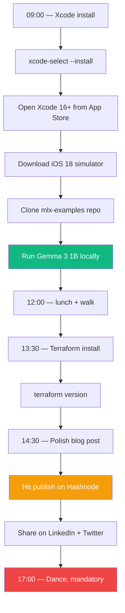

# Day 5 — Saturday, May 23, 2026

> **Goal:** End the day with **Xcode 16+ installed**, **MLX running Gemma 3 (1B) locally on Apple Silicon**, **Terraform CLI installed**, and your **kickoff blog post PUBLISHED**.

**Time budget:** ~5 hours (this is a flagship Saturday — see weekend layout)
- 09:00 – 12:00: Xcode + MLX + Gemma 3 (3 hrs)
- 13:30 – 14:30: Terraform install + verify (1 hr)
- 14:30 – 15:30: Polish + publish kickoff blog post (1 hr)
- 17:00 – 19:00: Dance / rest (mandatory)

---

## Lessons

| #  | File                                          | Topic                                                  | Time   |
|----|-----------------------------------------------|---------------------------------------------------------|--------|
| 1  | [`01-xcode-and-ios-simulator.md`](01-xcode-and-ios-simulator.md) | Install Xcode 16+, iOS 18+ simulator, command-line tools | 30 min |
| 2  | [`02-mlx-fundamentals.md`](02-mlx-fundamentals.md) | What MLX is, Apple-Silicon-native, Metal under the hood | 30 min |
| 3  | [`03-clone-mlx-examples.md`](03-clone-mlx-examples.md) | Clone repo + run a small example                         | 30 min |
| 4  | [`04-run-gemma-3-locally.md`](04-run-gemma-3-locally.md) | Download + run Gemma 3 (1B) on your M-chip Mac           | 1 hr   |
| 5  | [`05-terraform-fundamentals.md`](05-terraform-fundamentals.md) | What Terraform is, IaC concepts                          | 30 min |
| 6  | [`06-install-terraform-cli.md`](06-install-terraform-cli.md) | Install + verify Terraform CLI                          | 20 min |
| 7  | [`07-publish-kickoff-blog.md`](07-publish-kickoff-blog.md) | Polish + publish your kickoff post                       | 1 hr   |
| 8  | [`08-end-of-day-checklist.md`](08-end-of-day-checklist.md) | Wrap-up                                                  | 10 min |

---

## Big picture

---

## Why this Saturday matters most

Three "wow moments" land today:

1. **Gemma 3 on your Mac** — you'll watch a 1B-parameter LLM generate tokens *locally* on your laptop. The future of on-device AI is real. This is what Phase 3's iOS app will use.
2. **Terraform** — the moment you understand IaC, your "cloud" stops feeling like clicking in a browser and starts feeling like code.
3. **Blog post live** — your career switch is now public. There's no quitting in private.

These three together = the visceral sense of "this is happening." Don't skip dance after.

---

