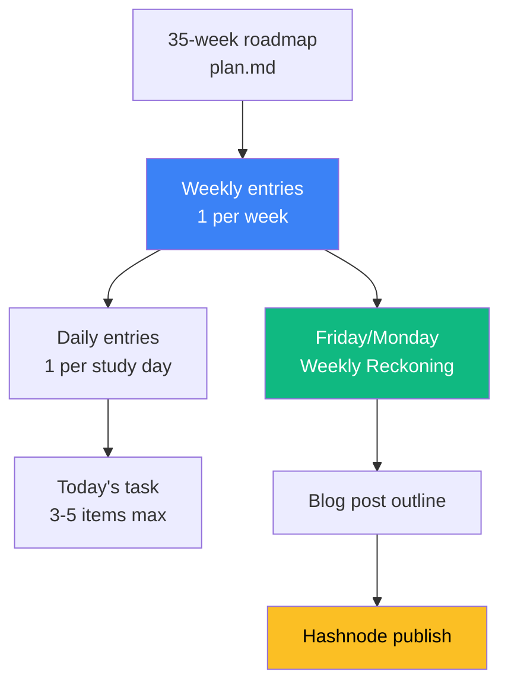

# 01 — Why a Project Tracker at all?

## 🧒 Layman explanation

You're about to spend **35 weeks** on this transition. That's ~210 study days, ~700 study hours, ~10 flagship sub-projects.

If you "remember it in your head," three things will happen:

1. By Week 6 you'll forget what you skipped in Week 3.
2. By Week 12 you'll lose half a day every Monday trying to remember "where was I?".
3. Recruiters will ask "what did you do Q3?" and you'll have nothing concrete.

A tracker fixes all three for ~10 min/day of overhead.

---

## 🔧 Why pick *Notion or Linear* specifically

| Tool      | Strengths                                                | Weaknesses                                | Fits when…                       |
|-----------|----------------------------------------------------------|-------------------------------------------|----------------------------------|
| **Notion** | Wikis + tasks + databases + journaling in one app       | Slower; can become a procrastination toy  | You like long-form notes         |
| **Linear** | Lightning-fast issue tracker, keyboard-driven, opinionated | No wiki; not great for prose             | You like Jira/GitHub-issue feel  |
| Obsidian  | Local-first markdown, very fast                          | No structured DB for sprint planning      | You're a markdown purist         |
| GitHub Issues | Already in your portfolio repo                       | No daily journal                          | You want zero new tools          |

**Pick one and commit.** Tool-shopping is the #1 productivity trap. The roadmap suggests **Notion** because the same workspace can host: tracker + journal + blog drafts + reference notes.

If you live in keyboard shortcuts and hate clicking, pick **Linear** and keep this `~/Desktop/AI/` folder as your wiki.

---

## 📊 What the tracker actually tracks

The system has 3 grains:

1. **Roadmap (yearly)** — the plan file. Read-only after this week.
2. **Weekly entry** — what you intend to ship + a Friday/Monday reckoning of what actually happened.
3. **Daily entry** — 3-5 atomic tasks + a 2-sentence journal.

---

## 🚦 Rules to keep the tracker alive past Week 4

1. **Daily entry is ≤ 5 minutes.** If it takes longer you'll skip it.
2. **One source of truth.** Code lives in GitHub. Blog drafts in Hashnode. Tracker has *links*, not content copies.
3. **Friday reckoning is non-negotiable.** Even if the week was zero-output, write that down honestly. The blog post depends on it.
4. **No "future you" tasks.** If a task is "Phase 3 stuff, will think later" — don't capture it. Capture only the next 1-2 weeks.

---

## 📚 References

- **Tiago Forte, "Building a Second Brain"** — the canonical text on personal knowledge systems
- **Linear's "How we work" doc** — https://linear.app/docs
- **Notion templates gallery** — https://www.notion.so/templates

---

## ✅ Exit criteria

- [ ] I've picked Notion OR Linear (and stopped considering alternatives)
- [ ] I understand the three grains: roadmap / weekly / daily
- [ ] I accept the 5-min/day overhead

**Next:** [`02-setup-notion-workspace.md`](02-setup-notion-workspace.md) (or [`03-linear-as-alternative.md`](03-linear-as-alternative.md))

---

