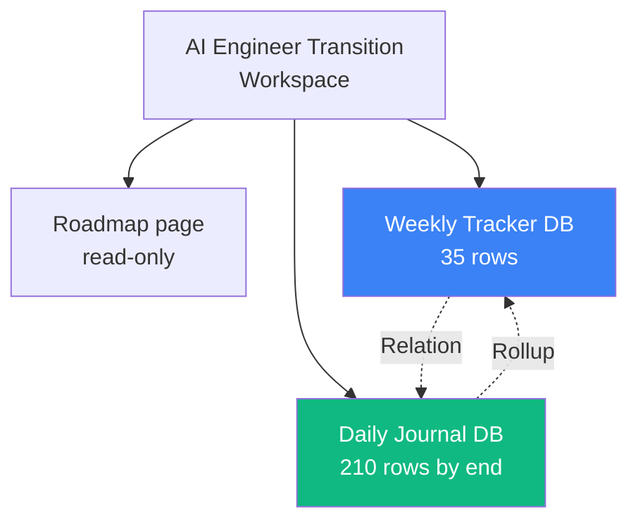

# 02 — Set up the Notion Workspace

## 🧒 Layman explanation

You'll create one Notion workspace called **"AI Engineer Transition"** with three top-level pages:

1. **Roadmap** — link to the plan file (or a paste of the phase summary)
2. **Weekly Tracker** — a database where each row is one of the 35 weeks
3. **Daily Journal** — a database where each row is one study day

Cross-links: every weekly row "Has Rolldown" to its 5 daily rows; every daily row links back to its week.

---

## 💻 Hands-on

### Step 1 — Create the workspace

1. Go to https://www.notion.so → sign in with your personal email (not work)
2. New workspace → name it **"AI Engineer Transition"**
3. Skip the template gallery — we'll build clean

### Step 2 — Top-level pages

In the sidebar, create 3 pages:

- 📘 **Roadmap (read-only)**
- 🗓️ **Weekly Tracker**
- 📓 **Daily Journal**

### Step 3 — Populate "Roadmap"

Paste the **Phase Map** table from `~/Desktop/AI/README.md`. This is your immutable reference. Don't edit it day-to-day.

### Step 4 — Build the "Weekly Tracker" database

On the "Weekly Tracker" page → press `/database` → choose **Database - Inline**.

Add columns:

| Column            | Type           | Notes                                          |
|-------------------|----------------|------------------------------------------------|
| Week #            | Number         | 1..35                                          |
| Phase             | Select         | Phase 0 / 1 / 2 / 3 / 4 / 5 / 6 / 7            |
| Theme             | Text           | One-line theme of the week                     |
| Dates             | Date (range)   | e.g. May 19 - May 25, 2026                     |
| Status            | Select         | Planned / In Progress / Done / Skipped         |
| Intended outcome  | Text           | What you committed to ship                     |
| Actual outcome    | Text           | Honest end-of-week reality                     |
| Blog post URL     | URL            | Filled in on the publish day                   |
| Reckoning notes   | Text (long)    | Friday/Monday reflection                       |

### Step 5 — Seed Week 1 row

Add a row for Week 1:

- Week # = 1
- Phase = Phase 0
- Theme = "Setup & Foundations"
- Dates = May 19 - May 25, 2026
- Status = In Progress
- Intended outcome = "Python 3.12 + uv; Gemini + Anthropic hello-worlds; GCP project + Vertex hello-world; Docker; MLX + Gemma 3 1B local; Terraform installed; kickoff blog published; tracker live; AWS account; all hello-worlds re-verified."
- Actual outcome = (fill in Day 7)
- Blog post URL = (fill in Day 7, the kickoff URL)

### Step 6 — Build the "Daily Journal" database

On the "Daily Journal" page → `/database` → **Database - Inline**.

Columns:

| Column                     | Type        |
|----------------------------|-------------|
| Date                       | Date        |
| Day-of-week                | Select      |
| Week (relation → Weekly)   | Relation    |
| Today's intent (3-5 items) | Text        |
| Done?                      | Checkbox(es)|
| What I learned             | Text (long) |
| Blockers / surprises       | Text        |
| Tomorrow's first move      | Text        |

> 💡 Use **Relation** column type to link each Daily row to its Weekly row. This auto-creates a "Daily entries" rollup on the weekly page.

### Step 7 — Seed Day 1 → Day 6 rows retroactively

You've already done Days 1-5. Spend 10 min filling them in from memory:

- **Day 1 (Tue May 19):** Python + uv + Gemini + Anthropic hello-worlds
- **Day 2 (Wed May 20):** Hashnode account + kickoff blog draft
- **Day 3 (Thu May 21):** GitHub portfolio repo + Docker fundamentals + first Dockerfile
- **Day 4 (Fri May 22):** GCP project + billing alert + gcloud + ADC + Vertex Gemini hello-world
- **Day 5 (Sat May 23):** Xcode/iOS + MLX + Gemma 3 1B + Terraform + kickoff blog PUBLISHED
- **Day 6 (Sun May 24, today):** Tracker + AWS + verification script

This retroactive fill takes 15 minutes and instantly gives you a tracker that looks active.

### Step 8 — Create a Notion template for "Daily Journal entry"

In the Daily Journal database → click the dropdown next to "New" → "New template".

Template body:

```markdown
## Date

## Today's intent (3-5 items)
- [ ] 
- [ ] 
- [ ] 

## What I learned (1-3 bullets)
- 

## Blockers / surprises
- 

## Tomorrow's first move
- 
```

Now every "New" entry pre-fills with this skeleton. **This is what keeps a tracker alive.**

### Step 9 — Bookmark the workspace

Add `notion.so/<your-workspace>` to your browser bookmark bar. Open it every morning before VSCode.

---

## 📊 The Notion structure



---

## 📚 References

- **Notion databases tutorial** — https://www.notion.so/help/intro-to-databases
- **Relations and rollups** — https://www.notion.so/help/relations-and-rollups
- **August Bradley's PPV system** (advanced) — https://www.augustbradley.com/

---

## ✅ Exit criteria

- [ ] Workspace "AI Engineer Transition" exists
- [ ] Roadmap page populated with the Phase Map
- [ ] Weekly Tracker database created; Week 1 row seeded
- [ ] Daily Journal database created with Relation to Weekly
- [ ] Days 1-5 backfilled
- [ ] Daily Journal template skeleton saved

**Next:** [`03-linear-as-alternative.md`](03-linear-as-alternative.md) — skim only if you're a keyboard fanatic, otherwise jump to [`04-create-free-aws-account.md`](04-create-free-aws-account.md).

---

🌀 *Magic applied with Wibey VS Code Extension 🪄*
