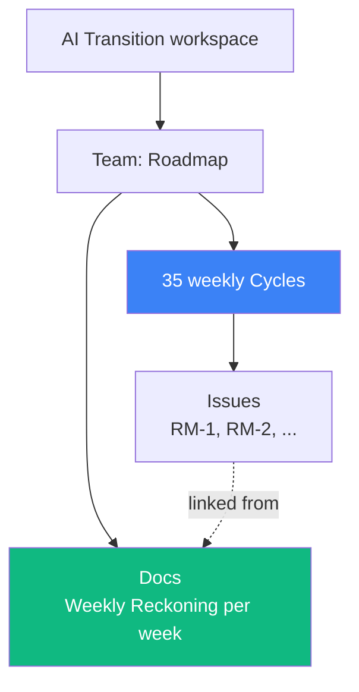

# 03 — Linear as an Alternative

## 🧒 Layman explanation

**Linear** (https://linear.app) is what engineers use when Jira feels too slow and Notion feels too soft. It's a pure issue-tracker — keyboard-driven, cycles (sprints) baked in, very opinionated.

Pros for this roadmap:

- Keyboard-only flow (`C` to create issue, `Cmd+K` for everything)
- 35 weeks ≈ 35 cycles → natural fit
- Free tier covers a personal workspace
- Triage view = your "what's next" queue

Cons:

- No native long-form notes / wiki → use this `~/Desktop/AI/` folder for that
- Friday reckoning has to live somewhere (a Linear "doc")

If you went with Notion in lesson 02, **skip this lesson**. Don't run two trackers.

---

## 💻 Hands-on (only if you chose Linear)

### Step 1 — Sign up

https://linear.app/signup → personal Google account → "Solo plan" (free).

### Step 2 — Create workspace and team

- Workspace name: **AI Transition**
- Team name: **Roadmap**
- Team identifier: `RM` (so issues are `RM-1`, `RM-2`, ...)

### Step 3 — Enable cycles

Settings → Cycles → ON.

- Cycle length: **1 week**
- Start day: **Tuesday** (matches your roadmap's week boundary)
- Auto-create cycles: 4 weeks ahead

You now have 35 weekly cycles spawning automatically.

### Step 4 — Create labels

Settings → Labels:

- `phase-0` through `phase-7` (one per phase)
- `theory` / `hands-on` / `flagship-project` / `blog` / `chore`

### Step 5 — Seed Cycle 1 (this week)

Open Cycle 1 → bulk-add the day-level intents:

- `RM-1` Python + uv + Gemini + Anthropic hello-worlds — label: phase-0, hands-on — status: Done
- `RM-2` Hashnode kickoff blog draft — phase-0, blog — Done
- `RM-3` GitHub portfolio repo + Docker fundamentals — phase-0, hands-on — Done
- `RM-4` GCP + gcloud + ADC + Vertex hello-world — phase-0, hands-on — Done
- `RM-5` Xcode + MLX + Gemma 3 + Terraform + publish kickoff — phase-0, hands-on — Done
- `RM-6` Tracker + AWS + verification script — phase-0, hands-on — In Progress
- `RM-7` Buffer + Weekly Reckoning — phase-0, blog — Todo

### Step 6 — Create the "Weekly Reckoning" doc template

Linear → Docs → New doc → save as a template called **"Weekly Reckoning"**:

```markdown
# Week N — <theme>

## What I intended to ship
- 

## What I actually shipped
- 

## What I learned (3 bullets max)
- 

## What blocked me
- 

## Next week's headline goal
- 

## Blog post draft / URL
- 
```

### Step 7 — Pin views

Pin two views to your sidebar:

- **My active cycle** (default view) — what to do today
- **Backlog** — for "I'll think about this in Phase 3" parking lot

---

## 📊 The Linear structure



---

## 📚 References

- **Linear docs** — https://linear.app/docs
- **Linear's method** — https://linear.app/method (their opinionated process essay)
- **Keyboard shortcuts cheatsheet** — `?` in any Linear screen

---

## ✅ Exit criteria

- [ ] Linear workspace + team set up
- [ ] Cycles enabled, Tuesday start, 1-week length
- [ ] Cycle 1 seeded with 7 issues (RM-1 to RM-7)
- [ ] Weekly Reckoning template saved as a Doc
- [ ] My active cycle + Backlog views pinned

**Next:** [`04-create-free-aws-account.md`](04-create-free-aws-account.md)

---

🌀 *Magic applied with Wibey VS Code Extension 🪄*
