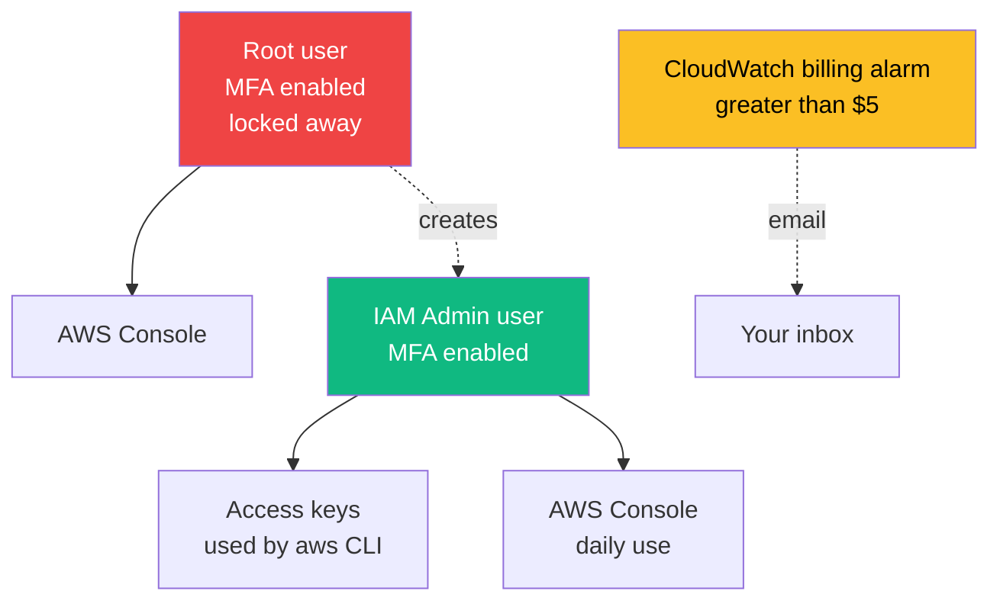

# 04 — Create a Free AWS Account (Carefully)

## 🧒 Layman explanation

You're going to be a **GCP-primary, AWS-secondary** AI engineer. The roadmap is GCP-first (because Gemini lives there), but every FDE interview will ask "do you also know AWS?" You don't need deep AWS — you need *enough* to:

- Read a Bedrock / SageMaker job spec without panic
- Spin up an S3 bucket in 30 seconds
- Discuss Bedrock vs Vertex trade-offs

That requires having an account, the CLI, and one or two demo resources. Today: account + CLI. Real Bedrock work comes in Phase 4.

**Why "carefully"?** AWS is famous for surprise bills. You'll lock it down with MFA, a tiny billing alarm, and a non-root admin user *before* you create a single resource.

---

## 💻 Hands-on

### Step 1 — Sign up

https://aws.amazon.com → "Create an AWS Account"

- Use a **personal email** (not work)
- Account name: **personal-ai-portfolio**
- Add a credit card (AWS requires one; free tier lasts 12 months for most services)
- **Choose Basic Support (free)** — DO NOT upgrade to Developer/Business support yet

### Step 2 — IMMEDIATELY turn on MFA for the root user

This is the single most important step.

1. Sign in to https://console.aws.amazon.com as the root user
2. Top-right → your email → **Security credentials**
3. Multi-factor authentication (MFA) → **Assign MFA device**
4. Choose **Authenticator app** → use 1Password / Authy / Google Authenticator
5. Scan QR → enter two consecutive codes → save

> ⚠️ **Never use the root user again after this.** You'll create an IAM admin in Step 4.

### Step 3 — Set a billing alert

1. Console → **Billing and Cost Management** → **Billing preferences**
2. Enable:
   - ✅ Receive Free Tier usage alerts
   - ✅ Receive Billing alerts
3. Save preferences

Now create a CloudWatch alarm:

1. Console → **CloudWatch** → switch region to **us-east-1** (billing metrics only live there)
2. Alarms → All alarms → **Create alarm**
3. Select metric → **Billing > Total Estimated Charge > USD**
4. Threshold: static, **Greater than $5**
5. SNS topic: create new → name `aws-billing-alert` → your email
6. Confirm the SNS email subscription (check inbox)
7. Alarm name: `billing-over-5-usd`

You will get an email at the moment estimated monthly charges exceed $5. Free tier should keep you at $0.

### Step 4 — Create an IAM admin user (you'll use this from now on)

1. Console → **IAM** → Users → **Create user**
2. Username: `<your-first-name>-admin` (e.g., `s0d0-admin`)
3. ✅ Provide user access to the AWS Management Console
4. Generate a sign-in URL — copy it somewhere you'll remember
5. Permissions → **Attach policies directly** → search and attach **`AdministratorAccess`**
6. (Optional, recommended) Add user to a group "Admins" for cleaner permissions later
7. Create user

Now turn on MFA for this IAM user too:

- IAM → Users → `<your-first-name>-admin` → Security credentials → MFA → assign virtual MFA

### Step 5 — Sign out of root, sign in as IAM admin

Use the sign-in URL from Step 4. From now on:

- **Root user** = sealed in a safe (only for closing the account or emergencies)
- **IAM admin** = your daily driver

### Step 6 — Generate an Access Key for CLI use

1. IAM → Users → your admin user → Security credentials
2. Access keys → **Create access key**
3. Use case: **Command Line Interface (CLI)**
4. Acknowledge the warning → Next
5. Description tag: `personal-mac-cli`
6. Create → **download the .csv** (you cannot view the secret again)

Move the CSV to a password manager (1Password) and delete the local copy.

> 💡 **Better long-term option:** AWS IAM Identity Center (SSO). But for Day 6, a simple access key is fine. Phase 4 will migrate to SSO.

---

## 📊 Account safety architecture

---

## 🚦 Free-tier guardrails to remember

- **S3:** 5 GB free for 12 months — fine for demos
- **Lambda:** 1M free invocations/month FOREVER (no 12-mo cliff)
- **EC2:** 750 hrs/month of t2.micro or t3.micro for 12 months — **only ONE running instance counts**
- **Bedrock:** NOT in free tier — every model call costs. Always check pricing before invoking
- **NAT Gateway / Elastic IPs:** NEVER provision casually — they cost ~$30/mo idle

Rule of thumb: **if you create something in AWS, leave a sticky note (or a Notion task) to `aws X delete-Y` it within 7 days.**

---

## 📚 References

- **AWS free tier** — https://aws.amazon.com/free
- **AWS account security best practices** — https://docs.aws.amazon.com/accounts/latest/reference/best-practices.html
- **Billing alarm walkthrough** — https://docs.aws.amazon.com/AmazonCloudWatch/latest/monitoring/monitor_estimated_charges_with_cloudwatch.html

---

## ✅ Exit criteria

- [ ] AWS account created with personal email
- [ ] Root user has MFA enabled
- [ ] $5 billing alarm armed in us-east-1
- [ ] IAM admin user created (with MFA)
- [ ] Access key downloaded and stored in 1Password
- [ ] Signed out of root; daily driver is the IAM admin

**Next:** [`05-install-aws-cli.md`](05-install-aws-cli.md)

---

