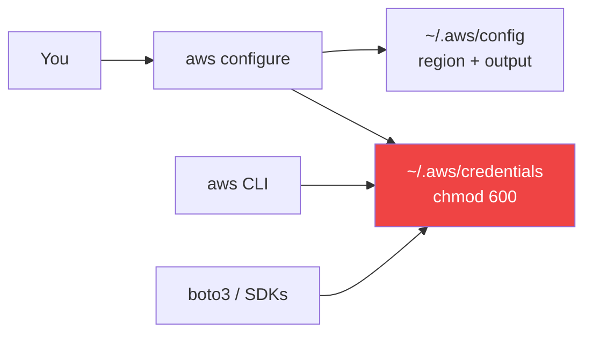

# 05 — Install and Configure the AWS CLI

## 🧒 Layman explanation

`aws` is the AWS-side analog of `gcloud`. Same idea: one binary that talks to every AWS service.

You'll install it via Homebrew, configure it with your IAM admin's access key, and prove it works with `aws sts get-caller-identity`.

---

## 💻 Hands-on

### Step 1 — Install

```bash
brew install awscli
```

Verify:

```bash
aws --version
# Expected: aws-cli/2.x.x Python/3.x Darwin/24.x.x ...
```

### Step 2 — Configure with your IAM admin's access key

```bash
aws configure
# AWS Access Key ID [None]:      <paste from 1Password>
# AWS Secret Access Key [None]:  <paste from 1Password>
# Default region name [None]:    us-east-1
# Default output format [None]:  json
```

This writes two files:

- `~/.aws/credentials` — your access key + secret
- `~/.aws/config` — region + output format

> ⚠️ Permissions: AWS auto-sets these to `600`. Verify with `ls -la ~/.aws/` — owner-read-write only.

### Step 3 — Prove it works

```bash
aws sts get-caller-identity
# {
#     "UserId": "AIDA...",
#     "Account": "123456789012",
#     "Arn": "arn:aws:iam::123456789012:user/s0d0-admin"
# }
```

The `Arn` should end with your IAM user name, **not** `:root`.

### Step 4 — Two safe one-liners to feel the surface area

```bash
# What regions exist?
aws ec2 describe-regions --output table

# What S3 buckets do I have? (should be empty)
aws s3 ls
```

Both should succeed (S3 returns nothing — you have no buckets yet).

### Step 5 — Better-than-keys: AWS SSO (optional, recommended for Phase 4+)

Long-term you'll move from `aws configure` (static keys) to **AWS IAM Identity Center (SSO)** — keys rotate automatically, no secret living on disk.

The flow is:

```bash
aws configure sso
# SSO start URL: https://<your-org>.awsapps.com/start
# SSO Region: us-east-1
# ... pick account + role ...
aws sso login --profile <profile-name>
```

For Day 6 this is **optional**. The static-key setup from Step 2 is enough to unblock the rest of the roadmap until Phase 4.

### Step 6 — Add `AWS_REGION` to your shell

So Boto3 / SDKs default to your region:

```bash
echo 'export AWS_REGION="us-east-1"' >> ~/.zshrc
source ~/.zshrc
```

### Step 7 — Install Boto3 for future Python work

In your existing AI virtual env (the one with google-genai + anthropic):

```bash
cd ~/Desktop/AI/portfolio   # or wherever your week 1 hello-world project lives
source .venv/bin/activate
uv pip install boto3
```

A 60-second smoke test:

```bash
python <<'EOF'
import boto3
sts = boto3.client("sts")
print(sts.get_caller_identity())
EOF
```

Should print the same identity dict as the CLI.

---

## 📊 Where the credentials live



The file `~/.aws/credentials` is the only secret on disk. Treat it like an SSH private key — don't commit it, don't sync it via iCloud Drive.

---

## 🚦 Common pitfalls

| Symptom                                      | Likely cause                                        | Fix                                          |
|----------------------------------------------|-----------------------------------------------------|----------------------------------------------|
| `Unable to locate credentials`                | `aws configure` never run on this Mac               | Run `aws configure`                           |
| `InvalidClientTokenId`                       | Pasted access key with stray whitespace             | Re-run `aws configure`                        |
| `AccessDenied` on a service                  | IAM user lacks permission                            | Attach policy or use admin user temporarily   |
| Charges appear despite "free tier"            | Forgot to delete EC2 / Elastic IP / NAT             | `aws ec2 describe-instances` then terminate   |
| `aws sts get-caller-identity` returns root    | Access key was issued under root, not IAM           | Create new key under the IAM admin user        |

---

## 📚 References

- **AWS CLI install** — https://docs.aws.amazon.com/cli/latest/userguide/getting-started-install.html
- **`aws configure` reference** — https://docs.aws.amazon.com/cli/latest/userguide/cli-configure-files.html
- **AWS SSO / Identity Center** — https://docs.aws.amazon.com/cli/latest/userguide/cli-configure-sso.html
- **Boto3 quickstart** — https://boto3.amazonaws.com/v1/documentation/api/latest/guide/quickstart.html

---

## ✅ Exit criteria

- [ ] `aws --version` shows v2.x
- [ ] `aws sts get-caller-identity` returns the IAM admin ARN (not root)
- [ ] `~/.aws/credentials` has perms `0600`
- [ ] `boto3` installed in your AI venv
- [ ] `AWS_REGION=us-east-1` exported in zshrc

**Next:** [`06-week1-verification-script.md`](06-week1-verification-script.md)

---

🌀 *Magic applied with Wibey VS Code Extension 🪄*
