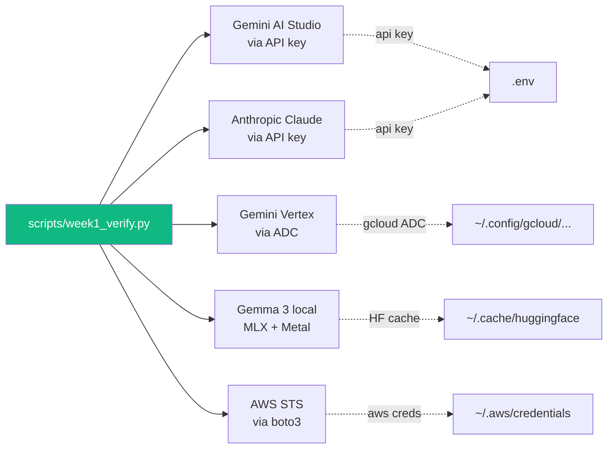

# 06 — The Week 1 Verification Script

## 🧒 Layman explanation

Across Days 1-6 you built **5 independent hello-worlds**:

1. Gemini via AI Studio (Day 1) — `hello_gemini.py`
2. Anthropic Claude (Day 1) — `hello_anthropic.py`
3. Gemini via Vertex (Day 4) — `hello_vertex.py`
4. Gemma 3 local via MLX (Day 5) — Python snippet
5. AWS identity via Boto3 (Day 6) — `boto3.client("sts").get_caller_identity()`

Until they all run **together, in one command**, "Week 1 is done" is wishful thinking. Today you write ONE script that calls each and prints ✅ / ❌.

Run it every Sunday until you forget how it works. Future-you will thank present-you.

---

## 💻 Hands-on

### Step 1 — Where the script lives

The verification script sits in your portfolio repo, not in the `~/Desktop/AI/` notes folder:

```bash
cd ~/Desktop/AI/portfolio        # adjust to your actual portfolio repo path
mkdir -p scripts
```

> 💡 If you don't have a portfolio repo yet (made on Day 3), substitute any project folder.

### Step 2 — Add `pyyaml` and ensure all SDKs are installed

```bash
source .venv/bin/activate
uv pip install google-genai anthropic boto3 mlx mlx-lm python-dotenv
```

### Step 3 — Create `scripts/week1_verify.py`

A reference implementation is in this lesson's `code/week1_verify.py`. Copy it into your portfolio:

```bash
cp ~/Desktop/AI/Week-01-Setup/Day-06-Sun-May-24/code/week1_verify.py scripts/week1_verify.py
```

(Or write your own — the contract is: 5 functions, each prints `✅` or `❌` with a 1-line reason.)

### Step 4 — Run it

```bash
python scripts/week1_verify.py
```

Expected output (some lines may take a few seconds):

```
=== Week 1 Verification ===
1. Gemini (AI Studio)     ✅  responded in 1.2s
2. Anthropic Claude       ✅  responded in 0.9s
3. Gemini (Vertex)        ✅  responded in 1.4s
4. Gemma 3 1B local       ✅  generated 12 tokens in 0.6s
5. AWS STS identity       ✅  arn:aws:iam::123456789012:user/s0d0-admin

5/5 checks passed. Week 1 stack is healthy. 🎉
```

If any check fails, the script prints what to fix.

### Step 5 — Make it a one-line habit

Add a shell alias to `~/.zshrc`:

```bash
echo 'alias verify-ai="cd ~/Desktop/AI/portfolio && source .venv/bin/activate && python scripts/week1_verify.py"' >> ~/.zshrc
source ~/.zshrc
```

Now `verify-ai` runs the whole thing.

---

## 📊 What the script actually exercises



Five separate auth flows, one script. **This is the everyday reality of an FDE** — juggling credentials across multiple platforms.

---

## 🧠 Why a verification script matters

When you onboard new tools in Phase 2-7, you'll keep extending this script:

- Week 9: add OpenAI hello-world
- Week 18: add Pinecone / Weaviate ping
- Week 24: add Vertex Search ping
- Week 30: add Bedrock invoke

By Phase 6 you'll have a 15-check "is my AI stack alive" script. **That single script is itself a portfolio artifact** — show it in interviews.

---

## 📚 References

- **`google-genai` SDK** — https://github.com/googleapis/python-genai
- **Anthropic Python SDK** — https://github.com/anthropics/anthropic-sdk-python
- **boto3** — https://boto3.amazonaws.com/v1/documentation/api/latest/index.html
- **`mlx-lm`** — https://github.com/ml-explore/mlx-lm

---

## ✅ Exit criteria

- [ ] `scripts/week1_verify.py` is checked into your portfolio repo
- [ ] Running it produces **5/5 ✅** lines
- [ ] `verify-ai` shell alias works
- [ ] Any failures are debugged before tomorrow

**Next:** [`07-end-of-day-checklist.md`](07-end-of-day-checklist.md)

---

🌀 *Magic applied with Wibey VS Code Extension 🪄*
