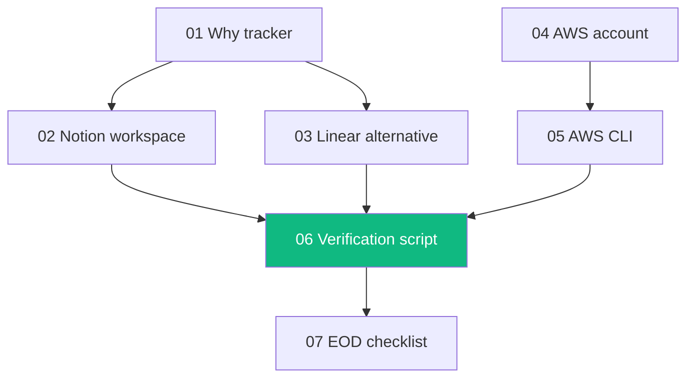

# Day 6 — Sunday, May 24, 2026 — Tracker + AWS + Verification

## 🎯 Goal of the day

Stand up the **project management spine** and the **secondary cloud (AWS)**, then run an end-of-week sanity script that proves every hello-world from Days 1–5 still passes. Sunday is intentionally lighter than Saturday.

By end of day, you should have:

1. A Notion (or Linear) workspace with weekly + daily tracker templates
2. A free-tier AWS account, locked down with billing alerts
3. AWS CLI installed + configured with an IAM user (or SSO) on PATH
4. A single verification script that runs:
   - Gemini via AI Studio (Day 1)
   - Gemini via Vertex (Day 4)
   - Anthropic Claude (Day 1)
   - Gemma 3 local (Day 5)
5. All four checks green ✅

## 📋 Lesson order

1. `01-why-a-tracker.md` — Why bother with Notion/Linear at all
2. `02-setup-notion-workspace.md` — Build the workspace, weekly + daily templates
3. `03-linear-as-alternative.md` — When Linear beats Notion
4. `04-create-free-aws-account.md` — AWS root, MFA, IAM admin user, billing alert
5. `05-install-aws-cli.md` — `aws` on PATH, configure SSO/access keys
6. `06-week1-verification-script.md` — One script that proves every hello-world still works
7. `07-end-of-day-checklist.md` — Wrap up before Monday

## 🧭 Dependency graph

## ⏱️ Time budget

| Slot           | Activity                                      |
|----------------|-----------------------------------------------|
| 09:00 - 10:30  | Notion/Linear workspace + templates           |
| 10:30 - 12:00  | AWS account + IAM admin + billing alert       |
| 12:00 - 13:00  | Lunch                                         |
| 13:00 - 14:00  | AWS CLI install + configure                   |
| 14:00 - 15:30  | Verification script + run all hello-worlds    |
| 15:30 - 16:00  | EOD checklist + commit + journal              |

## ✅ Exit criteria

- [ ] Notion or Linear workspace exists with at least one weekly review entry
- [ ] AWS account is open with MFA on root + a non-root IAM admin user
- [ ] `aws sts get-caller-identity` returns your IAM user ARN
- [ ] AWS billing alarm at $5 is armed (free tier — should never trigger)
- [ ] `python scripts/week1_verify.py` prints 4 ✅ lines
- [ ] Day 6 entry exists in your tracker

---

