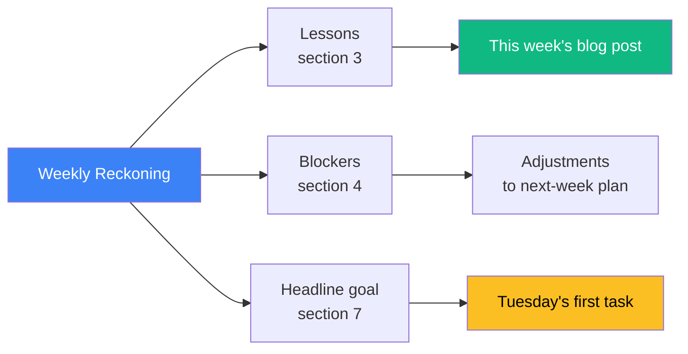

# 02 — The Weekly Reckoning Template

## 🧒 Layman explanation

A **Weekly Reckoning** is a 20-minute structured retro you do every Monday for the previous week. It has 7 sections — short answers, ruthlessly honest. It feeds directly into Section 5 of your weekly Hashnode post (the part that says "what I learned this week").

Reckonings are the single most useful artifact in the 35-week roadmap. They're how you learn from yourself.

---

## 📝 The template

Save this as a Notion template (or a Linear Doc template). Use it identically Week 1 → Week 35.

```markdown
# Week N — <theme>
*Dates: <Tue> - <Mon> | Phase <#>*

## 1. What I intended to ship
- 
- 
- 

## 2. What I actually shipped (honest)
- 
- 
- 

## 3. What I learned (3 bullets max — the durable lessons)
- 
- 
- 

## 4. What blocked me (root cause, not symptom)
- Symptom: 
  Root cause: 
- Symptom: 
  Root cause: 

## 5. What surprised me (good or bad)
- 
- 

## 6. Where I am in the roadmap vs plan
- Behind / On / Ahead
- If behind: what's the new plan? (delete tasks, don't slip them)

## 7. Next week's headline goal (ONE sentence)
- 

---

### Stats
- Hours logged: 
- Blog posts published: 
- Code committed (lines / commits): 
- Coffee consumed: 
```

---

## 💻 Week 1 worked example (your first Reckoning)

Fill this in *now* while everything is fresh. Suggested skeleton:

```markdown
# Week 1 — Setup & Foundations
*Dates: May 19 - May 25, 2026 | Phase 0*

## 1. What I intended to ship
- Python 3.12 + uv working environment
- Gemini + Anthropic + Vertex hello-worlds
- GCP project with billing alert + ADC
- Docker installed + first Dockerfile
- MLX + Gemma 3 1B running locally
- Terraform CLI installed
- Hashnode account + kickoff blog draft (later: published)
- Tracker (Notion/Linear) live
- AWS account + CLI
- Verification script proving every hello-world

## 2. What I actually shipped (honest)
- <fill in — match item-by-item to section 1, mark ✅ or ⚠️ partial>

## 3. What I learned (3 bullets max)
- ADC > raw service-account key files. Workload Identity Federation is the
  production endgame; `gcloud auth application-default login` is the dev
  shortcut. The two-flow thing (auth login vs auth application-default login)
  tripped me up for an hour.
- MLX on Apple Silicon is genuinely fast — Gemma 3 1B at ~30 tok/s is
  comparable to a remote Flash call without network. On-device first is a
  real architectural option, not a marketing slogan.
- Terraform's "declarative diff" mental model only clicks once you've
  tried to write the equivalent bash with idempotent gcloud — even a
  single GCS bucket is 30+ lines of bash to get right.

## 4. What blocked me (root cause, not symptom)
- Symptom: <e.g. PERMISSION_DENIED on Vertex hello-world>
  Root cause: <forgot to run `gcloud auth application-default login` —
  ADC ≠ user auth>

## 5. What surprised me
- How much of FDE work is credentials engineering, not model engineering
- How small Gemma 3 1B is on disk (~600 MB) for how capable it is

## 6. Where I am in the roadmap vs plan
- On plan (Week 1 = setup, all exit criteria met)

## 7. Next week's headline goal
- Write a first real script: a multi-turn chatbot against Gemini Flash
  with token + cost tracking, deployable as a FastAPI endpoint.

---

### Stats
- Hours logged: ~40
- Blog posts published: 1 (kickoff) + 1 (weekly recap, today)
- Code committed: ~12 commits / 600 lines
- Coffee consumed: <too many>
```

---

## 📊 How a Reckoning feeds the next week



The Reckoning is **the bridge** between this week's reality and next week's plan.

---

## 🚦 Reckoning rules

1. **Be brutally honest in section 2.** If you didn't ship something, write that. Future-you uses this record to spot patterns.
2. **Section 3 is hard — 3 bullets MAX.** If you have 10, the lessons aren't yet durable. Pick the 3 you'll remember in 6 months.
3. **Section 4 must reach root cause.** "I was tired" isn't a root cause. "I scheduled deep work for 9pm on a weeknight" is.
4. **Section 7 is one sentence.** If you can't compress next week to one sentence, your next week is unfocused.

---

## 📚 References

- **Toyota's 5 Whys** for root-cause discipline — https://en.wikipedia.org/wiki/Five_whys
- **DHH's "We hire writers"** — https://signalvnoise.com/posts/3408-the-2-reasons-companies-fail-and-how-to-avoid-them — on writing clearly
- **The plan file itself** — `/Users/s0d0bla/.wibey/plans/ai_engineer_roadmap_721a4d24.plan.md`

---

## ✅ Exit criteria

- [ ] Week 1 Reckoning template saved in tracker
- [ ] Week 1 Reckoning **filled in** for real
- [ ] Headline goal for Week 2 is written in one sentence

**Next:** [`03-week1-recap-blog-post.md`](03-week1-recap-blog-post.md)

---

🌀 *Magic applied with Wibey VS Code Extension 🪄*
