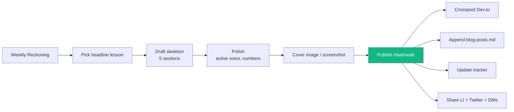

# 03 — Draft and Publish the Week 1 Recap Blog Post

## 🧒 Layman explanation

The **kickoff post** (published Day 5) introduces the journey. The **weekly recap posts** are the body of the journey — one per week, 34 more to come.

The recap post is **NOT** a daily journal dump. It's a curated story with:

- 1 headline lesson (the most durable thing you learned)
- 2-3 concrete artifacts (links, code, screenshots)
- 1 honest stumble (showing you're human, builds trust)
- 1 forward look (what's next)

Aim for **600-1200 words**. Shorter = unsharable. Longer = unfinished.

---

## 📝 The recap-post skeleton

Use this exact structure every week. The repetition is a feature — readers (and recruiters) learn to scan it.

```markdown
# Week 1 — Setup & Foundations (Walmart iOS → FDE)

*Phase 0 of 7 · Days 1-7 · May 19-25, 2026*

## TL;DR
- <one-line summary of the week>
- <key artifact link 1>
- <key artifact link 2>

## What I built
*(3-5 bullets with concrete proof)*
- 
- 
- 

## The headline lesson
*(2-3 paragraphs, the durable thing you'll remember in 6 months)*

> Pick ONE lesson from your Reckoning section 3. Go deep on it.

## What stumbled me
*(1 paragraph — the honest stumble. Shows readers you're real.)*

## What's next (Week 2 preview)
*(1 paragraph + 1-sentence headline goal)*

---
*If you're an FDE / AI Engineer hiring manager, my portfolio repo is at <url>
and you can reach me at <email>.*

---
*Posts in this series:*
1. [Kickoff: I'm a Walmart iOS engineer learning to become an FDE](<kickoff url>)
2. **You are here — Week 1: Setup & Foundations**
```

---

## 💻 Hands-on

### Step 1 — Pick the headline lesson

Re-open your Reckoning. Of the 3 lessons in section 3, **pick the most non-obvious one**. That becomes the post's spine.

Strong candidates for Week 1:

- "ADC > service-account keys" → audience: anyone deploying anything to GCP
- "MLX makes on-device AI a real option, not marketing" → audience: anyone on Apple Silicon
- "Declarative beats imperative — even for one bucket" → audience: anyone still scripting `gcloud`

### Step 2 — Write the post

Open Hashnode → New post. Paste the skeleton. Fill in.

Style tips:

- **Active voice.** "I installed Terraform" > "Terraform was installed."
- **Numbers > adjectives.** "30 tokens/sec" > "really fast."
- **Code blocks early.** Show, then explain.
- **One screenshot.** Terminal showing Gemma 3 generating a response is great cover.

### Step 3 — Tags + SEO

Reuse the kickoff tags (you set these on Day 5). Add `phase-0` if Hashnode supports custom tags.

SEO description: *"Week 1 of my Walmart-iOS-to-Forward-Deployed-AI-Engineer transition. Set up Python 3.12, GCP + Vertex, Anthropic, Docker, MLX + local Gemma 3 1B, Terraform, AWS — plus a kickoff blog post and a tracker."*

### Step 4 — Cross-post

Toggle Dev.to cross-post (you enabled this on Day 5).

### Step 5 — Publish

Click Publish. Copy the URL.

### Step 6 — Update tracker

Go back to your tracker (Notion or Linear):

- Open the Week 1 row
- Status = **Done**
- Actual outcome = (paste the recap post's "What I built" bullets)
- Blog post URL = (paste the new recap URL)

### Step 7 — Share once

LinkedIn + Twitter + 1-2 DMs to mentors. Same low-key cadence as the kickoff.

### Step 8 — Add to `blog-posts.md`

```bash
echo "- Week 1 recap: <url>" >> ~/Desktop/AI/Week-01-Setup/blog-posts.md
```

You'll keep appending. By Week 35 this file is your portfolio's table of contents.

---

## 📊 The recap-post lifecycle



---

## 🚦 What a great recap post does NOT do

- ❌ Dump every lesson from every day (no one reads that)
- ❌ Apologize for being a beginner
- ❌ Claim mastery you don't have
- ❌ Compare yourself to "real AI engineers"
- ❌ Pitch yourself to recruiters in the body (only the footer)

What it DOES do:

- ✅ Show concrete proof (links, code, screenshots)
- ✅ Teach ONE thing well
- ✅ Acknowledge one honest stumble
- ✅ Tee up next week with curiosity

---

## 📚 References

- **Patrick McKenzie on "career capital"** — https://www.kalzumeus.com/2011/10/28/dont-call-yourself-a-programmer/
- **Julia Evans' weekly blog cadence** — https://jvns.ca/ (study her structure)
- **Hashnode best-of by tag** — https://hashnode.com/n/ai

---

## ✅ Exit criteria

- [ ] Week 1 recap blog post **published** with a public URL
- [ ] Cross-posted to Dev.to
- [ ] Tracker Week 1 row updated to Done with the URL
- [ ] URL appended to `~/Desktop/AI/Week-01-Setup/blog-posts.md`
- [ ] Shared on LinkedIn once

**Next:** [`04-prep-for-week-2.md`](04-prep-for-week-2.md)

---

