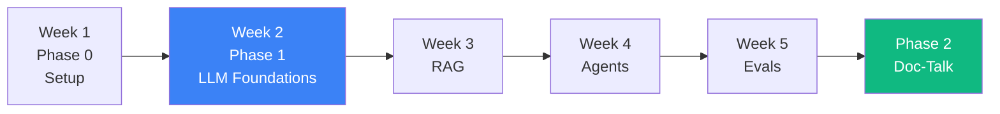

# 04 — Prep for Week 2

## 🧒 Layman explanation

You're about to leave **Phase 0 (Setup)** and enter **Phase 1 (LLM API Foundations)**.

The shift:

| Phase 0 (Week 1)            | Phase 1 (Weeks 2-5)                          |
|-----------------------------|----------------------------------------------|
| Install + configure tools   | Use the tools to build real things            |
| `hello, world` LLM calls    | Multi-turn, streaming, structured-output, function-calling |
| Free + local                | Paid (but bounded) + cloud                    |
| ~1 SDK at a time            | google-genai, anthropic, openai side-by-side  |
| No FastAPI yet              | First FastAPI endpoint that wraps an LLM      |
| No tests yet                 | First pytest suite                            |

Week 2 sits at the front of Phase 1. Its headline goal (suggested):

> **Build a deployable multi-turn chatbot in FastAPI that streams responses from Gemini Flash, tracks tokens + cost per conversation, and is covered by pytest.**

That's ambitious but well-scoped. We're not building UI — just the API.

---

## 📋 Week 2 lesson outline (tentative)

You'll generate this in detail when you start Week 2. For now, sketch the day-by-day at a glance:

| Day | Theme                                                          |
|-----|---------------------------------------------------------------|
| Tue | Streaming primer — SSE, async generators, token-by-token I/O   |
| Wed | Multi-turn state — system prompt, conversation history, tokens |
| Thu | FastAPI 101 — `POST /chat` endpoint, Pydantic request/response |
| Fri | Cost telemetry — count input + output tokens, write to a log   |
| Sat | Pytest + structlog + httpx async tests                         |
| Sun | Dockerize the FastAPI app + Cloud Run dry-run                  |
| Mon | Buffer + Week 2 recap blog post                                 |

---

## 💻 Light prep tasks for today

These are 5-minute tasks, not lessons:

### 1. Re-read the plan's Phase 1 section

```bash
# Open the plan file and skim Week 2-5 sections
```

Just skim — don't try to absorb. You're priming diffuse-mode.

### 2. Pre-create the Week 2 folder

```bash
mkdir -p ~/Desktop/AI/Week-02-LLM-Foundations
touch ~/Desktop/AI/Week-02-LLM-Foundations/README.md
```

Empty for now. Filled when Tuesday begins.

### 3. Pre-create a Week 2 row in the tracker

In Notion's Weekly Tracker (or Linear Cycle 2):

- Week # = 2
- Phase = Phase 1
- Theme = "LLM API Foundations — streaming, multi-turn, FastAPI"
- Dates = May 26 - Jun 1, 2026
- Status = Planned
- Intended outcome = "FastAPI `/chat` endpoint streaming Gemini Flash, multi-turn, cost-tracked, pytest-covered"

### 4. Skim 2-3 references you'll use Week 2

- **FastAPI tutorial** — https://fastapi.tiangolo.com/tutorial/
- **Gemini streaming docs** — https://ai.google.dev/api/generate-content#stream
- **Pydantic v2 migration guide** — https://docs.pydantic.dev/latest/migration/

10 minutes, no notes. Just expose your brain to the surface area.

---

## 📊 The arc from Week 1 to Week 2



The skills compound: streaming + multi-turn (W2) → retrieval-augmented (W3) → multi-step reasoning (W4) → measurable quality (W5) → all-of-the-above wrapped in a flagship product (Phase 2 Doc-Talk).

---

## 🚦 Don't start Week 2 today

You've done Day 7. Today's exit gate is **Week 1 = Done**, not **Week 2 = Started**.

If you have spare energy at 3pm:

- Read fiction
- Walk
- Cook a real meal
- Sleep early

If you must work, work on **non-roadmap** stuff: clear your inbox, do laundry, plan a date.

---

## 📚 References

- **Anders Ericsson on deliberate practice** — original 1993 paper or his book *Peak*

---

## ✅ Exit criteria

- [ ] Phase 1 section of the plan skimmed (not memorized)
- [ ] `~/Desktop/AI/Week-02-LLM-Foundations/` folder pre-created
- [ ] Week 2 row pre-created in tracker (status: Planned)
- [ ] Decided to NOT start Week 2 content today

**Next:** [`05-end-of-week-checklist.md`](05-end-of-week-checklist.md)

---

