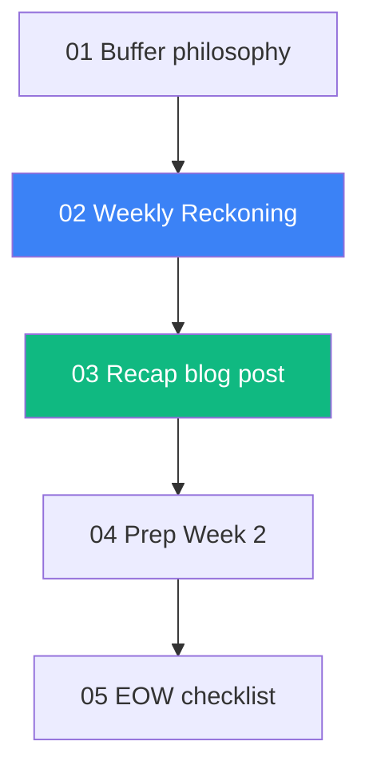

# Day 7 — Monday, May 25, 2026 — Buffer + Weekly Reckoning

## 🎯 Goal of the day

Today is **deliberately under-scheduled.** Week 1 was dense (6 days of new tooling, a kickoff blog, a verification script). Day 7 is for:

1. Catching anything Days 1-6 left unfinished
2. Writing the **Weekly Reckoning** — honest retro of the week
3. Drafting and publishing the **first weekly recap blog post** (this is a recurring habit you'll repeat 34 more times)
4. Resting before Week 2

If Days 1-6 are already perfect, you have a 4-hour Monday. That's a feature, not a bug.

## 📋 Lesson order

1. `01-buffer-day-philosophy.md` — Why every week needs a buffer
2. `02-weekly-reckoning-template.md` — The retro format you'll reuse 34 more times
3. `03-week1-recap-blog-post.md` — Draft + publish the weekly recap
4. `04-prep-for-week-2.md` — Sneak peek of Phase 1 (LLM APIs deep-dive)
5. `05-end-of-week-checklist.md` — Sign off Week 1

## 🧭 Dependency graph

## ⏱️ Time budget

| Slot           | Activity                                              |
|----------------|-------------------------------------------------------|
| 09:00 - 10:00  | Reckoning: write the retro in your tracker            |
| 10:00 - 11:30  | Recap blog post draft                                 |
| 11:30 - 12:00  | Polish + publish recap post                           |
| 12:00 - 13:00  | Lunch                                                 |
| 13:00 - 14:00  | Cleanup: anything Days 1-6 left undone                |
| 14:00 - 14:30  | Week 2 preview + skim its plan section                |
| 14:30 - 15:00  | EOW checklist + commit + push                         |
| 15:00 onward   | **Rest.** Walk, read, life.                           |

## ✅ Exit criteria

- [ ] Weekly Reckoning entry filled in tracker for Week 1
- [ ] Week 1 recap blog post **published**
- [ ] All 5 verification checks still ✅
- [ ] Week 2 plan skimmed, top intent captured
- [ ] Phase 0 marked **DONE** in tracker

---

