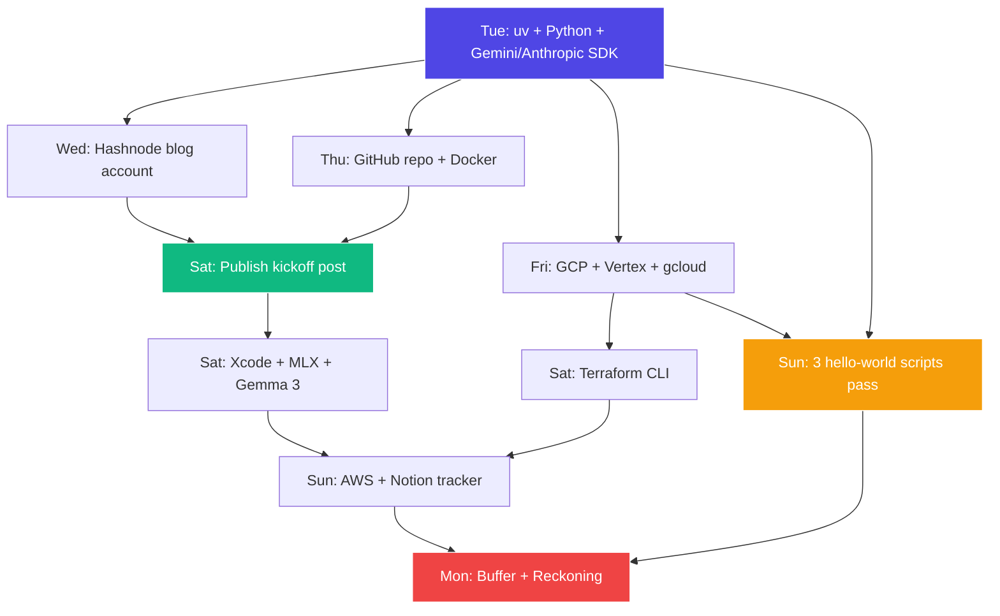

# Week 1 — Phase 0: Setup (May 19 – May 25, 2026)

> **Phase Goal:** Remove all friction before the real work starts. By end of week, every account, CLI, SDK, and API key required for the next 8 months should be installed, verified, and producing a "hello world".

---

## Why Week 1 matters

A career switch only works if the first week ships a **visible artifact**. Your week-1 artifact is a **published blog post + a working GitHub portfolio repo + three "hello world" scripts** that prove your Gemini, Vertex, and Anthropic auth all work.

If you skip this and dive straight into FastAPI in Week 2, you'll lose 3–4 hours mid-week debugging environment problems — and one bad mid-week eats your whole study budget.

---

## What you'll have at end of Week 1

| ✅ | Artifact                                                                                       |
|----|------------------------------------------------------------------------------------------------|
|    | `uv`-managed Python project that runs `python --version` → 3.12+                               |
|    | `google-genai` SDK installed, `client.models.generate_content(...)` returns text                |
|    | `anthropic` SDK installed, `messages.create(...)` returns text                                  |
|    | `.env` flow with three keys: `GOOGLE_API_KEY`, `ANTHROPIC_API_KEY`, plus ADC for Vertex         |
|    | Personal **GCP project** with **Vertex AI + Generative Language APIs** enabled                  |
|    | `gcloud auth application-default login` configured → Vertex Gemini call works without API key   |
|    | `$50/month` GCP billing alert wired to your email                                               |
|    | **Hashnode blog** live on `<you>.hashnode.dev` with kickoff post published                     |
|    | **GitHub portfolio repo** with three flagship placeholder folders + READMEs                    |
|    | **Docker Desktop** installed, `docker run hello-world` passes                                  |
|    | **Terraform CLI** installed, `terraform version` returns something                              |
|    | **Xcode 16+** with iOS 18+ simulator + MLX clone running Gemma 3 (1B) locally                   |
|    | **Free AWS account** created (for Phase 3 Bedrock work)                                        |
|    | Tracker (Notion or Linear) with the 35-week plan loaded                                        |

---

## Day-by-day plan

| Day  | Date         | Hrs (target) | Lesson folder                | Topics                                                                   |
|------|--------------|--------------|------------------------------|--------------------------------------------------------------------------|
| Tue  | May 19       | 4            | `Day-01-Tue-May-19/`         | `uv` + Python skeleton + Gemini SDK + Anthropic SDK + `.env`             |
| Wed  | May 20       | 4            | `Day-02-Wed-May-20/`         | Hashnode + kickoff blog post drafting                                    |
| Thu  | May 21       | 4            | `Day-03-Thu-May-21/`         | GitHub portfolio repo + Docker Desktop                                   |
| Fri  | May 22       | 4            | `Day-04-Fri-May-22/`         | GCP account + Vertex AI APIs + `gcloud` CLI + ADC                        |
| Sat  | May 23       | 5            | `Day-05-Sat-May-23/`         | Xcode 16 + MLX + Gemma 3 local + Terraform CLI + publish blog            |
| Sun  | May 24       | 4            | `Day-06-Sun-May-24/`         | Notion/Linear tracker + AWS account + 3 hello-world verification         |
| Mon  | May 25       | 2            | `Day-07-Mon-May-25/`         | Buffer + first blog post live + week reckoning                           |

**Total target:** ~27 hrs (light week by design — setup, not deep work)

---

## Theory (cross-cutting concepts)

Before diving into the day-by-day, read these 4 short pieces in the `theory/` folder. They give you the mental model for the entire next 35 weeks.

1. [`theory/01-what-is-ai-engineering.md`](theory/01-what-is-ai-engineering.md) — What the role actually is + how FDE differs from "AI Engineer"
2. [`theory/02-llm-fundamentals.md`](theory/02-llm-fundamentals.md) — How LLMs work (just enough), tokens, context windows, the API call lifecycle
3. [`theory/03-cloud-platforms-overview.md`](theory/03-cloud-platforms-overview.md) — GCP vs AWS vs Azure mental model + why we picked GCP-primary
4. [`theory/04-development-environment.md`](theory/04-development-environment.md) — Why `uv` over `pip`, why FastAPI, why Docker — the tooling rationale

---

## Big picture: the Week 1 dependency graph

**Critical path:** Tue (SDKs) → Fri (GCP) → Sun (verification) → Mon (buffer).
If you have to skip any day, **don't skip Tue or Fri**.

---

## End-of-week "Reckoning" template

Run this every Sunday 17:00–18:00 (per the roadmap). For Week 1, answer:

- ✅ Did all 14 exit-criteria boxes get ticked? If not, why?
- 📝 What did I get wrong in my mental model that I had to correct?
- 🐢 Where did I lose the most time? (debug GCP IAM? Hashnode CSS? `gcloud` auth?)
- 📈 What's the **one thing** I will do differently in Week 2?
- 🔗 Is my kickoff blog post **publicly live** with a working URL?

Add your answers to `Day-07-Mon-May-25/01-buffer-day.md`.

---

🌀 *Magic applied with Wibey VS Code Extension 🪄*
