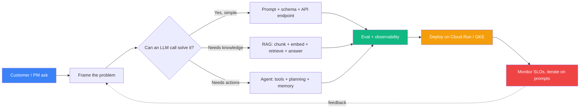

# Theory 01 — What is AI Engineering (and what is an FDE)?

## 🧒 Layman explanation

Imagine three kinds of people who work with AI:

1. **The AI Researcher** — invents new model architectures (think: the people who created Transformers). Works at OpenAI / Google DeepMind / Anthropic / Meta FAIR research labs. Reads and writes academic papers. **You are not this person.**

2. **The ML Engineer (traditional)** — trains models on company data. Cleans data, picks features, tunes hyperparameters, validates accuracy, deploys a model. They build the brain. Tools: PyTorch, TensorFlow, MLflow, scikit-learn. **You are not this person either** (this requires a stats PhD-flavored background).

3. **The AI Engineer** — *uses* pre-trained foundation models (Gemini, Claude, GPT-5) as components in a product. They never train the brain — they wire it up. They write the **glue**: the prompt that goes in, the schema for the structured output, the tool the model can call, the cache that makes it cheap, the eval that measures if it's good, the production API, the dashboard. **This is who you are becoming.**

There's a fourth flavor, the one you actually want:

4. **The Forward-Deployed Engineer (FDE)** — an AI Engineer who **goes to the customer**. Sits with their PM, learns their domain, builds a pilot in 2 weeks, integrates it into their Slack/Jira/CRM, hands it off, and moves to the next customer. Anthropic, OpenAI, Palantir, and Scale all hire this archetype. The job description is 70% AI engineer + 30% solutions architect + 100% communication.

| Role               | Builds                          | Audience            | Time horizon | What gets measured        |
|--------------------|---------------------------------|---------------------|--------------|---------------------------|
| AI Researcher      | New architectures               | Other researchers   | 6–18 months  | Papers, citations         |
| ML Engineer        | A trained model                 | Internal teams      | Months       | Accuracy / business KPI   |
| **AI Engineer**    | **An LLM-powered product**      | **End users**       | **Weeks**    | **Product metrics, cost** |
| **FDE**            | **An LLM-powered product, for *one specific customer***  | **A customer team** | **Days–weeks** | **Customer signs renewal** |

---

## 🔧 Technical deep-dive

### The "stack" an AI Engineer ships

Most AI Engineering products are built from the same Lego blocks. You'll learn each of these as you go.

```
┌──────────────────────────────────────────────────────────────────────┐
│  Layer 7  — UI                       (SwiftUI / React / Slack bot)    │
│  Layer 6  — API                      (FastAPI / Express)               │
│  Layer 5  — Agent / orchestration    (Google ADK / LangGraph)          │
│  Layer 4  — RAG / retrieval          (pgvector + embeddings + rerank)  │
│  Layer 3  — LLM call                 (Gemini / Claude / Bedrock)       │
│  Layer 2  — Prompt + schema          (templates + Pydantic)            │
│  Layer 1  — Observability + evals    (Langfuse + Ragas)                │
│  Layer 0  — Infra                    (Docker + Cloud Run/GKE + IaC)    │
└──────────────────────────────────────────────────────────────────────┘
```

The roadmap covers **all 8 layers** in order: Phase 1 covers L0–L3, Phase 2 covers L4 + observability, Phase 3 covers L5 + agents + multimodal.

### What makes the FDE flavor different

Read this list. These are the skills that **don't appear in any LLM tutorial** but appear in every FDE interview:

1. **Customer discovery** — asking the right 5 questions in a 1-hour call to scope a pilot
2. **Data access patterns** — "your data lives in Salesforce — here's the SCIM connector I'll write"
3. **Pilot scoping** — knowing what to *cut* so a 2-week pilot ships, not a 6-month project
4. **Integration playbooks** — Slack slash commands, GitHub webhooks, SSO/SAML wiring
5. **Success metrics** — defining "did this work?" *before* you build it, in language the customer's CFO understands
6. **Handoff** — writing a runbook the customer's own team can operate after you leave
7. **Multi-cloud literacy** — half your customers are AWS-first, half GCP-first
8. **Compliance** — SOC2, HIPAA, PII handling — knowing the answer before they ask

The roadmap's **Phase 4 (Week 31)** is dedicated to internalizing this — but the seed is planted in Phase 1 Week 10 when you build your first Slack webhook.

### Why this job exists *now*

Foundation models (Gemini 2.5, Claude 4, GPT-5) are **good enough** that 80% of business value comes from wiring, not from training. Five years ago the bottleneck was model quality; today the bottleneck is *deployment + integration*. That's the FDE thesis.

---

## 📊 Flow diagram — the AI Engineer's typical workflow



This is the entire loop. Every job description for "AI Engineer" / "FDE" can be mapped to skills in this loop.

---

## 📚 References

- **"What is an AI Engineer?"** — Swyx (2023, the post that named the role): https://www.latent.space/p/ai-engineer
- **Chip Huyen's "AI Engineering" book** — pre-read Ch 1 if you can get a copy (you'll do Ch 1–6 in Phase 4)
- **Anthropic's careers page** — read 3 FDE/Applied AI job listings to internalize what they screen for
- **Palantir's FDE blog post archive** — https://blog.palantir.com (search "Forward Deployed")
- **Eugene Yan's "Patterns for Building LLM-based Systems & Products"** — https://eugeneyan.com/writing/llm-patterns/

---

## ✅ Exit criteria

- [ ] I can explain the difference between an AI Researcher, ML Engineer, AI Engineer, and FDE in one sentence each
- [ ] I can name the 8 layers of the AI Engineering stack from memory
- [ ] I can name 3 skills that distinguish an FDE from a generic AI Engineer
- [ ] I have read at least 2 of the references above

---

