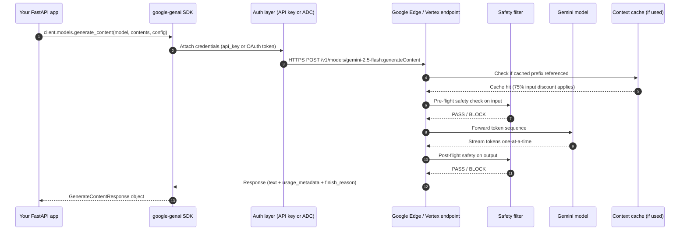
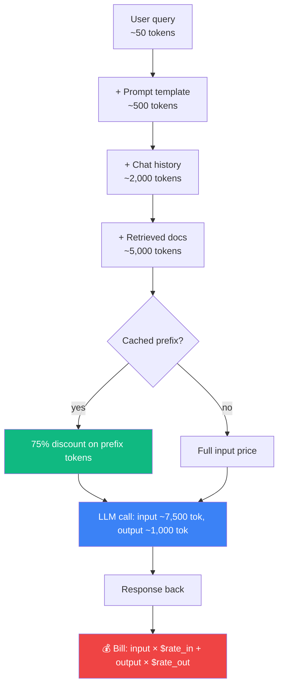

# Theory 02 — LLM Fundamentals (just enough to be dangerous)

> You don't need to be able to *train* an LLM to be an AI Engineer. You do need to understand the mental model of how a call works, what a token is, what a context window is, and where money disappears.

---

## 🧒 Layman explanation

A Large Language Model (LLM) like Gemini 2.5 Pro or Claude 4 is a **very large autocomplete**. You give it some text ("the cat sat on the"), and it predicts the most likely next word ("mat"). That's it. The whole magic trick.

**The wrinkles that make it useful:**

1. It doesn't predict *words*, it predicts **tokens** (pieces of words, ~4 characters each on average for English).
2. It was trained on roughly *the entire internet*, so it has absorbed grammar, facts, code patterns, reasoning patterns, even how to behave like a helpful assistant.
3. You don't just give it raw text — you give it a **structured conversation** ("system: you are a helpful assistant", "user: write me a poem", "assistant: …").
4. It can be told to call **tools** (functions you define) to look up real-world data — that's how it stops being a "trained-on-the-past frozen model" and becomes useful right now.
5. It can be made to return **structured JSON** instead of free text — so your code can use the output directly.

**Two cost knobs you will obsess over:**

- **Input tokens** — what you send in (system prompt + user message + history + retrieved docs)
- **Output tokens** — what comes back

Output tokens are usually 4–5× more expensive than input tokens. Cached input tokens are ~75% cheaper than fresh input tokens. **Most of AI engineering is moving expensive output tokens into cheaper structured retrieval + cached input.**

---

## 🔧 Technical deep-dive

### Tokens — the unit of LLM pricing and reasoning

When you send "Hello, world!" to a model, it doesn't see those characters — it sees a sequence of integer IDs from a vocabulary of ~100,000–200,000 tokens.

- "Hello" → token #15339
- "," → token #11
- " world" → token #1917
- "!" → token #0

A rough rule for English: **1 token ≈ 4 characters ≈ ¾ of a word**. So a 1,000-word essay is ~1,300 tokens. The Constitution of India is ~146,000 words → ~190,000 tokens.

| Item                                         | Token count (approx) |
|----------------------------------------------|----------------------|
| One sentence                                 | 15–30                |
| One paragraph                                | 100–200              |
| A typical user query                         | 50–500               |
| A typical system prompt                      | 200–2,000            |
| One page of source code                      | 800–1,500            |
| The Bible                                    | ~800,000             |
| **Gemini 2.5 Pro context window (1M)**       | **~750,000 words**   |

The number you must memorize: **Gemini 2.5 Pro / Flash both support a 1M-token context window**. Claude 4 supports 200K. GPT-5 family supports 400K–1M depending on variant. This matters because…

### Context window — the "working memory" of a single call

Everything you send + everything that comes back must fit in a fixed envelope. Gemini's envelope is 1M tokens. Claude's is 200K. If you exceed it, the model errors out (or silently truncates with cheaper APIs — never trust that).

```
┌─────────────────────────────────────────────────────────────┐
│   Context window (e.g., 1M tokens for Gemini 2.5)            │
│  ┌────────────┐ ┌──────────────┐ ┌─────────┐ ┌──────────┐    │
│  │ System     │ │ Retrieved    │ │ Chat    │ │ Output   │    │
│  │ prompt     │ │ docs (RAG)   │ │ history │ │ (so far) │    │
│  │ ~2K        │ │ ~100K        │ │ ~50K    │ │ ~5K      │    │
│  └────────────┘ └──────────────┘ └─────────┘ └──────────┘    │
└─────────────────────────────────────────────────────────────┘
```

You will manage this envelope constantly — that's the job of "context engineering."

### The API call lifecycle (Gemini, end-to-end)



**Each numbered step costs you something:**
- Step 1: your code complexity
- Step 2: an API key (rotatable) **or** ADC (no key on disk, preferred)
- Steps 3–9: network latency (~200–800ms typical for non-streamed)
- Step 6: cost, in cached vs uncached input tokens + output tokens
- Step 5, 7: safety blocks — these *will* fire in production; design for them

### Streaming vs non-streaming

```python
# Non-streaming: wait for whole response (good for batch jobs, JSON modes)
response = client.models.generate_content(
    model="gemini-2.5-flash",
    contents="Tell me a joke",
)
print(response.text)

# Streaming: get tokens as they're generated (good for chat UIs, time-to-first-token UX)
for chunk in client.models.generate_content_stream(
    model="gemini-2.5-flash",
    contents="Tell me a joke",
):
    print(chunk.text, end="", flush=True)
```

Streaming makes products feel 5× faster even when total wall-clock is the same. Every chat product you've ever used streams. You will too.

### Temperature, top-p, max tokens — the three knobs you'll actually touch

| Param          | Range   | What it does                                                   | When to set what                                                              |
|----------------|---------|-----------------------------------------------------------------|-------------------------------------------------------------------------------|
| `temperature`  | 0–2     | How random the next token pick is. 0 = always pick the top.    | 0 for code/JSON/extraction. 0.7 for creative. 1.0 for brainstorming.          |
| `top_p`        | 0–1     | Nucleus sampling — restrict picks to top P% probability mass.   | Usually leave at 0.95. Pair with temperature, not both.                       |
| `max_output_tokens` | 1+ | Hard cap on the response.                                       | Always set. Prevents the model from rambling and prevents runaway cost.       |

### Why output tokens cost more

Generation is autoregressive — each token requires a full forward pass through the model's weights. Input tokens are processed in parallel (one big matmul) but output tokens are sequential. So roughly 4–5× the cost per token. Make every output token earn its place.

### Pricing landscape (memorize approximate orders of magnitude)

| Model                       | Input ($/M tokens) | Output ($/M tokens) | Cached input |
|-----------------------------|---------------------:|-----------------------:|--------------|
| Gemini 2.5 Flash-Lite       | ~$0.075              | ~$0.30                 | ~$0.019      |
| Gemini 2.5 Flash            | ~$0.30               | ~$2.50                 | ~$0.075      |
| Gemini 2.5 Pro              | ~$1.25               | ~$10                   | ~$0.31       |
| Claude 4 Sonnet             | ~$3                  | ~$15                   | ~$0.30       |
| Claude 4 Opus               | ~$15                 | ~$75                   | ~$1.50       |
| `gemini-embedding-001`      | ~$0.15               | n/a                    | n/a          |

*(Prices drift over time; check current sheet. Order of magnitude is stable.)*

**Key insight:** Gemini 2.5 Flash is **~10× cheaper than Claude Sonnet** for similar capability on most tasks. This is why the roadmap defaults to Gemini.

---

## 📊 Mental model — the "money flow" diagram



Every penny you save in production AI comes from making one of these arrows cheaper:
- **Smaller models** → cheaper $rate per token
- **Context caching** → 75% off the cached prefix
- **Better retrieval** → fewer docs need to be sent (shorter `RT`)
- **Output schema constraints** → stop the model from rambling
- **Semantic cache (Redis)** → skip the call entirely for repeat questions

---

## 📚 References

- **OpenAI tokenizer playground** — https://platform.openai.com/tokenizer — paste text, see tokens (works for English regardless of model)
- **Anthropic's "Prompt engineering" course** (free) — first 4 chapters cover this
- **Gemini docs: "Tokens"** — https://ai.google.dev/gemini-api/docs/tokens
- **"The Illustrated Transformer"** — Jay Alammar — *optional* but the best 30-min read on what's actually happening inside the model
- **Eugene Yan: "LLM token economics"** — https://eugeneyan.com

---

## ✅ Exit criteria

- [ ] I can explain "what is a token" without saying the word "letter" or "word"
- [ ] I can name the context-window size of Gemini 2.5 Pro, Claude 4, and explain what context window means
- [ ] I know which is cheaper: 1M input tokens on Gemini Flash or 1M input tokens on Claude Opus (and by roughly how much)
- [ ] I can draw the API call lifecycle diagram from memory in 60 seconds
- [ ] I understand why output tokens cost ~5× more than input

---

🌀 *Magic applied with Wibey VS Code Extension 🪄*
