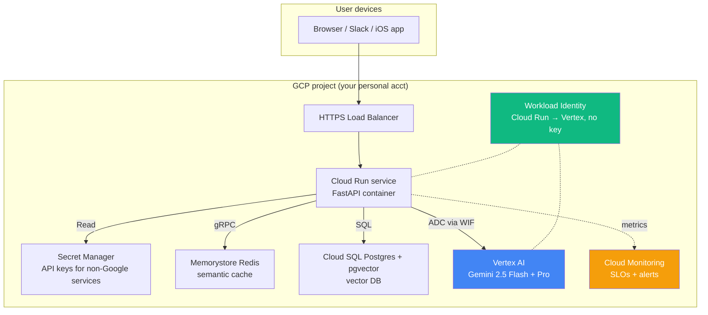

# Theory 03 — Cloud Platforms Overview (GCP vs AWS vs Azure)

> Goal: build a mental map of the three big clouds, **why we pick GCP-primary**, and what each cloud calls the same primitive (this naming-collision is half of "cloud literacy").

---

## 🧒 Layman explanation

A "cloud" is *someone else's computers, but rented by the second, with an API in front of them*. The three big ones are:

| Cloud           | Owner       | Market share (US) | Vibe                                                 |
|-----------------|-------------|-------------------|------------------------------------------------------|
| **AWS**         | Amazon      | ~32%              | Oldest, most services, sprawling, enterprise-default |
| **Azure**       | Microsoft   | ~22%              | Enterprise / Office365 / Government heavy            |
| **GCP**         | Google      | ~11%              | Smallest of the 3 but **best for AI** (you'll see why)|

For LLM work specifically, the ranking flips:

| Cloud  | AI offering                  | Why it matters to you                                       |
|--------|------------------------------|-------------------------------------------------------------|
| GCP    | **Vertex AI + Gemini**       | Native home of Gemini; your default                          |
| AWS    | **Bedrock** (Claude, Llama)  | 40% of US enterprises ⇒ FDE interview signal; you need literacy |
| Azure  | OpenAI on Azure              | If a customer is Microsoft-first they're here                |

The roadmap picks **GCP primary** because the LLM you'll use 80% of the time (Gemini) lives natively on it, and the Anthropic API gives you Claude regardless. You'll add **Bedrock literacy in Phase 3 Week 25** so you can speak the AWS dialect.

---

## 🔧 Technical deep-dive

### The 3-cloud "Rosetta Stone"

Every cloud has the same Lego blocks but calls them different names. Memorize this table:

| Primitive                          | GCP                               | AWS                              | Azure                             |
|------------------------------------|-----------------------------------|----------------------------------|-----------------------------------|
| Top-level container                | **Project**                       | **Account**                      | **Subscription**                  |
| Identity & access                  | IAM                               | IAM                              | Entra ID + RBAC                   |
| Run a container, autoscaled        | **Cloud Run**                     | App Runner / Fargate             | Container Apps                    |
| Run a fleet of containers (K8s)    | **GKE**                           | EKS                              | AKS                               |
| Function-as-a-service              | Cloud Functions / Cloud Run Functions | Lambda                       | Functions                         |
| Object storage                     | **GCS** (Cloud Storage)           | **S3**                           | Blob Storage                      |
| Managed SQL Postgres               | Cloud SQL                         | RDS                              | Azure Database for Postgres       |
| Managed Redis                      | **Memorystore for Redis**         | ElastiCache                      | Cache for Redis                   |
| Async queue                        | **Pub/Sub**                       | SQS / SNS / EventBridge          | Service Bus / Event Grid          |
| Scheduled jobs                     | Cloud Scheduler / Cloud Tasks     | EventBridge Scheduler            | Logic Apps                        |
| Secret storage                     | **Secret Manager**                | Secrets Manager                  | Key Vault                         |
| Logs                               | Cloud Logging                     | CloudWatch Logs                  | Monitor Logs                      |
| Monitoring & alerts                | Cloud Monitoring                  | CloudWatch                       | Monitor                           |
| LLM service (managed)              | **Vertex AI**                     | **Bedrock**                      | Azure OpenAI                      |
| Workload-to-cloud-auth-without-keys| **Workload Identity Federation**  | IAM Roles for Service Accounts (IRSA) | Managed Identity              |
| Private network                    | VPC                               | VPC                              | VNet                              |
| Talk to managed service privately  | **Private Service Connect / Endpoints** | VPC Endpoints (PrivateLink) | Private Endpoints                 |
| Infra-as-code first-party tool     | Deployment Manager (rare)         | CloudFormation                   | ARM / Bicep                       |
| **Infra-as-code multi-cloud tool** | **Terraform** ← roadmap pick      | Terraform                        | Terraform                         |
| CDN                                | Cloud CDN                         | CloudFront                       | Front Door                        |

> 💡 **Read this table once, then bookmark it.** Every FDE interview will name-drop one of these. You can use AWS terms in a Google interview and they'll smile and translate — but only if you know the equivalents.

### Why GCP-primary for this roadmap (the FDE-specific argument)

1. **Gemini is the SOTA model** as of 2026 for cost+quality on most tasks. It lives on GCP and only fully exposes on GCP (multimodal, 1M context, grounding-with-search, code execution, Live API).
2. **Vertex AI** wraps Gemini with enterprise plumbing: VPC-SC, regional residency, IAM, audit logs. This is what *enterprise customers* require — and that's who FDEs pitch.
3. **Workload Identity Federation** lets you call Vertex from any container (even on AWS!) without an API key. This is the security story every FDE interview asks about.
4. **Anthropic's Claude** is also reachable on Vertex (Vertex Model Garden), so you don't actually have to leave GCP to do multi-provider work in Phase 2–3.
5. **GCP free tier is generous** (Cloud Run gives 2M requests/month free, Memorystore has a small free tier, Logging is free up to 50GB/month) — important for a personal account.

### The "billing trap" — every cloud has one

Cloud bills surprise people. Three rules to prevent the $400 surprise:

1. **Set a budget alert on Day 1.** GCP: Billing → Budgets & alerts → $50/month → email me at 50/90/100%. AWS: Billing → Budgets → same.
2. **Never enable a service "to see what it does" without checking pricing first.** Some services (BigQuery, Cloud SQL, GKE) have minimum monthly costs even when idle.
3. **Tag everything by project.** You'll have personal-portfolio AI work and (maybe) Walmart-related experiments — separate them by project from Day 1.

---

## 📊 Flow diagram — your Phase 2 production stack

The roadmap's Phase 2 end-state (you're building toward this in Week 18–19):

By end of Week 19, this diagram is what's *actually running* on your GCP account.

---

## When you'd reach for AWS

The roadmap brings AWS in only at **Phase 3 Week 25** for **Bedrock literacy** — meaning you'll deploy a "Claude on Bedrock" hello-world and write a provider-agnostic wrapper that supports Gemini, Anthropic direct, and Anthropic-on-Bedrock. This makes you bilingual and protects against the very common interview question:

> "Our customer is AWS-shop. How would you ship this on Bedrock instead of Vertex?"

You don't need to deeply know AWS until then. **Don't pre-learn AWS — it's a time sink.**

---

## 📚 References

- **Google Cloud Free Program** — https://cloud.google.com/free
- **Vertex AI overview** — https://cloud.google.com/vertex-ai
- **The Cloud Native Computing Foundation landscape** — https://landscape.cncf.io (overwhelming but the canonical map)
- **Will Larson's "Staff engineer's path"** Ch 5 — has a clean mental model of cloud abstractions
- **"GCP for AWS Engineers" official guide** — https://cloud.google.com/docs/get-started/aws-azure-gcp-service-comparison

---

## ✅ Exit criteria

- [ ] I can name the GCP equivalent of: S3, Lambda, RDS, SQS, Secrets Manager
- [ ] I can name the AWS equivalent of: Vertex AI, Cloud Run, GKE, Pub/Sub, Memorystore
- [ ] I can explain why this roadmap picks GCP over AWS in 2 sentences
- [ ] I understand what a $50/month billing alert is and why it must be set on Day 1
- [ ] I can sketch the Phase 2 production stack diagram from memory

---

