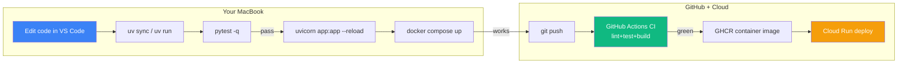

# Theory 04 — Development Environment (why `uv`, why FastAPI, why Docker)

> Tooling choices are one-way doors early in a project. This week locks them in for the next 8 months. Read the rationale once so you don't second-guess later.

---

## 🧒 Layman explanation

You're about to build production AI services. The tools you pick today determine three things:

1. **How fast you can iterate** (package installs, hot reload, type checking)
2. **How readable your code is to a future interviewer** (does it look like production Python or beginner Python?)
3. **How portable your work is** (can the interviewer's machine run your repo in 60 seconds?)

The roadmap's stack is **boring on purpose**:

| Concern             | Choice                  | Why                                                     |
|---------------------|--------------------------|---------------------------------------------------------|
| Python installer    | `uv` (Astral)            | 10–100× faster than pip; lockfile-first; replaces pyenv |
| Python version      | 3.12+                    | Modern type syntax; FastAPI is happy here                |
| Backend framework   | FastAPI                  | Async-native, Pydantic-native, OpenAPI-free, fastest in production |
| Data validation     | Pydantic v2              | Industry standard; Gemini accepts it as schema directly |
| Test framework      | pytest                   | Just the default                                         |
| Linter/formatter    | ruff (replaces black + flake8 + isort) | Astral, ridiculously fast              |
| Type checker        | mypy or pyright          | Catch bugs before runtime                                |
| Packaging           | container image (Docker) | Same in dev, CI, and prod                                |
| Dev portal          | VS Code (your current)   | You already know it                                      |

Don't deviate. Every senior Python repo on GitHub in 2026 uses this stack. Mimic it.

---

## 🔧 Technical deep-dive

### Why `uv` instead of `pip`

`pip` and the historical Python tooling chain (pip + virtualenv + pip-tools + pyenv + pipx) is **slow, fractured, and per-tool-configured**. `uv` is one binary, written in Rust, that does all five of those things.

```
┌──────────────────────────────────────────────────────────────────┐
│  Old way:                                                          │
│    pyenv install 3.12      (managed by pyenv)                       │
│    python -m venv .venv    (managed by stdlib)                       │
│    source .venv/bin/activate                                         │
│    pip install -r requirements.txt   (managed by pip)               │
│    pip freeze > requirements.txt     (no lockfile semantics)        │
│                                                                      │
│  New way (uv):                                                       │
│    uv python install 3.12                                            │
│    uv init my-project    (creates pyproject.toml + venv)             │
│    uv add fastapi pydantic google-genai anthropic                    │
│    uv run python script.py    (auto-activates venv)                  │
│    uv lock                       (deterministic uv.lock)             │
│    uv sync                       (reproduce exact env from lock)     │
└──────────────────────────────────────────────────────────────────┘
```

**Speed receipts:** installing a typical FastAPI stack with `pip` takes ~45s; with `uv` it takes ~3s. This matters because you'll do this 100s of times over 8 months.

### Why FastAPI

FastAPI nails three things that matter for LLM services:

1. **Async by default** — LLM calls are I/O-bound; async lets one process handle 100s of concurrent streams. Flask blocks; FastAPI doesn't.
2. **Pydantic for I/O contracts** — your request and response bodies are typed Python classes that auto-generate OpenAPI/Swagger docs.
3. **Streaming SSE** — `StreamingResponse` makes "ChatGPT-style streaming chat" a 5-line endpoint.

Quick comparison:

| Feature                   | FastAPI         | Flask                  | Django REST            |
|---------------------------|-----------------|------------------------|------------------------|
| Async support             | Native          | Bolt-on (Quart needed) | Limited                |
| Auto-generated OpenAPI    | Yes             | No                     | Plugin                 |
| Pydantic integration      | Yes             | No                     | No                     |
| Streaming responses       | One-liner       | Awkward                | Awkward                |
| Production deployment     | Uvicorn/Gunicorn| Gunicorn               | Gunicorn               |
| Performance (req/s)       | Very high       | Medium                 | Medium                 |

### Why Pydantic v2

Two reasons:

1. **Gemini accepts Pydantic models directly as `response_schema`** — meaning the same class you use to validate Python is the same class that constrains the LLM's output. One source of truth.
2. **Performance** — Pydantic v2 is written in Rust under the hood. Validating thousands of LLM responses per second isn't an issue.

```python
from pydantic import BaseModel

class Answer(BaseModel):
    text: str
    citations: list[str]
    confidence: float

# Used both ways:
# 1. As Gemini schema
response = client.models.generate_content(
    model="gemini-2.5-flash",
    contents="Who wrote Hamlet?",
    config={"response_mime_type": "application/json", "response_schema": Answer},
)

# 2. As Python validator
parsed = Answer.model_validate_json(response.text)
print(parsed.confidence)
```

### Why Docker (preview — full deep-dive in Day 3)

Docker is **the unit of deployment for everything from Phase 1 onward**. Your laptop, GitHub Actions CI, Cloud Run, GKE, Bedrock agents, and Vertex Agent Engine all consume the same artifact: a container image.

Building Phase 1's Doc-Talk *outside* a container would mean re-doing the deploy work 4 times. Build it inside one and you ship it once.

### Why VS Code

You already use it. Add these extensions before Day 1:

| Extension                        | Why                                                        |
|----------------------------------|------------------------------------------------------------|
| Python (Microsoft)               | Language server, debugger                                  |
| Pylance                          | Fast type checking (uses pyright under the hood)            |
| Ruff (Astral)                    | Inline lint + format on save                                |
| Docker                           | Visualize images, containers, compose files                 |
| GitHub Pull Requests             | Review PRs without leaving editor                           |
| Even Better TOML                 | `pyproject.toml` syntax highlighting                        |
| HashiCorp Terraform              | When you install Terraform Sat                              |
| Mermaid Preview                  | Render the flow diagrams in these markdown files            |

---

## 📊 Flow diagram — your daily dev loop after Week 1



This loop is what "shipping like a senior engineer" looks like. By end of Week 10 you'll have all of it.

---

## What you'll install in Week 1 (preview)

| Day | Install                                          | Verify with                                   |
|-----|--------------------------------------------------|-----------------------------------------------|
| Tue | `uv` + Python 3.12 + `google-genai` + `anthropic`| `uv --version`, `python --version`            |
| Thu | Docker Desktop                                   | `docker run hello-world`                      |
| Fri | Google Cloud SDK (`gcloud`)                      | `gcloud --version`                            |
| Sat | Xcode 16+, MLX                                   | `xcrun --version`, MLX example runs           |
| Sat | Terraform                                        | `terraform version`                           |
| Sat | Hashnode + GitHub blogs / repos                  | Public URL loads                              |

---

## 📚 References

- **`uv` docs** — https://docs.astral.sh/uv/
- **FastAPI tutorial** — https://fastapi.tiangolo.com/tutorial/ (you'll work through this Week 2)
- **Pydantic v2 docs** — https://docs.pydantic.dev/latest/
- **"Modern Python with uv and ruff"** — Hynek's blog post: https://hynek.me
- **VS Code Python tutorial** — https://code.visualstudio.com/docs/python/python-tutorial

---

## ✅ Exit criteria

- [ ] I can name 3 reasons why `uv` is better than `pip`
- [ ] I can explain why FastAPI is the right framework for LLM services (3 points)
- [ ] I understand why Pydantic models double as Gemini schemas
- [ ] I know which VS Code extensions to install before Day 1
- [ ] I can draw the "daily dev loop" diagram

---

