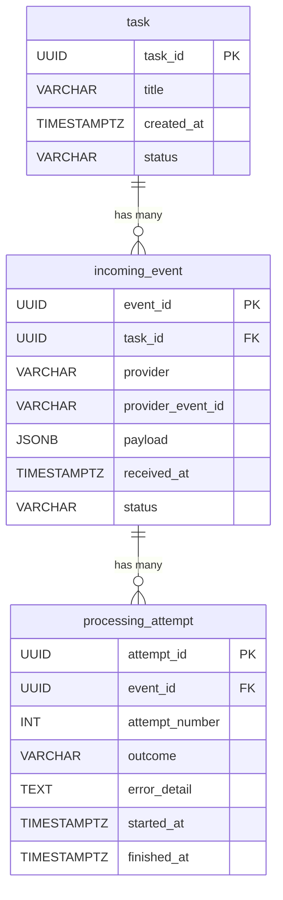

# SQL/PostgreSQL Deep Teaching — From Zero to Evidence

> **Learning stage:** Guided practice → Independent build → Evidence
> **Prerequisite:** PostgreSQL 16 available, orientation SQL 3/3 recorded
> **Domain context:** Your existing [TaskRecord](file:///Users/swapnildhiman/Desktop/AI/iOSToAIJourney/AI%20Solutions%20Platform/src/ai_solutions_platform/domain/tasks.py) and [InMemoryTaskRepository](file:///Users/swapnildhiman/Desktop/AI/iOSToAIJourney/AI%20Solutions%20Platform/src/ai_solutions_platform/persistence/in_memory_tasks.py)

---

## Part 1: The Big Picture — What Are We Doing and Why?

### Plain-language purpose

Right now your AI Solutions Platform stores everything in memory — a Python dictionary. The moment you restart the app, everything vanishes. A **relational database** like PostgreSQL is the permanent filing cabinet. But it's not just about "storing data" — it's about storing data with **rules** that the database itself enforces, so even if your code has bugs, the database says "no, that's invalid."

### The analogy

Think of PostgreSQL as a **government registry office**:
- Every record gets a **unique registration number** (primary key)
- Some records **reference** other records — "this processing attempt is for *that* specific event" (foreign key)
- The office has **rules** — you can't register the same event twice (unique constraint), you can't set status to "banana" (check constraint)
- The office keeps **indexes** — like a filing cabinet sorted by last name — so you can find records fast without scanning every drawer (database index)
- If a multi-step registration fails halfway, the office **tears up the entire form** — nothing gets recorded (transaction rollback)

### Why this matters for your roadmap

On Monday, July 27, you'll build a real `PostgresTaskRepository` adapter. Today is about understanding the *concepts* and *design decisions* so that Monday's work is implementation, not discovery.

---

## Part 2: Your Three Tables — What They Represent

Let's ground this in your actual domain. Your platform processes AI tasks. Here's the real-world flow in plain English:

**Imagine a food delivery app:**
1. A customer places an **order** (that's our `task`)
2. The restaurant sends a **notification** saying "order is being prepared" (that's our `incoming_event`)
3. The delivery system **tries to deliver** the order — maybe it fails the first time and retries (each try is a `processing_attempt`)

Now replace "food delivery" with "AI task processing" — same pattern.

```
User creates a TASK → An external system sends an INCOMING EVENT about it 
→ The platform makes one or more PROCESSING ATTEMPTS to handle the event
```

### `task` — The work item

This is the entity you already have as `TaskRecord` in your domain layer. It has a `task_id`, a `title`, and a `created_at`. In the database, this becomes a row in a table.

### `incoming_event` — Something happened externally

Think of this as a **notification**. When an external system (like a webhook from Stripe, GitHub, or any API) tells your platform "hey, something happened related to task X", you need to record that notification.

**Why record it?** Because:
- The same notification might arrive **twice** (networks are unreliable) — you need to know "I already processed this one"
- You need to know **who sent it** (which provider?)
- You need to know **which task** it's about

### `processing_attempt` — We tried to handle an event

When you receive an event, your platform tries to process it. But what if the processing fails? (Server crashed, network timeout, etc.) You **retry**. Each try is a separate `processing_attempt`.

**Example:**
- Event: "GitHub says PR was merged for task X"
- Attempt 1: Try to process → failed (timeout)
- Attempt 2: Try to process → failed (server busy)
- Attempt 3: Try to process → succeeded ✅

All three attempts are recorded so you have a complete history.

### The relationships — How the tables connect



**Reading the diagram:**
- `||--o{` means "one-to-many" — one task can have many events, one event can have many attempts
- `PK` = Primary Key (the unique ID for each row)
- `FK` = Foreign Key (a reference pointing to another table's PK)

**In plain English:**
- One **task** can receive **many events** (e.g., "started", "updated", "completed")
- One **event** can have **many processing attempts** (e.g., attempt 1 failed, attempt 2 succeeded)
- But each event belongs to exactly **one** task
- And each attempt belongs to exactly **one** event

---

## Part 3: Relational Modeling — Technical Deep Dive

### 3.1 What is a Primary Key?

Imagine a school register. Every student gets a **roll number**. No two students share the same roll number. And you can't leave the roll number blank.

That's exactly what a **primary key** does in a database:
- **Uniqueness** — no two rows can have the same PK value
- **NOT NULL** — the PK column can never be empty

**Your code already uses this concept!** Look at your [TaskRecord](file:///Users/swapnildhiman/Desktop/AI/iOSToAIJourney/AI%20Solutions%20Platform/src/ai_solutions_platform/domain/tasks.py):
```python
task_id: UUID   # ← This is your primary key in Python
```

In SQL, we write `task_id UUID PRIMARY KEY` — same idea, but now the *database* enforces it.

**UUID vs auto-increment — which to use?**

| Choice | What it is | When to use |
|---|---|---|
| `UUID` | A random 128-bit ID like `550e8400-e29b-41d4-a716-446655440000` | When your app generates IDs before talking to the database (your case!) |
| `BIGSERIAL` | Auto-counting number: 1, 2, 3, 4... | When the database should assign IDs for you |

**Decision for your tables:** Use `UUID` for all three tables — matches your existing `TaskRecord.task_id` pattern.

### 3.2 The `task` Table — Line by Line

Let's build the first table. I'll explain **every single line** as if you've never seen SQL before.

```sql
CREATE TABLE task (
```

👆 This says: "Create a new table called `task`." Think of it as creating a new spreadsheet with a specific name.

```sql
    task_id     UUID        PRIMARY KEY,
```

👆 **Column 1:** `task_id`
- `UUID` = the data type (a long random ID like `550e8400-e29b-41d4-a716-446655440000`)
- `PRIMARY KEY` = "this is the unique identifier for each row — no duplicates, can't be empty"
- This matches your Python `TaskRecord.task_id`

```sql
    title       VARCHAR(500) NOT NULL,
```

👆 **Column 2:** `title`
- `VARCHAR(500)` = text, maximum 500 characters
- `NOT NULL` = "you MUST provide a title — empty is not allowed"

```sql
    CONSTRAINT uq_task_title UNIQUE (title),
```

👆 **Rule:** No two tasks can have the same title.
- `CONSTRAINT uq_task_title` = "I'm naming this rule 'uq_task_title'" (naming helps with error messages)
- `UNIQUE (title)` = "the title column must be unique across all rows"
- **This is the database version of your Python [DuplicateTaskTitle](file:///Users/swapnildhiman/Desktop/AI/iOSToAIJourney/AI%20Solutions%20Platform/src/ai_solutions_platform/domain/tasks.py#L17-L18) exception!** Even if your Python code has a bug and forgets to check, PostgreSQL will reject the duplicate.

```sql
    created_at  TIMESTAMPTZ NOT NULL DEFAULT now(),
```

👆 **Column 3:** `created_at`
- `TIMESTAMPTZ` = a date+time value with timezone (e.g., `2026-07-24 18:30:00+05:30`)
- `NOT NULL` = must have a value
- `DEFAULT now()` = "if the app doesn't send a timestamp, use the current time automatically"

```sql
    status      VARCHAR(20) NOT NULL DEFAULT 'pending'
        CONSTRAINT ck_task_status
            CHECK (status IN ('pending', 'active', 'completed', 'failed', 'cancelled'))
);
```

👆 **Column 4:** `status`

> [!IMPORTANT]
> **Your doubt answered:** "TaskRecord doesn't have a `status` field — so how does this work?"
>
> You're right! Your current [TaskRecord](file:///Users/swapnildhiman/Desktop/AI/iOSToAIJourney/AI%20Solutions%20Platform/src/ai_solutions_platform/domain/tasks.py#L8-L14) only has `task_id`, `title`, and `created_at`. It does NOT have `status`.
>
> **The `status` column here is a learning extension** — we're adding it in the database design exercise to practice CHECK constraints. When you build the real PostgreSQL adapter on Monday (July 27), you'll decide whether to:
> - **Option A:** Add `status: str` to `TaskRecord` in the domain layer first, then mirror it in SQL
> - **Option B:** Keep `TaskRecord` as-is and only add `status` to the SQL table later when the domain needs it
>
> **For today's learning exercise, `status` is here to teach you what a CHECK constraint is.** It's not wired to the app.

- `VARCHAR(20)` = text, max 20 characters
- `DEFAULT 'pending'` = if you don't specify a status, it starts as `'pending'`
- `CHECK (status IN ('pending', 'active', ...))` = **the database will reject any value not in this list**

**What does the CHECK do?** Try inserting `status = 'banana'`:
```sql
INSERT INTO task (task_id, title, status)
VALUES ('...', 'Test', 'banana');
-- ERROR: new row violates check constraint "ck_task_status"
-- The database says NO. Only 'pending', 'active', 'completed', 'failed', 'cancelled' are allowed.
```

### 3.2.1 What is a B-tree Index? (Beginner explanation)

You commented: *"Could you please explain this concept of B-tree been created on Primary Key, Unique title?"*

Let's start simple.

**Imagine a 500-page book with no table of contents and no page numbers.** To find the chapter on "PostgreSQL Indexes", you'd have to flip through every single page from page 1. That's slow.

Now imagine the book has an **index at the back** — an alphabetically sorted list:
```
Indexes ........... page 223
Primary Keys ...... page 67
Transactions ...... page 301
```

You look up "Indexes" in the back, find "page 223", and jump straight there. **That's what a database index does.**

A **B-tree** (Balanced tree) is the specific *data structure* PostgreSQL uses to build this index. It looks like this:

```
                    [M]
                   /   \
              [D, H]     [R, V]
             / | \       / | \
           [A-C][E-G][I-L][N-Q][S-U][W-Z]
```

**How it works:**
1. You ask: "Find the task with title starting with 'S'"
2. Start at the top: Is 'S' before or after 'M'? → After → go right
3. Next level: Is 'S' before 'R', between 'R' and 'V', or after 'V'? → Between → go middle
4. Arrive at the [S-U] bucket → found it!

Instead of checking every row (could be millions), you made **3 comparisons**. That's the power of a B-tree.

**Now here's the key fact:**

When you write:
```sql
task_id  UUID  PRIMARY KEY
```
PostgreSQL **automatically builds a B-tree index** on `task_id`. You don't ask for it — it just happens. Why? Because the database needs a fast way to check "does this task_id already exist?" every time you insert a new row.

Same thing when you write:
```sql
CONSTRAINT uq_task_title UNIQUE (title)
```
PostgreSQL automatically builds **another B-tree index** on `title`. It needs it to quickly check "does this title already exist?" before allowing an insert.

**Summary:**
| SQL statement | Auto-creates a B-tree index? | Why? |
|---|---|---|
| `PRIMARY KEY` | ✅ Yes | Must quickly check for duplicate PKs |
| `UNIQUE` | ✅ Yes | Must quickly check for duplicate values |
| `FOREIGN KEY` | ❌ **No!** | Common gotcha — you must create it yourself |
| `CHECK` | ❌ No | Just validates a rule, no lookup needed |
| `NOT NULL` | ❌ No | Just checks if value exists |

### 3.3 The `incoming_event` Table — Complete Beginner Walkthrough

**What is this table for?**

Imagine you're running a delivery app. External systems send you notifications:
- "Payment received for order #123" (from Stripe)
- "Order #123 picked up" (from the restaurant)
- "Order #123 delivered" (from the delivery partner)

Each of these is an **incoming event**. You need to:
1. Record that you received it
2. Know which order (task) it belongs to
3. Make sure you don't process the same notification twice

Now let's build the table, **one line at a time:**

```sql
CREATE TABLE incoming_event (
```
👆 Create a new table called `incoming_event`.

---

```sql
    event_id        UUID        PRIMARY KEY,
```
👆 Every event gets its own unique ID. Same as `task_id` in the task table.

---

```sql
    task_id         UUID        NOT NULL
        REFERENCES task (task_id)
```
👆 **This is a FOREIGN KEY.** Let me explain:

**What is a Foreign Key?** It's a column that says "the value in this column MUST exist in another table."

So `task_id UUID NOT NULL REFERENCES task (task_id)` means:
- This event has a `task_id` column
- The value in `task_id` **must match** an existing `task_id` in the `task` table
- If you try to insert an event with `task_id = 'abc'` but no task with `task_id = 'abc'` exists → **PostgreSQL rejects it**

**Real-world analogy:** It's like a hospital record that says "Patient ID: 12345". The hospital system verifies that patient 12345 actually exists before creating the record. You can't create a medical record for a patient that doesn't exist.

---

```sql
            ON DELETE CASCADE
            ON UPDATE CASCADE,
```

> [!WARNING]
> **Your misunderstanding clarified:** You asked: *"If task_id does not exist that is coming as input to incoming_event, then that task_id row will get deleted from the parent table?"*
>
> **No! That's the opposite of what CASCADE does.** Let me explain clearly:

`ON DELETE CASCADE` means: **"If someone deletes a row from the PARENT table (`task`), automatically delete all matching rows in THIS table (`incoming_event`).**"

It's the **parent → child** direction, NOT child → parent.

**Step by step example:**

```
1. You have a task with task_id = 'abc' in the task table
2. You have 3 events with task_id = 'abc' in incoming_event table
3. Someone runs: DELETE FROM task WHERE task_id = 'abc'
4. CASCADE kicks in: PostgreSQL automatically deletes all 3 events
   that had task_id = 'abc'
```

**What happens if you try to insert an event with a non-existent task_id?**
```sql
-- There is NO task with this ID
INSERT INTO incoming_event (event_id, task_id, provider, provider_event_id)
VALUES ('...', 'nonexistent-task-id', 'github', 'evt_1');

-- ERROR: insert or update on table "incoming_event" violates 
-- foreign key constraint. Key (task_id)=(nonexistent-task-id) 
-- is not present in table "task".
```

**The insert is REJECTED. Nothing gets deleted. The parent table is untouched.**

**Here are all three ON DELETE options compared:**

| Option | What happens when you delete a task | Example |
|---|---|---|
| `CASCADE` | All events for that task are automatically deleted too | Delete task → its events vanish too |
| `RESTRICT` | PostgreSQL **blocks** the delete if events exist | "You can't delete this task because it has events" |
| `SET NULL` | The `task_id` in events becomes `NULL` | Events survive but lose their parent reference |

**Why CASCADE here?** An event about "task ABC" has no meaning if task ABC no longer exists. Orphaned events are useless data.

---

```sql
    provider        VARCHAR(100) NOT NULL,
```
👆 **Who sent this event?** Examples: `'github'`, `'stripe'`, `'slack'`. Must always be provided (`NOT NULL`).

---

```sql
    provider_event_id VARCHAR(200) NOT NULL,
```
👆 **The provider's own tracking number.** When GitHub sends you a webhook, it includes its own event ID like `'evt_abc123'`. This is NOT your primary key — it's GitHub's identifier.

---

```sql
    CONSTRAINT uq_incoming_event_provider_dedup
        UNIQUE (provider, provider_event_id),
```
👆 **This is DEDUPLICATION — preventing double processing.**

`UNIQUE (provider, provider_event_id)` means: the **combination** of provider + their event ID must be unique.

**Why a combination?** Because different providers might use the same format:
- GitHub sends event `'evt_123'` → allowed
- Stripe sends event `'evt_123'` → also allowed (different provider!)
- GitHub sends event `'evt_123'` **again** → ❌ REJECTED (same provider + same event = duplicate!)

---

```sql
    payload         JSONB       NOT NULL DEFAULT '{}',
```
👆 **The actual event data.** `JSONB` is PostgreSQL's JSON type. Events from different providers have different shapes, so we store the raw data as flexible JSON rather than fixed columns. `DEFAULT '{}'` means: if no payload is provided, use an empty JSON object.

---

```sql
    received_at     TIMESTAMPTZ NOT NULL DEFAULT now(),
```
👆 When did we receive this event? Auto-filled with current time if not specified.

---

```sql
    status          VARCHAR(20) NOT NULL DEFAULT 'accepted'
        CONSTRAINT ck_incoming_event_status
            CHECK (status IN ('accepted', 'processing', 'succeeded', 'failed', 'dead_letter'))
);
```
👆 What state is this event in? Same CHECK pattern as the task table.

**The lifecycle of an event:**
```
accepted → processing → succeeded ✅
                      → failed ❌ (might retry)
                      → dead_letter 💀 (gave up after too many retries)
```

### 3.4 The `processing_attempt` Table — Line by Line

**What is this table for?**

Remember our delivery app analogy? Sometimes delivery fails:
- Attempt 1: Driver went to wrong address → failed
- Attempt 2: Customer wasn't home → failed
- Attempt 3: Delivered successfully → succeeded ✅

Each attempt is a separate row in `processing_attempt`. This gives you a **complete history** of every try.

Let's build it line by line:

```sql
CREATE TABLE processing_attempt (
    attempt_id      UUID        PRIMARY KEY,
```
👆 Each attempt gets its own unique ID.

---

```sql
    event_id        UUID        NOT NULL
        REFERENCES incoming_event (event_id)
            ON DELETE CASCADE
            ON UPDATE CASCADE,
```
👆 **Foreign key to `incoming_event`.** This says:
- "Which event is this attempt for?"
- The `event_id` here **must exist** in the `incoming_event` table
- `ON DELETE CASCADE`: If the event is deleted (which happens if the parent task is deleted), all its attempts are deleted too

**The cascade chain:** Delete a task → its events are auto-deleted → each event's attempts are auto-deleted. One delete cleans up everything.

---

```sql
    attempt_number  INT         NOT NULL
        CONSTRAINT ck_attempt_number_positive
            CHECK (attempt_number > 0),
```
👆 **Which try is this?** 1st attempt, 2nd attempt, 3rd attempt...
- `INT` = a whole number (1, 2, 3...)
- `CHECK (attempt_number > 0)` = must be positive. You can't have attempt 0 or attempt -3. That makes no sense.

---

```sql
    CONSTRAINT uq_attempt_per_event
        UNIQUE (event_id, attempt_number),
```
👆 **No duplicate attempt numbers per event.** For event X, there can be only one "attempt 1", only one "attempt 2", etc.

But different events CAN both have an "attempt 1" — that's fine, they're separate events.

---

```sql
    outcome         VARCHAR(20) NOT NULL DEFAULT 'pending'
        CONSTRAINT ck_attempt_outcome
            CHECK (outcome IN ('pending', 'succeeded', 'failed', 'timed_out')),
```
👆 **What happened?** Four possible outcomes:
- `'pending'` — still running (default)
- `'succeeded'` — it worked ✅
- `'failed'` — it broke ❌
- `'timed_out'` — took too long ⏰

---

```sql
    error_detail    TEXT,
```
👆 **Why did it fail?** This is optional (no `NOT NULL`) — it's only filled in when something goes wrong. Example: `"Connection timeout after 30 seconds"`.

---

```sql
    started_at      TIMESTAMPTZ NOT NULL DEFAULT now(),
    finished_at     TIMESTAMPTZ
);
```
👆 **When did it start and end?**
- `started_at` — always set (auto-fills with current time)
- `finished_at` — starts as `NULL` (empty). Gets filled in when the attempt completes. If it's still `NULL`, the attempt is still running.

---

### 3.5 Indexes — Making Searches Fast

You commented: *"Too tough to understand, no examples, how exactly does the index look like, how is it connected to our three tables?"*

Let me start from scratch.

#### What is an index? (The library analogy)

Imagine a **library with 10,000 books** on shelves. You want to find "Harry Potter".

**Without an index (card catalog):**
- Walk to shelf 1, read every title... nope
- Walk to shelf 2, read every title... nope
- Walk to shelf 3... shelf 4... shelf 5...
- After checking 8,247 books, you finally find it on shelf 413
- That's a **sequential scan** — checking every single item

**With an index (card catalog):**
- Walk to the card catalog
- Open the "H" drawer
- Find "Harry Potter → Shelf 413, Position 7"
- Walk directly to shelf 413 and grab it
- That's an **index scan** — jumping straight to the answer

#### How many indexes do we have? Where do they go?

We have indexes on **all three tables**. Some are created **automatically** (by PRIMARY KEY and UNIQUE), and some we create **manually**.

Here's the complete picture:

```
┌─────────────────────────────────────────────────────────────┐
│  TABLE: task                                                │
│  ┌─────────────────────────────────────────────────────┐    │
│  │ Rows:                                               │    │
│  │  task_id  │  title          │ status  │ created_at   │    │
│  │  aaa...   │ "Alpha task"    │ pending │ Jul 24 10AM  │    │
│  │  bbb...   │ "Beta task"     │ active  │ Jul 24 11AM  │    │
│  │  ccc...   │ "Gamma task"    │ failed  │ Jul 24 12PM  │    │
│  └─────────────────────────────────────────────────────┘    │
│                                                             │
│  🔍 INDEX 1 (AUTO - from PRIMARY KEY):                      │
│     Sorted by: task_id                                      │
│     Purpose: Find a task by its ID instantly                │
│     Looks like: aaa→row1, bbb→row2, ccc→row3               │
│                                                             │
│  🔍 INDEX 2 (AUTO - from UNIQUE title):                     │
│     Sorted by: title                                        │
│     Purpose: Check "does this title already exist?"         │
│     Looks like: "Alpha"→row1, "Beta"→row2, "Gamma"→row3    │
│                                                             │
│  🔍 INDEX 3 (MANUAL - we create this):                      │
│     Sorted by: (status, created_at DESC)                    │
│     Purpose: "Show me all 'pending' tasks, newest first"    │
│     Looks like:                                             │
│       active  │ Jul 24 11AM → row2                          │
│       failed  │ Jul 24 12PM → row3                          │
│       pending │ Jul 24 10AM → row1                          │
└─────────────────────────────────────────────────────────────┘

┌─────────────────────────────────────────────────────────────┐
│  TABLE: incoming_event                                      │
│                                                             │
│  🔍 INDEX 4 (AUTO - from PRIMARY KEY):                      │
│     Sorted by: event_id                                     │
│     Purpose: Find an event by its ID                        │
│                                                             │
│  🔍 INDEX 5 (AUTO - from UNIQUE):                           │
│     Sorted by: (provider, provider_event_id)                │
│     Purpose: Deduplication — "did we already get this?"     │
│                                                             │
│  🔍 INDEX 6 (MANUAL - we create this):                      │
│     Sorted by: task_id                                      │
│     Purpose: "Show me all events for task X"                │
│     WHY MANUAL? Foreign keys do NOT get auto-indexes!       │
└─────────────────────────────────────────────────────────────┘

┌─────────────────────────────────────────────────────────────┐
│  TABLE: processing_attempt                                  │
│                                                             │
│  🔍 INDEX 7 (AUTO - from PRIMARY KEY):                      │
│     Sorted by: attempt_id                                   │
│     Purpose: Find an attempt by its ID                      │
│                                                             │
│  🔍 INDEX 8 (AUTO - from UNIQUE):                           │
│     Sorted by: (event_id, attempt_number)                   │
│     Purpose: "Show me all attempts for event X, in order"   │
│     Also prevents duplicate attempt numbers per event       │
└─────────────────────────────────────────────────────────────┘
```

**Total: 8 indexes across 3 tables.** 5 are automatic, 3 are manual.

#### Why do we need to create manual indexes?

Remember from the B-tree section:
- `PRIMARY KEY` → auto-creates an index ✅
- `UNIQUE` → auto-creates an index ✅
- `FOREIGN KEY` → does **NOT** auto-create an index ❌

So we need to manually create indexes for foreign key columns that we'll search by.

#### The three manual indexes — explained one at a time

**Manual Index 1: Find tasks by status (on the `task` table)**

```sql
CREATE INDEX idx_task_status_recent
    ON task (status, created_at DESC);
```

👆 Let's break this down:
- `CREATE INDEX` = "build a new index"
- `idx_task_status_recent` = the name we give this index (you choose the name)
- `ON task` = "this index is for the `task` table"
- `(status, created_at DESC)` = "sort by status first, then by created_at newest-first"

**When would you use this?** When someone asks:
> "Show me all failed tasks, most recent first"

**Without this index:**
```
PostgreSQL: "Let me read ALL 10,000 tasks, check each one's status,
            keep only the 'failed' ones, then sort them by date..."
            → Slow! 🐌
```

**With this index:**
```
PostgreSQL: "Let me jump to the 'failed' section of my index...
            they're already sorted by date... here are your 15 results!"
            → Fast! ⚡
```

**The tradeoff:** Every time you INSERT a new task or UPDATE a task's status, PostgreSQL also has to update this index. That's a tiny bit of extra work on writes, in exchange for much faster reads.

---

**Manual Index 2: Find events for a task (on the `incoming_event` table)**

```sql
CREATE INDEX idx_incoming_event_task
    ON incoming_event (task_id);
```

👆 This index is on the `task_id` column of the `incoming_event` table.

**When would you use this?** When someone asks:
> "Show me all events for task ABC"

**Why is this needed?** Because `task_id` in `incoming_event` is a foreign key, and **PostgreSQL does NOT automatically create indexes on foreign key columns**. Without this index, PostgreSQL would have to scan every single event in the table to find which ones belong to task ABC.

> [!TIP]
> **Rule of thumb:** If you have a FOREIGN KEY column and you'll ever search by it (which you almost always will), create an index on it manually.

---

**What about `processing_attempt`?** We don't need a manual index there because the `UNIQUE (event_id, attempt_number)` constraint already auto-created an index that covers our main search pattern: "find all attempts for event X, in order."

#### Summary: The complete index map

| Table | Index name | Columns | How created | What question it answers |
|---|---|---|---|---|
| `task` | *(auto)* | `task_id` | `PRIMARY KEY` | "Find task by ID" |
| `task` | *(auto)* | `title` | `UNIQUE (title)` | "Does this title exist?" |
| `task` | `idx_task_status_recent` | `status, created_at DESC` | **Manual** `CREATE INDEX` | "Show failed/pending tasks, newest first" |
| `incoming_event` | *(auto)* | `event_id` | `PRIMARY KEY` | "Find event by ID" |
| `incoming_event` | *(auto)* | `provider, provider_event_id` | `UNIQUE (...)` | "Is this a duplicate event?" |
| `incoming_event` | `idx_incoming_event_task` | `task_id` | **Manual** `CREATE INDEX` | "Show all events for task X" |
| `processing_attempt` | *(auto)* | `attempt_id` | `PRIMARY KEY` | "Find attempt by ID" |
| `processing_attempt` | *(auto)* | `event_id, attempt_number` | `UNIQUE (...)` | "Show attempts for event X, in order" |

---

## Part 4: Transactions and Rollback — The Safety Net

### What is a transaction? (ATM analogy)

Imagine you're at an ATM transferring ₹5,000 from Savings to Current account:
1. Step 1: Deduct ₹5,000 from Savings ✅
2. Step 2: Add ₹5,000 to Current...
3. 💥 Power goes out!

**Without transactions:** Your Savings lost ₹5,000 but Current didn't receive it. Money vanished!

**With transactions:** The bank says "both steps must succeed, or NEITHER happens." When power went out after step 1, the bank **undoes step 1** automatically. Your Savings gets the ₹5,000 back. Nothing changed.

That's a **transaction** — a group of operations that either **ALL succeed** (COMMIT) or **ALL get undone** (ROLLBACK). There's no in-between.

### The three commands you need to know

| Command | What it does | ATM analogy |
|---|---|---|
| `BEGIN` | "I'm starting a group of operations" | You swipe your card and enter PIN |
| `COMMIT` | "Everything worked — make it permanent" | Transfer succeeds, you get the receipt |
| `ROLLBACK` | "Something went wrong — undo everything" | Power went out, bank reverses all changes |

### The ACID properties (simple version)

| Property | One-line meaning | Example |
|---|---|---|
| **Atomicity** | All or nothing | Either BOTH the debit AND credit happen, or NEITHER happens |
| **Consistency** | Rules are never broken | You can't end up with negative balance if there's a CHECK constraint |
| **Isolation** | Others don't see your half-done work | While you're mid-transfer, another ATM still sees your original balance |
| **Durability** | Once saved, it survives crashes | After COMMIT, even if the server explodes, your data is safe |

### The rollback exercise — step by step

Here's exactly what you'll run. Each step has an explanation:

```sql
-- ╔══════════════════════════════════════════════════════════╗
-- ║  STEP 1: Count how many tasks exist BEFORE we start     ║
-- ╚══════════════════════════════════════════════════════════╝
SELECT count(*) AS before_count FROM task;
-- Let's say this returns: 3
```
👆 We're saving the "before" picture so we can compare later.

```sql
-- ╔══════════════════════════════════════════════════════════╗
-- ║  STEP 2: Start a transaction                            ║
-- ╚══════════════════════════════════════════════════════════╝
BEGIN;
```
👆 This tells PostgreSQL: "Everything I do from now until COMMIT or ROLLBACK is ONE group."

```sql
-- ╔══════════════════════════════════════════════════════════╗
-- ║  STEP 3: Insert a task INSIDE the transaction           ║
-- ╚══════════════════════════════════════════════════════════╝
INSERT INTO task (task_id, title, status)
VALUES (
    'a0000000-0000-0000-0000-000000000001',
    'Transaction test task',
    'pending'
);
```
👆 We added a new task. But it's NOT permanent yet — it's only in our "draft".

```sql
-- ╔══════════════════════════════════════════════════════════╗
-- ║  STEP 4: Check — can WE see the new row?                ║
-- ╚══════════════════════════════════════════════════════════╝
SELECT task_id, title, status FROM task
WHERE task_id = 'a0000000-0000-0000-0000-000000000001';

-- Result: YES! We see it:
-- task_id                              | title                  | status
-- a0000000-0000-0000-0000-000000000001 | Transaction test task  | pending
```
👆 Inside OUR transaction, the row exists. But if someone else queried the database right now, they would NOT see this row. It's our private draft.

```sql
-- ╔══════════════════════════════════════════════════════════╗
-- ║  STEP 5: ROLLBACK — tear up the draft!                  ║
-- ╚══════════════════════════════════════════════════════════╝
ROLLBACK;
```
👆 This says: "Forget everything I did since BEGIN. Undo it all."

```sql
-- ╔══════════════════════════════════════════════════════════╗
-- ║  STEP 6: Check — is the row still there?                ║
-- ╚══════════════════════════════════════════════════════════╝
SELECT task_id, title, status FROM task
WHERE task_id = 'a0000000-0000-0000-0000-000000000001';

-- Result: EMPTY! The row is GONE.
-- The INSERT was completely undone.

SELECT count(*) AS after_count FROM task;
-- Returns: 3 (same as before!)
-- The database is exactly as it was before we started.
```

**Timeline of what happened:**
```
Time 1:  Database has 3 tasks
         ↓
Time 2:  BEGIN — start transaction
         ↓
Time 3:  INSERT — we THINK we added a task (now 4 in our view)
         ↓
Time 4:  ROLLBACK — PostgreSQL says "NOPE, undoing everything"
         ↓
Time 5:  Database still has 3 tasks. Nothing changed. ✅
```

### COMMIT — when you WANT to keep the changes

For contrast, here's what happens when things go right:

```sql
BEGIN;    -- Start the group

INSERT INTO task (task_id, title, status)
VALUES (
    'b0000000-0000-0000-0000-000000000002',
    'This one stays forever',
    'pending'
);

COMMIT;   -- "Save! Make it permanent!"
```
👆 After `COMMIT`, the row is permanent. Even if the server crashes right now, this row survives. That's **durability**.

```sql
SELECT * FROM task WHERE task_id = 'b0000000-0000-0000-0000-000000000002';
-- Row exists and will exist forever (until you explicitly DELETE it).
```

---

## Part 5: Safe Python Parameterized Queries

### The problem: SQL injection (restaurant analogy)

Imagine a restaurant where you fill out an order form:

```
Order form: "I would like to eat ____________"
```

Normal customer writes: `pizza` → "I would like to eat pizza" ✅

Malicious customer writes: `pizza. Also, fire the chef and give me all the money` → "I would like to eat pizza. Also, fire the chef and give me all the money" 😱

The restaurant treated the customer's input as **part of the instruction**, not just data. That's exactly what SQL injection does.

**In code:**

```python
# ❌ DANGEROUS — string interpolation
user_input = "'; DROP TABLE task; --"
query = f"SELECT * FROM task WHERE title = '{user_input}'"

# What PostgreSQL actually receives:
# SELECT * FROM task WHERE title = ''; DROP TABLE task; --'
#                                    ^^^^^^^^^^^^^^^^^
#                                    This part DELETES your table!
```

👆 The attacker typed something that "escaped" out of the data area and became a SQL command. PostgreSQL can't tell the difference between your code and the attacker's injection.

### The solution: parameterized queries — complete end-to-end example

You asked: *"If the query is 'get me the task where title = I love AI;Drop task_id from Task', how does it get split into two envelopes?"*

Great question. Let me trace **exactly** what happens, step by step, for BOTH the dangerous way and the safe way, with the **same input**.

---

#### 🔴 The DANGEROUS way (string interpolation) — end to end

**Setup:** A user types this into your app's search box:

```
I love AI'; DROP TABLE task; --
```

**Step 1: Your Python code builds the query**

```python
user_input = "I love AI'; DROP TABLE task; --"

# ❌ DANGEROUS: you paste the user's text directly into the SQL
query = f"SELECT * FROM task WHERE title = '{user_input}'"
```

**Step 2: What does `query` look like now?** Let's print it:

```python
print(query)
```

Output:
```sql
SELECT * FROM task WHERE title = 'I love AI'; DROP TABLE task; --'
```

👆 See the problem? The `'` in the user's input **closed the string early**. Now there are TWO SQL commands:
1. `SELECT * FROM task WHERE title = 'I love AI'` ← finds nothing, harmless
2. `DROP TABLE task` ← **DELETES YOUR ENTIRE TABLE** 😱
3. `--'` ← this is a comment, ignoring the leftover quote

**Step 3: Python sends this ONE string to PostgreSQL**

```
┌─────────────────────────────────────────────────────────────────┐
│  ONE THING sent over the network:                               │
│                                                                 │
│  "SELECT * FROM task WHERE title = 'I love AI';                 │
│   DROP TABLE task; --'"                                         │
│                                                                 │
│  PostgreSQL sees it as:                                         │
│    Command 1: SELECT * FROM task WHERE title = 'I love AI'      │
│    Command 2: DROP TABLE task                                   │
│                                                                 │
│  Result: table deleted. All your data is gone. 💀                │
└─────────────────────────────────────────────────────────────────┘
```

---

#### 🟢 The SAFE way (parameterized query) — end to end, same input

**Step 1: Your Python code writes the query WITH A PLACEHOLDER**

```python
user_input = "I love AI'; DROP TABLE task; --"

# ✅ SAFE: the user's input is NOT pasted into the SQL string
cur.execute(
    "SELECT * FROM task WHERE title = %s",   # ← the SQL template
    (user_input,)                             # ← the data, SEPARATELY
)
```

👆 **Notice:** We NEVER do `f"...{user_input}..."`. The user's input is in a **completely separate variable** — a Python tuple `(user_input,)`.

**Step 2: What does Python send to PostgreSQL?**

Here's the crucial difference. Python does NOT build one string. It sends **TWO separate things** over the network:

```
┌─────────────────────────────────────────────────────────────────┐
│  THING 1 (the instruction):                                     │
│  "SELECT * FROM task WHERE title = $1"                          │
│                                                                 │
│  ☝️ This is a TEMPLATE with a blank ($1).                       │
│     PostgreSQL parses this and sees:                            │
│     "This is a SELECT query with ONE parameter slot."           │
│     It does NOT see any DROP TABLE command.                     │
│     There is nothing dangerous here.                            │
└─────────────────────────────────────────────────────────────────┘

┌─────────────────────────────────────────────────────────────────┐
│  THING 2 (the data):                                            │
│  Parameter $1 = "I love AI'; DROP TABLE task; --"               │
│                                                                 │
│  ☝️ PostgreSQL KNOWS this is pure data.                         │
│     It will NEVER try to execute this as a command.             │
│     It treats the entire string — including the                 │
│     semicolons, quotes, and "DROP TABLE" — as a                 │
│     literal text value to search for.                           │
└─────────────────────────────────────────────────────────────────┘
```

**Step 3: What does PostgreSQL do?**

```
PostgreSQL receives:
  Instruction: "SELECT * FROM task WHERE title = $1"
  Data:        $1 = "I love AI'; DROP TABLE task; --"

PostgreSQL thinks:
  "Okay, I need to find all tasks where the title column
   equals the text: I love AI'; DROP TABLE task; --"

  "Let me search... nope, no task has that exact title."

  Result: empty result set. 0 rows. Table is safe. ✅
```

**The key insight:** The user's input NEVER becomes part of the SQL instruction. It's always treated as DATA. Even if the user types `DROP TABLE`, `DELETE`, `INSERT`, or any SQL keyword — PostgreSQL treats it as a plain text value, like searching for a book titled "DROP TABLE" in a library.

---

#### Why does `%s` work differently from Python's `%`?

You might be thinking: "Doesn't `%s` mean string formatting in Python?"

**No!** In psycopg (the database driver), `%s` is a **database placeholder**, not Python's `%` operator.

```python
# Python string formatting (DANGEROUS — builds one string):
query = "SELECT * FROM task WHERE title = '%s'" % user_input
# → ONE string sent to PostgreSQL ❌

# psycopg parameterization (SAFE — sends two things):
cur.execute("SELECT * FROM task WHERE title = %s", (user_input,))
# → TWO things sent to PostgreSQL ✅
```

The difference is **who processes the `%s`**:
- Python's `%` operator → Python pastes the value into the string → ONE string → dangerous
- `cur.execute()` → psycopg sends template + values separately → TWO things → safe

---

### The two parameter styles

Now that you understand HOW parameterization works, here are the two styles:

**Style 1: Positional (`%s`) — fill blanks in order**

```python
cur.execute(
    "SELECT * FROM task WHERE title = %s AND status = %s",
    ("Alpha task", "pending")
)
```
👆 First `%s` gets `"Alpha task"`, second `%s` gets `"pending"`.

Think of it like a form with numbered blanks:
```
Find task where title = ___①___ and status = ___②___
Answer ①: "Alpha task"
Answer ②: "pending"
```

**Style 2: Named (`%(name)s`) — fill blanks by name**

```python
cur.execute(
    "SELECT * FROM task WHERE title = %(title)s AND status = %(status)s",
    {"title": "Alpha task", "status": "pending"}
)
```
👆 `%(title)s` gets the value from key `"title"`, `%(status)s` gets from `"status"`.

Think of it like a form with labeled blanks:
```
Find task where title = ___title___ and status = ___status___
title:  "Alpha task"
status: "pending"
```

**Which to use?** Named parameters are easier to read when you have many values. For 1-2 values, either works fine.

---

### Complete runnable proof script — line by line

This is the script you'll run to produce evidence. Let me explain every line:

```python
"""
Parameterized query proof — safe Python SQL access.
"""
```
👆 A docstring explaining what this file does.

```python
import psycopg
from uuid import uuid4
from datetime import datetime, timezone
```
👆 We import three things:
- `psycopg` — the library that talks to PostgreSQL
- `uuid4` — generates random unique IDs (like our task_id)
- `datetime, timezone` — for timestamps

```python
def demonstrate_parameterized_query():
```
👆 We wrap everything in a function so it runs cleanly.

```python
    conn_string = "host=localhost dbname=learner_exercise user=postgres"
```
👆 The address of our database. "Talk to PostgreSQL on this machine, use the database called `learner_exercise`, log in as `postgres`."

```python
    with psycopg.connect(conn_string) as conn:
        with conn.cursor() as cur:
```
👆 Two `with` blocks:
1. `psycopg.connect(...)` — opens a connection to PostgreSQL (like opening a phone line)
2. `conn.cursor()` — creates a cursor (like a pen you use to write/read on that phone line)

The `with` ensures both get properly closed when we're done, even if there's an error.

---

**Part A: INSERT a task using parameters**

```python
            new_id = uuid4()
```
👆 Generate a random UUID like `550e8400-e29b-41d4-a716-446655440000`.

```python
            cur.execute(
                """
                INSERT INTO task (task_id, title, status, created_at)
                VALUES (%s, %s, %s, %s)
                RETURNING task_id, title
                """,
                (
                    str(new_id),
                    "Parameterized query proof task",
                    "pending",
                    datetime.now(timezone.utc),
                ),
            )
```
👆 Let's decode this:
- **The SQL template** has FOUR `%s` placeholders — one for each column value
- **The data tuple** has FOUR values — they map to the placeholders in order:
  - `%s` #1 → `str(new_id)` (the task_id)
  - `%s` #2 → `"Parameterized query proof task"` (the title)
  - `%s` #3 → `"pending"` (the status)
  - `%s` #4 → `datetime.now(timezone.utc)` (the timestamp)
- `RETURNING task_id, title` — after inserting, PostgreSQL sends back the inserted values so we can verify

```python
            inserted = cur.fetchone()
            print(f"Inserted: task_id={inserted[0]}, title={inserted[1]}")
```
👆 `fetchone()` gets the one row that `RETURNING` sent back. We print it to confirm the insert worked.

**Expected output:** `Inserted: task_id=550e8400-..., title=Parameterized query proof task`

---

**Part B: SELECT (read back) the task we just created**

```python
            cur.execute(
                "SELECT task_id, title, status FROM task WHERE task_id = %s",
                (str(new_id),),
            )
            found = cur.fetchone()
            print(f"Found:    task_id={found[0]}, title={found[1]}, status={found[2]}")
```
👆 We search for the task we just inserted, using its ID as a parameter.
- One `%s` → one value in the tuple: `(str(new_id),)`
- Note the **comma after `str(new_id)`** — this makes it a tuple. Without the comma, Python wouldn't treat it as a tuple.

**Expected output:** `Found:    task_id=550e8400-..., title=Parameterized query proof task, status=pending`

---

**Part C: Try an injection attack (it will fail safely)**

```python
            malicious_input = "'; DROP TABLE task; --"
            cur.execute(
                "SELECT count(*) FROM task WHERE title = %s",
                (malicious_input,),
            )
            count = cur.fetchone()[0]
            print(f"Injection attempt matched {count} rows (expected 0)")
            print("Table still exists — parameterization prevented injection.")
```
👆 This is the proof:
- We pass a **malicious string** that would delete the table if we used string interpolation
- With parameterization, PostgreSQL just searches for a task literally titled `'; DROP TABLE task; --`
- It finds 0 matches (no task has that silly title)
- The table is completely safe

**Expected output:**
```
Injection attempt matched 0 rows (expected 0)
Table still exists — parameterization prevented injection.
```

---

**Part D: Clean up**

```python
        conn.rollback()
        print("Rolled back — proof task not persisted.")
```
👆 We ROLLBACK so the proof task doesn't stay in the database. This is a learning exercise — we don't want to leave test data behind.

---

**Part E: Run the script**

```python
if __name__ == "__main__":
    demonstrate_parameterized_query()
```
👆 Standard Python pattern: "If someone runs this file directly, call the function." This means you can run it with:
```bash
python3 parameterized_query_proof.py
```

**Complete expected output:**
```
Inserted: task_id=550e8400-..., title=Parameterized query proof task
Found:    task_id=550e8400-..., title=Parameterized query proof task, status=pending
Injection attempt matched 0 rows (expected 0)
Table still exists — parameterization prevented injection.
Rolled back — proof task not persisted.
```

---

## Part 6: Query Plans — Understanding How PostgreSQL Finds Your Data

### What is a query plan? (GPS analogy)

When you use Google Maps, you don't just say "go to the mall." Google Maps shows you the **route**:
- "Take NH-48 for 5 km"
- "Turn right at the signal"
- "Mall is on the left"
- "Estimated time: 12 minutes"

A **query plan** is PostgreSQL's version of Google Maps. Before running your query, PostgreSQL figures out the best route to find your data, and `EXPLAIN` shows you that route.

### The two commands

| Command | What it does |
|---|---|
| `EXPLAIN` | Shows the plan but **doesn't run** the query (like viewing directions without driving) |
| `EXPLAIN ANALYZE` | Shows the plan AND **runs** the query, so you see actual times (like driving and tracking your actual travel time) |

### The key words you'll see in the output

| Word | What it means | Is it good or bad? |
|---|---|---|
| **Seq Scan** | "I read EVERY row in the table and checked each one" | 🐌 Slow for big tables |
| **Index Scan** | "I used an index to jump directly to the matching rows" | ⚡ Fast! |
| **Sort** | "I had to sort the results myself" | 🐌 Extra work (index might avoid this) |
| **Rows Removed by Filter** | "I read these rows but threw them away because they didn't match" | 🐌 Wasted effort |

### The exercise: let's watch PostgreSQL think

**Step 1: Insert some test data**

```sql
INSERT INTO task (task_id, title, status) VALUES
    ('c0000000-0000-0000-0000-000000000001', 'Alpha task', 'pending'),
    ('c0000000-0000-0000-0000-000000000002', 'Beta task', 'active'),
    ('c0000000-0000-0000-0000-000000000003', 'Gamma task', 'failed'),
    ('c0000000-0000-0000-0000-000000000004', 'Delta task', 'pending'),
    ('c0000000-0000-0000-0000-000000000005', 'Epsilon task', 'completed');
```
👆 We now have 5 tasks with different statuses.

**Step 2: Ask PostgreSQL to show its plan**

```sql
EXPLAIN ANALYZE
SELECT task_id, title, created_at
FROM task
WHERE status = 'pending'
ORDER BY created_at DESC;
```
👆 We're asking: "Show me all pending tasks, newest first" AND "tell me how you found them."

**Step 3: Read the output (line by line)**

PostgreSQL will show something like this:

```
 Index Scan Backward using idx_task_status_recent on task
   (cost=0.15..8.20 rows=2 width=556)
   (actual time=0.025..0.027 rows=2 loops=1)
   Index Cond: ((status)::text = 'pending'::text)
 Planning Time: 0.150 ms
 Execution Time: 0.045 ms
```

Let's decode this like reading a receipt:

```
"Index Scan Backward using idx_task_status_recent"
  ↑                         ↑
  │                         └── The NAME of the index it used
  │                             (our manual index on status + created_at!)
  └── HOW it found the data: used an index! ⚡ Fast!
      "Backward" = it read the index in reverse order
      (because we asked for ORDER BY created_at DESC)

"rows=2"
  ↑
  └── It found 2 matching rows (Delta and Alpha are both 'pending')

"Index Cond: ((status)::text = 'pending'::text)"
  ↑
  └── It used the index to filter by status='pending'
      It did NOT read all 5 rows — it jumped straight to the 'pending' ones

"Execution Time: 0.045 ms"
  ↑
  └── Took 0.045 milliseconds. Very fast!
```

**Step 4: Now remove the index and see what happens**

```sql
-- Temporarily drop our manual index
DROP INDEX idx_task_status_recent;

-- Run the same query again
EXPLAIN ANALYZE
SELECT task_id, title, created_at
FROM task
WHERE status = 'pending'
ORDER BY created_at DESC;
```

Now the output changes:

```
 Sort  (cost=1.07..1.08 rows=2 width=556)
   Sort Key: created_at DESC
   Sort Method: quicksort  Memory: 25kB
   ->  Seq Scan on task  (cost=0.00..1.06 rows=2 width=556)
         Filter: ((status)::text = 'pending'::text)
         Rows Removed by Filter: 3
```

Let's decode this:

```
"Seq Scan on task"
  ↑
  └── SEQUENTIAL SCAN! 🐌 It read EVERY row in the table.
      No index was available, so it had to check all 5 rows one by one.

"Rows Removed by Filter: 3"
  ↑
  └── Out of 5 rows, 3 didn't match status='pending'.
      It read them and threw them away. Wasted effort!
      (With 5 rows this is fine, with 10 million rows this is terrible.)

"Sort"
  ↑
  └── EXTRA SORTING STEP! 🐌 Without the index, the results aren't
      pre-sorted, so PostgreSQL had to sort them itself.
      (Our index had them pre-sorted — no extra work needed.)
```

**Step 5: Recreate the index**

```sql
CREATE INDEX idx_task_status_recent
    ON task (status, created_at DESC);
```
👆 Put it back! We proved our point.

### Side-by-side comparison

| | With index ⚡ | Without index 🐌 |
|---|---|---|
| How it found data | **Index Scan** — jumped straight to 'pending' rows | **Seq Scan** — read ALL 5 rows |
| Rows wasted | 0 (only read matching rows) | 3 (read 5, threw away 3) |
| Sorting | Already sorted by the index | Had to sort manually |
| Speed | 0.045 ms | Slower (extra scan + sort) |

> [!TIP]
> With only 5 rows, PostgreSQL might choose Seq Scan even WITH the index — because for tiny tables, reading everything is actually faster than looking up the index first. The difference becomes dramatic at thousands/millions of rows.

---

## Part 7: Fixture Hygiene — No Real Identities

### The rule

Every example, fixture, test data point, and proof artifact must use **synthetic identities**. No real names, no real email addresses, no real company data.

### What to use

| Instead of | Use |
|---|---|
| A real personal address (`you@gmail.com`) | `learner@example.invalid` |
| A real employer address (`first.last@employer.com`) | `user@example.invalid` |
| A real phone number | `+1-555-0100` (reserved fictional range) |
| A real API key | `sk-test-synthetic-00000000` |
| A real company name | `Acme Corp` or `Example Inc` |

The `.invalid` TLD is an IANA-reserved domain — it's guaranteed to never be a real domain. The `555-01xx` phone range is reserved for fiction. Use these consistently.

### Scan your work

After assembling evidence, grep for real identities:

```bash
# Check for real email patterns (anything not @example.invalid)
grep -rn '@' your_evidence_file.sql | grep -v '@example.invalid'

# Check for real names or company references
grep -rniE 'your-employer|your-first-name|your-real-name' your_evidence_file.sql
```

---

## Part 8: Putting It All Together — The Evidence Package

Your evidence package for this block should contain:

### Checklist

| # | Evidence item | What proves it |
|---|---|---|
| 1 | Three-table schema with SQL | The `CREATE TABLE` statements with all constraints |
| 2 | PK/FK/Unique/Check decisions | Named constraints with written rationale for each choice |
| 3 | Index choices with cost notes | Each index links to an access pattern + write/storage cost comment |
| 4 | Rollback proof | `BEGIN` → `INSERT` → `SELECT` (row visible) → `ROLLBACK` → `SELECT` (row gone) |
| 5 | Parameterized query proof | Python code + output showing parameter binding, not string interpolation |
| 6 | Query plan observation | `EXPLAIN ANALYZE` output + annotation of whether the named index was used |
| 7 | Fixture confirmation | Grep/scan showing no real personal identities in any evidence |

### Recording destinations (future — not edited today)

- `PROGRESS.md` → **AI Solutions Platform milestones**
- `notes/sprint-01-AI-Software-Foundations-notes.md` → narrative SQL evidence

---

## Part 9: What You Are NOT Doing Today

> [!CAUTION]
> **Stop after bounded learning evidence.** These are explicitly deferred to Monday, July 27:

- ❌ Async PostgreSQL repository/adapter (`asyncpg` or `SQLAlchemy`)
- ❌ Migration tooling and migration files (`alembic`)
- ❌ Dependency composition or application wiring
- ❌ Dependency-aware readiness probes
- ❌ Application-lifespan depth
- ❌ Persisted vertical-slice integration

Today is **learn and prove**. Monday is **build and integrate**.

---

## Part 10: File Location Map — Where Everything Lives

### Your current project tree (relevant files)

```
AI Solutions Platform/
├── src/ai_solutions_platform/
│   ├── domain/
│   │   ├── __init__.py
│   │   └── tasks.py              ← TaskRecord, DuplicateTaskTitle (EXISTS)
│   ├── persistence/
│   │   ├── __init__.py
│   │   └── in_memory_tasks.py    ← InMemoryTaskRepository (EXISTS)
│   ├── api/
│   │   ├── app.py                ← FastAPI app (EXISTS)
│   │   ├── dependencies.py       ← Dependency provider (EXISTS)
│   │   ├── schemas.py            ← Pydantic schemas (EXISTS)
│   │   └── routes/
│   │       └── tasks.py          ← API routes (EXISTS)
│   └── ...
├── tests/
│   ├── conftest.py               ← Test fixtures (EXISTS)
│   ├── unit/
│   └── integration/
├── diagnostics/
│   ├── Sprint-00-Orientation-diagnostics/
│   └── Sprint-01-AI-Software-Foundations/   ← (empty, ready for evidence)
└── pyproject.toml
```

### Files for TODAY's learning exercises (no application changes)

These are **standalone learning exercise files** — they don't wire into the app. They live in `diagnostics/` because that's where sprint evidence goes.

| File | Path | Purpose | Action |
|---|---|---|---|
| Schema SQL | [diagnostics/Sprint-01-AI-Software-Foundations/](file:///Users/swapnildhiman/Desktop/AI/iOSToAIJourney/AI%20Solutions%20Platform/diagnostics/Sprint-01-AI-Software-Foundations)`sql_schema.sql` | `CREATE TABLE` for all 3 tables + constraints + indexes | **NEW** |
| Rollback proof | [diagnostics/Sprint-01-AI-Software-Foundations/](file:///Users/swapnildhiman/Desktop/AI/iOSToAIJourney/AI%20Solutions%20Platform/diagnostics/Sprint-01-AI-Software-Foundations)`rollback_proof.sql` | `BEGIN` → `INSERT` → verify → `ROLLBACK` → verify gone | **NEW** |
| Parameterized query proof | [diagnostics/Sprint-01-AI-Software-Foundations/](file:///Users/swapnildhiman/Desktop/AI/iOSToAIJourney/AI%20Solutions%20Platform/diagnostics/Sprint-01-AI-Software-Foundations)`parameterized_query_proof.py` | Python script demonstrating safe parameter binding | **NEW** |
| Query plan observation | [diagnostics/Sprint-01-AI-Software-Foundations/](file:///Users/swapnildhiman/Desktop/AI/iOSToAIJourney/AI%20Solutions%20Platform/diagnostics/Sprint-01-AI-Software-Foundations)`query_plan_observation.sql` | `EXPLAIN ANALYZE` output + annotation | **NEW** |
| Evidence package | [diagnostics/Sprint-01-AI-Software-Foundations/](file:///Users/swapnildhiman/Desktop/AI/iOSToAIJourney/AI%20Solutions%20Platform/diagnostics/Sprint-01-AI-Software-Foundations)`sql_evidence_package.md` | Assembled schema rationale, proofs, plan observation, fixture confirmation | **NEW** |

### Recording destinations (edited later, NOT today)

| File | Path | What gets added |
|---|---|---|
| Progress ledger | [PROGRESS.md](file:///Users/swapnildhiman/Desktop/AI/iOSToAIJourney/PROGRESS.md) → **AI Solutions Platform milestones** | SQL evidence summary after review |
| Sprint 1 notes | [sprint-01-AI-Software-Foundations-notes.md](file:///Users/swapnildhiman/Desktop/AI/iOSToAIJourney/notes/sprint-01-AI-Software-Foundations-notes.md) | Narrative SQL learning evidence |

### Files deferred to Monday, July 27 (DO NOT create today)

These go in the application source tree and wire into the running app:

| File | Path | Purpose | When |
|---|---|---|---|
| Domain events model | `src/ai_solutions_platform/domain/events.py` | `IncomingEvent`, `ProcessingAttempt` domain classes | **Mon Jul 27** |
| Postgres adapter | `src/ai_solutions_platform/persistence/postgres_tasks.py` | `PostgresTaskRepository` implementing the repository protocol with `asyncpg` or SQLAlchemy | **Mon Jul 27** |
| Migrations | `migrations/versions/001_create_tables.py` | Alembic migration: `CREATE TABLE` from today's schema design | **Mon Jul 27** |
| Composition update | `src/ai_solutions_platform/api/dependencies.py` | Switch provider from `InMemoryTaskRepository` → `PostgresTaskRepository` | **Mon Jul 27** |
| Readiness probe | `src/ai_solutions_platform/api/app.py` | Add database-health check to readiness endpoint | **Mon Jul 27** |
| Integration tests | `tests/integration/test_postgres_tasks.py` | Tests against a real PostgreSQL instance | **Mon Jul 27** |
| Lifespan handler | `src/ai_solutions_platform/api/app.py` | Connection pool startup/shutdown in FastAPI lifespan | **Mon Jul 27** |

> [!IMPORTANT]
> Today's exercise files go in `diagnostics/Sprint-01-AI-Software-Foundations/`. They are **standalone evidence**, not application code. Nothing in `src/` or `tests/` changes today.

---

## Quick Reference Card

```
PostgreSQL Constraint Cheatsheet
================================
PRIMARY KEY     = UNIQUE + NOT NULL (auto-creates index)
FOREIGN KEY     = References another table's PK (does NOT auto-create index!)
UNIQUE          = No duplicates allowed (auto-creates index)
CHECK           = Custom validation rule (no index)
NOT NULL        = Column must have a value (no index)
DEFAULT         = Value used when none is provided (no index)

Transaction Commands
====================
BEGIN           = Start a transaction
COMMIT          = Make changes permanent
ROLLBACK        = Undo all changes since BEGIN
SAVEPOINT x     = Create a named checkpoint within a transaction
ROLLBACK TO x   = Undo to the savepoint (but stay in the transaction)

Query Plan Reading
==================
EXPLAIN         = Show the plan without running the query
EXPLAIN ANALYZE = Run the query AND show the plan with actual times
Seq Scan        = Full table scan (potentially slow)
Index Scan      = Used an index (fast)
Sort            = Extra sorting step (index might avoid this)
Filter          = Rows read but discarded (index might avoid this)
```

---

## Appendix — Reviewer verification, July 25, 2026

Everything above this line is the July 24 teaching-and-practice record, written
before execution. Every "output" block above is an *expectation* (the text at
Part 6 says "PostgreSQL will show something like this"). This appendix is the
first record of the artifacts actually being **run**, so the distinction stays
honest: the design was yours, the transcripts below are the machine's.

### Environment

| Item | Value |
|---|---|
| Server | PostgreSQL **16.14** (Debian 16.14-1.pgdg13+1), aarch64 |
| Container | `orientation-pg` (image `postgres:16`), host port 5433 |
| Database | `learner_exercise` (created for this verification) |
| Client | `docker exec -i orientation-pg psql -U postgres -d learner_exercise` |
| Python client | psycopg 3 in an **ephemeral** env (`uv run --no-project --with "psycopg[binary]"`) |

### 1. Schema executes clean — VERIFIED

```text
$ docker exec -i orientation-pg psql -U postgres -d learner_exercise \
    -v ON_ERROR_STOP=1 < sql_schema.sql
DROP TABLE            (x3, with "does not exist, skipping" notices on a fresh DB)
CREATE TABLE          (x3)
CREATE INDEX          (x2)
EXIT=0
```

`\dt` returned `incoming_event`, `processing_attempt`, `task`. `\di` returned
exactly 8 indexes.

**Correction 1 — the index split in `sql_evidence_package.md` is wrong.**
The prose says "5 implicit/automatic from constraints, 3 explicit/manual". The
real breakdown is **6 automatic + 2 manual**:

- automatic: `task_pkey`, `uq_task_title`, `incoming_event_pkey`,
  `uq_incoming_event_provider_dedup`, `processing_attempt_pkey`,
  `uq_attempt_per_event`
- manual: `idx_task_status_recent`, `idx_incoming_event_task`

The 8-row table in that same document is correct; only the sentence above it
miscounts. Worth internalising *why* it is 6: every `PRIMARY KEY` **and** every
`UNIQUE` constraint silently creates a backing B-tree. Three tables × (1 PK +
1 UNIQUE) = 6. A `CHECK` constraint creates none, and a `FOREIGN KEY` creates
none either — which is exactly why `idx_incoming_event_task` had to be written
by hand.

### 2. Transaction rollback — VERIFIED (closes an orientation carry-forward)

```text
 before_count = 0
BEGIN
INSERT 0 1
 task_id                              | title                           | status
 a0000000-0000-0000-0000-000000000001 | Transaction Rollback Proof Task | pending
(1 row)                                   <-- visible INSIDE the transaction
ROLLBACK
 task_id | title | status
(0 rows)                                  <-- gone after ROLLBACK
 after_count = 0
```

Atomicity demonstrated end to end on a live server: written, observable to the
owning session, then removed with no trace. This closes the orientation
carry-forward *"SQL — demonstrate ROLLBACK live"*.

### 3. Python parameterized query — VERIFIED (closes an orientation carry-forward)

```text
[SUCCESS] Inserted: task_id=d88a9ef9-d5b1-4e79-98d6-1a5f17f7322e, title='Parameterized query proof task'
[SUCCESS] Fetched:  task_id=d88a9ef9-d5b1-4e79-98d6-1a5f17f7322e, title='Parameterized query proof task', status='pending'
[SAFE] Injection attempt matched 0 rows (Expected: 0).
[SAFE] Parameterization prevented SQL injection attack successfully.
[CLEANUP] Transaction rolled back. DB state clean.
```

Post-run check: `SELECT to_regclass('task')` still returned `task`, so the
`'; DROP TABLE task; --` payload was treated as a **string value**, never as
SQL. That is the whole point — the driver sends the statement and the parameters
on separate wire protocol fields, so there is no string for the payload to break
out of. This closes the orientation carry-forward *"a Python parameterized query
live"*.

**Correction 2 — the script cannot run as written in this project, and its
failure branch hides that.** Two real problems:

1. `psycopg` is **not** a dependency of `AI Solutions Platform/pyproject.toml`.
   `uv run --extra dev python -c "import psycopg"` fails with
   `ModuleNotFoundError`. So the very first import dies before any database code
   executes.
2. Because of (1), the `except psycopg.OperationalError` handler that prints
   `"Script logic is verified"` is **unreachable** in the project environment,
   and even when it *is* reachable it prints a reassuring sentence for a run
   that proved nothing. A proof script that reports success when it never
   connected is worse than one that crashes.

The run above only worked because the reviewer supplied psycopg in a throwaway
environment plus `PGPORT=5433` and a password (the container rejects TCP
connections without one; `docker exec` works only because the local socket
trusts). Adding `psycopg` properly belongs to the **Monday July 27** async
Postgres adapter block, so it is deliberately *not* added today.

### 4. Query plan — VERIFIED, with the reasoning corrected

Real plan **with** `idx_task_status_recent` (5 seeded rows):

```text
 Index Scan using idx_task_status_recent on task
   (cost=0.14..8.16 rows=1 width=540) (actual time=0.022..0.024 rows=2 loops=1)
   Index Cond: ((status)::text = 'pending'::text)
 Planning Time: 0.194 ms
 Execution Time: 0.051 ms
```

Real plan **without** the index:

```text
 Sort  (cost=11.63..11.64 rows=1 width=540) (actual time=0.019..0.019 rows=2 loops=1)
   Sort Key: created_at DESC
   Sort Method: quicksort  Memory: 25kB
   ->  Seq Scan on task  (cost=0.00..11.62 rows=1 width=540) (actual time=0.007..0.008 rows=2 loops=1)
         Filter: ((status)::text = 'pending'::text)
         Rows Removed by Filter: 3
 Planning Time: 0.045 ms
 Execution Time: 0.025 ms
```

What the notes and `query_plan_observation.sql` got **right**: the index is
chosen; the `Index Cond` is on `status`; dropping it produces `Seq Scan` +
explicit `Sort`; and `Rows Removed by Filter: 3` matches exactly.

**Correction 3 — it is not a backward scan, and the stated reason is inverted.**
The file predicts `Index Scan Backward` and explains it as "scans backward
because index is (status, created_at DESC) and query specifies ORDER BY
created_at DESC". The server actually chose a plain forward `Index Scan`. The
logic runs the other way: the index already stores `created_at` **descending**,
so reading it *forward* hands back rows in `DESC` order for free. A *backward*
scan is what PostgreSQL would need for `ORDER BY created_at ASC` against this
same index. Rule of thumb: forward scan when the query's sort direction matches
the index's, backward when it opposes it — and either way the sort disappears,
which is the real prize.

**Correction 4 — the printed costs are invented and the estimate is off.**
Actual `cost=0.14..8.16` (not `0.15..8.20`), and the Seq Scan is
`cost=0.00..11.62` (not `0.00..1.06`). More instructive: the planner estimated
`rows=1` while `actual rows=2`, because the table was never `ANALYZE`d, so
statistics are a default guess rather than a measurement.

**Observation the notes did not make — and the honest one.** Without the index
the query was *faster*: **0.025 ms vs 0.051 ms**. At 5 rows the whole table is a
single page, so a sequential read plus an in-memory quicksort beats an index
lookup plus heap fetches. The Part 6 hedge ("might choose Seq Scan even WITH the
index") was pointing at the right instinct. The takeaway is not "indexes are
slow" — it is that **an index is a bet on cardinality**, and the bet only pays
once the table is large enough that skipping pages beats reading them. Prove
index value on realistic row counts, never on fixtures.

### 5. Fixture hygiene — the July 24 claim was FALSE, now closed

`sql_evidence_package.md` states that all fixtures use synthetic placeholders.
That was true of the five new files and **untrue of the artifact the schedule
actually named**: the carried orientation fixture
`AI Solutions Platform/diagnostics/Sprint-00-Orientation-diagnostics/test_insert.sql`
still contained a real personal email address on line 4. The 6:36–6:41 PM step
("replace any real fixture identity with something synthetic") was not
performed on it.

Fixed July 25: that row now inserts `learner@example.invalid` / `Learner One`,
and the two anti-pattern examples in Part 7 above no longer name a real personal
address or a real employer domain. The orientation carry-forward *"replace the
real email in test_insert.sql with a synthetic identity"* is now closed.

### Verified status

| Artifact | Claimed July 24 | Verified July 25 |
|---|---|---|
| `sql_schema.sql` | 3 tables, 8 indexes | **Runs clean.** 3 tables, 8 indexes — but 6 auto + 2 manual, not 5 + 3 |
| `rollback_proof.sql` | rollback removes the row | **Confirmed** on live PostgreSQL 16.14 |
| `parameterized_query_proof.py` | injection-safe binding | **Confirmed**, in an ephemeral env only; psycopg is not a project dependency |
| `query_plan_observation.sql` | backward index scan; named costs | **Runs**, but forward scan, different costs, and Seq Scan was faster at 5 rows |
| `sql_evidence_package.md` | all fixtures synthetic | **Was false** for `test_insert.sql`; fixed July 25 |

Still deferred to **Monday, July 27** and not touched here: `PostgresTaskRepository`,
Alembic migration, compose wiring, dependency-aware readiness, lifespan depth,
and clean-database integration.
